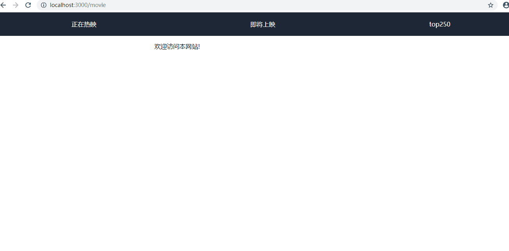

# 服务器端渲染（SSR)

### 学前准备

- ES6
- Node
- Vue
- React
- Angular

### 什么是服务器端渲染

- 前端渲染：html页面作为静态文件存在，前端请求时后端不对该文件做任何内容上的修改，直接以资源的方式返回给前端，前端拿到页面后，根据写在html页面上的js代码，对该html的内容进行修改。
- 服务端渲染：前端发出请求后，后端在将HTML页面返回给前端之前，先把HTML页面中的特定区域，用数据填充好，再将完整的HTML返回给前端。在SPA场景下，服务端渲染都是针对第一次get请求，它会完整的html给浏览器，浏览器直接渲染出首屏，用不着浏览器端多一个AJAX请求去获取数据再渲染。

### 为什么使用服务器端渲染

优点：

- 更好的 SEO，因为传统的搜索引擎只会从 HTML 中抓取数据，这会导致前端渲染的页面无法被抓取。
- 更快的内容到达时间(time-to-content)，特别是对于缓慢的网络情况或运行缓慢的设备 。页面首屏时间大概有80%消耗在网络上，剩下的时间在后端读取数据以及浏览器渲染，显然要优化后面的20%是比较困难的，优化网络时间是效果最明显的手段。传统的Ajax请求是先请求js再由js发起数据请求，两项时间再加上浏览器渲染时间才是首屏时间。而SSR能将两个请求合并为一个。

缺点：

- 更多的服务器端负载。
- 服务器端和浏览器环境差异带来的问题，例如document等对象找不到的问题。

### 如何选择

建议：如果注重SEO的新闻站点，非强交互的页面，建议用SSR；像后台管理页面这类强交互的应用，建议使用前端渲染。

