# 1. 小程序介绍

[微信小程序 ( Mini Program )](https://baike.baidu.com/item/%E5%BE%AE%E4%BF%A1%E5%B0%8F%E7%A8%8B%E5%BA%8F/20171697?fr=aladdin) ，微信创始人 [张小龙](https://baike.baidu.com/item/%E5%BC%A0%E5%B0%8F%E9%BE%99/24795) ，在2017年1月9日宣布的微信小程序正式上线


## 1.1. 特点

- 触手可及，用完即走
- 拥有和原生APP的体验
- 用户量大
- 面向所有用户开放（企业，组织，个人均可以发布自己的小程序）
- 小程序就是套在 **微信里面的原生APP**

## 1.2. 小程序的运行环境

### 1.2.1. 传统原生APP

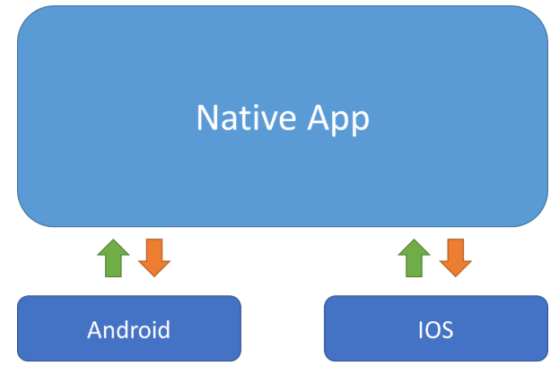

------


### 1.2.2. 微信运行环境

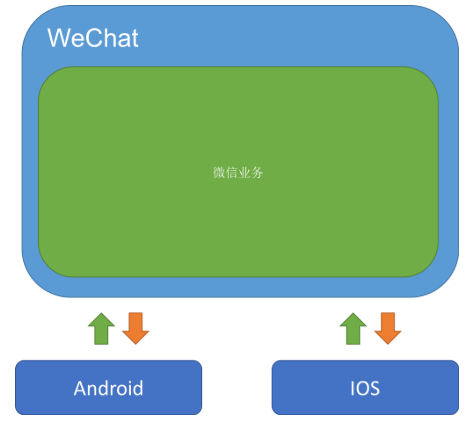

------


### 1.2.3. 微信小程序运行环境

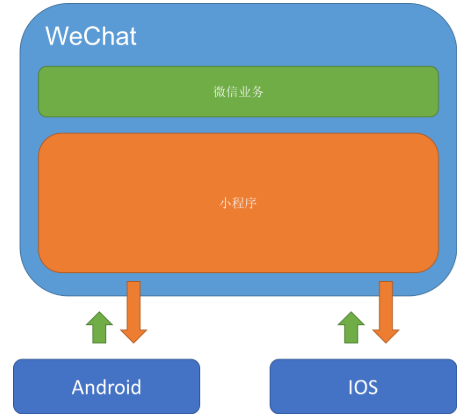


### 1.2.4. 小结

问：

> 微信小程序和原生APP、微信有什么联系？

答：

> 微信小程序就是套在微信里的原生APP

# 2. 开发环境的准备

## 2.1. 注册账号

访问[注册页面](https://mp.weixin.qq.com/wxopen/waregister?action=step1)，耐心完成注册即可。

## 2.2. 获取APPID

由于后期调用微信小程序的接口等功能，需要索取开发者的小程序中的APPID，所以在注册成功后，可登录，然后获取APPID。

[登录](https://mp.weixin.qq.com/)，成功后可看到如下界面

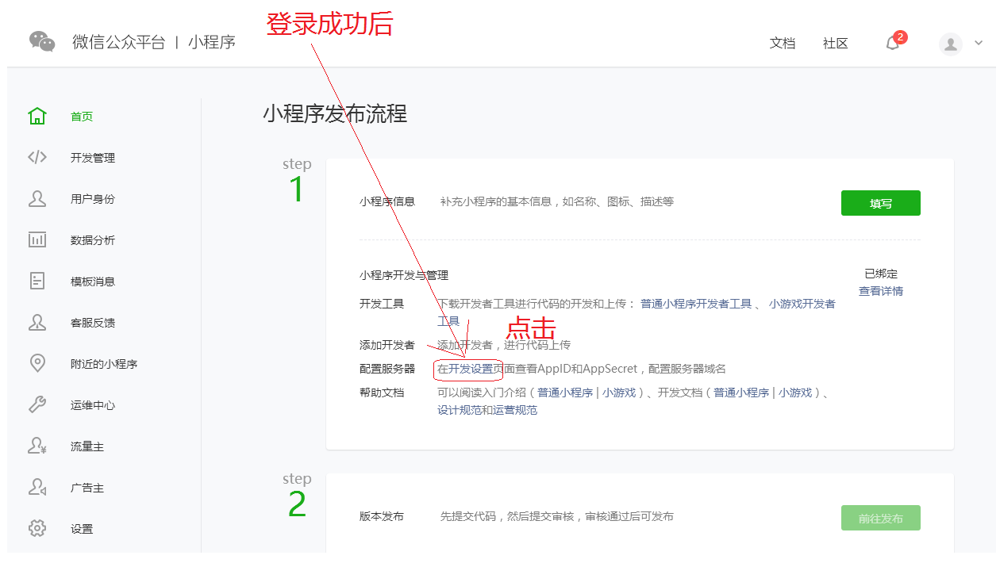

然后复制你的APPID,悄悄的保存起来，不要给别人看到😄。

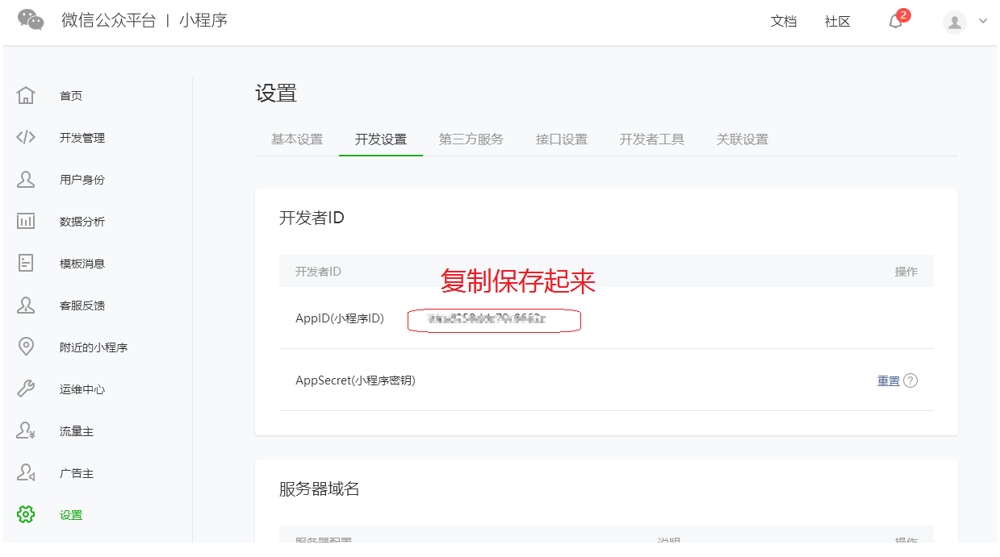

## 2.3. 开发工具

严格来说，微信小程序支持所有的开发工具，但是从效率和便利性来说，推荐如下

1. `vs code`  [下载地址](https://code.visualstudio.com/Download) 

   1. 推荐vs code  代码插件 `wechat-snippet`

      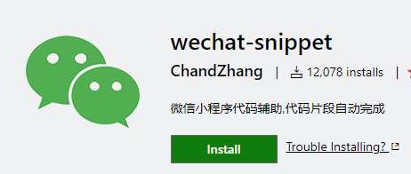

   2. 文件图标主题 `file-icons`

      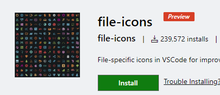

2.   微信自己的`微信小程序开发工具 `   [下载地址](https://developers.weixin.qq.com/miniprogram/dev/devtools/download.html)


# 3. 我的第一个微信小程序

下面开始演示如何创建我的第一个微信小程序

## 3.1. 安装微信小程序开发者工具

下载好微信小程序开发者工具后，直接双击安装，一直点击下一步即可。 安装好后，界面如下

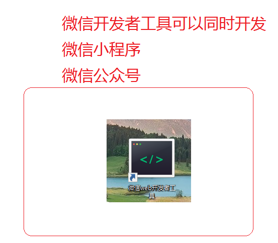

## 3.2. 选择小程序项目

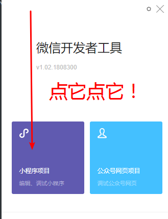

## 3.3. 新建项目

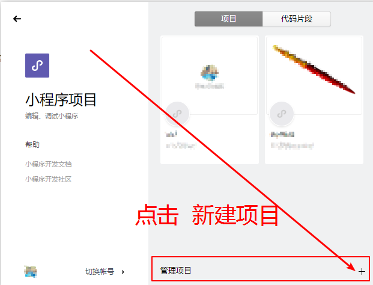

## 3.4. 创建项目

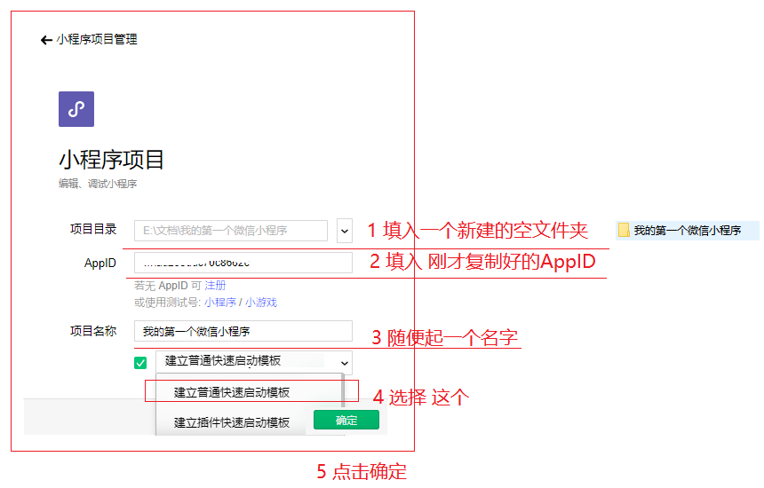

## 3.5. 成功

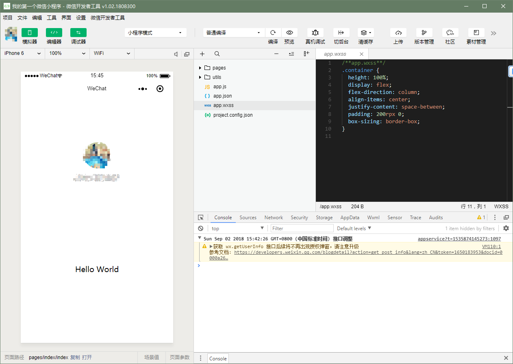


# 4. 微信开发工具深入介绍

[工具介绍](https://developers.weixin.qq.com/miniprogram/dev/devtools/devtools.html)

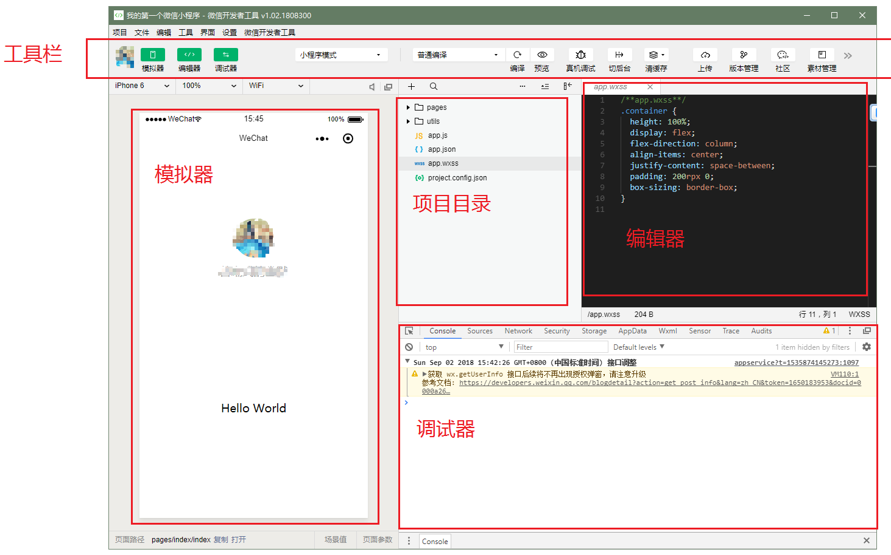


# 5. mina框架

小程序开发框架的目标是通过尽可能简单、高效的方式让开发者可以在微信中开发具有原生 APP 体验的服务。

框架提供了自己的视图层描述语言 `WXML` 和 `WXSS`，以及基于 `JavaScript` 的逻辑层框架，并在视图层与逻辑层间提供了数据传输和事件系统，让开发者能够专注于数据与逻辑。

[官网](https://developers.weixin.qq.com/miniprogram/dev/framework/MINA.html)

## 5.1. 小程序文件结构和传统web对比

| 结构 | 传统web    | 微信小程序 |
| ---- | ---------- | ---------- |
| 结构 | HTML       | WXML       |
| 样式 | CSS        | WXSS       |
| 逻辑 | Javascript | Javascript |
| 配置 | 无         | JSON       |

通过以上对比得出，**传统web** 是三层结构。而微信小程序 是四层结构，多了一层 **配置.json**


## 5.2. 基本的项目目录

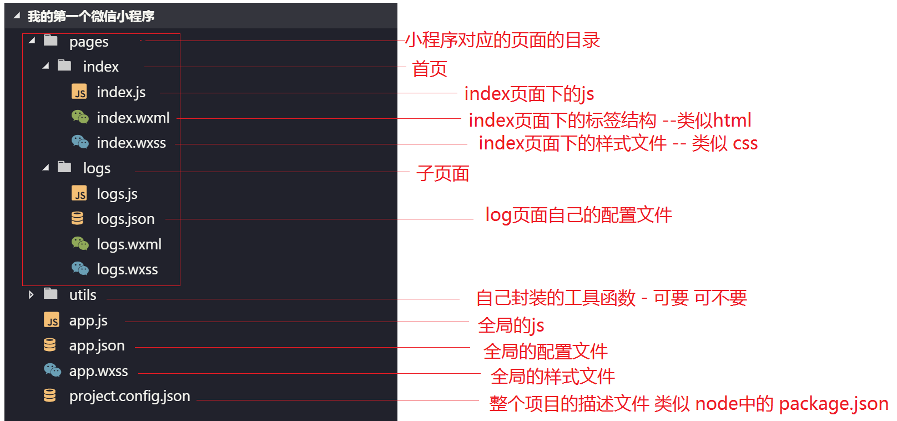


# 6. 配置介绍

一个小程序应用程序会包括最基本的两种配置文件。一种是全局的 `app.json` 和 页面自己的 `page.json`

**注意：配置文件中不能出现注释**

## 6.1. 全局配置app.json

`app.json` 是当前小程序的全局配置，包括了小程序的所有页面路径、界面表现、网络超时时间、底部 tab 等。**普通快速启动项目**里边的 `app.json` 配置

```json
{
  "pages":[
    "pages/index/index",
    "pages/logs/logs"
  ],
  "window":{
    "backgroundTextStyle":"light",
    "navigationBarBackgroundColor": "#fff",
    "navigationBarTitleText": "WeChat",
    "navigationBarTextStyle":"black"
  }
}
```

字段的含义

1. `pages`字段 —— 用于描述当前小程序所有页面路径，这是为了让微信客户端知道当前你的小程序页面定义在哪个目录。
2. `window`字段 —— 定义小程序所有页面的顶部背景颜色，文字颜色定义等。
3. 完整的配置信息请参考 [app.json配置](https://developers.weixin.qq.com/miniprogram/dev/framework/config.html)

## 6.2. page.json

这里的 `page.json` 其实用来表示页面目录下的 `page.json` 这类和小程序页面相关的配置。

开发者可以独立定义每个页面的一些属性，如顶部颜色、是否允许下拉刷新等等。

页面的配置只能设置 `app.json` 中部分 `window` 配置项的内容，页面中配置项会覆盖 `app.json` 的 `window` 中相同的配置项。

| 属性                         | 类型     | 默认值  | 描述                                                         |
| ---------------------------- | -------- | ------- | ------------------------------------------------------------ |
| navigationBarBackgroundColor | HexColor | #000000 | 导航栏背景颜色，如 `#000000`                                 |
| navigationBarTextStyle       | String   | white   | 导航栏标题颜色，仅支持 `black` / `white`                     |
| navigationBarTitleText       | String   |         | 导航栏标题文字内容                                           |
| backgroundColor              | HexColor | #ffffff | 窗口的背景色                                                 |
| backgroundTextStyle          | String   | dark    | 下拉 loading 的样式，仅支持 `dark` / `light`                 |
| enablePullDownRefresh        | Boolean  | false   | 是否全局开启下拉刷新。 详见 [Page.onPullDownRefresh](https://developers.weixin.qq.com/miniprogram/dev/framework/app-service/page.html#onpulldownrefresh) |
| onReachBottomDistance        | Number   | 50      | 页面上拉触底事件触发时距页面底部距离，单位为px。 详见 [Page.onReachBottom](https://developers.weixin.qq.com/miniprogram/dev/framework/app-service/page.html#onreachbottom) |
| disableScroll                | Boolean  | false   | 设置为 `true` 则页面整体不能上下滚动；只在页面配置中有效，无法在 `app.json` 中设置该项 |

# 7. 视图层

WXML（WeiXin Markup Language）是框架设计的一套标签语言，结合[基础组件](https://developers.weixin.qq.com/miniprogram/dev/component/index.html)、[事件系统](https://developers.weixin.qq.com/miniprogram/dev/framework/view/wxml/event.html)，可以构建出页面的结构。

## 7.1. 数据绑定

### 7.1.1. 普通写法

```html
<view> {{ message }} </view>
```


```js
Page({
  data: {
    message: 'Hello MINA!'
  }
})
```

### 7.1.2. 组件属性

```html
<view id="item-{{id}}"> </view>
```

```js
Page({
  data: {
    id: 0
  }
})
```

### 7.1.3. bool类型

**不要直接写 checked="false"，其计算结果是一个字符串**

```html
<checkbox checked="{{false}}"> </checkbox>
```

## 7.2. 运算

### 7.2.1. 三元运算

```html
<view hidden="{{flag ? true : false}}"> Hidden </view>
```

### 7.2.2. 算数运算

```html
<view> {{a + b}} + {{c}} + d </view>
```

```js
Page({
  data: {
    a: 1,
    b: 2,
    c: 3
  }
})
```

### 7.2.3. 逻辑判断

```html
<view wx:if="{{length > 5}}"> </view>
```

### 7.2.4. 字符串运算

```html
<view>{{"hello" + name}}</view>
```

```javascript
Page({
  data:{
    name: 'MINA'
  }
})
```

### 7.2.5. 注意

 花括号和引号之间如果有空格，将最终被解析成为字符串

## 7.3. 列表渲染

### 7.3.1. wx:for

项的变量名默认为 `item`      `wx:for-item` 可以指定数组当前元素的变量名

下标变量名默认为 `index`    `wx:for-index` 可以指定数组当前下标的变量名

```html
<view wx:for="{{array}}">
  {{index}}: {{item.message}}
</view>
```

```js
Page({
  data: {
    array: [{
      message: 'foo',
    }, {
      message: 'bar'
    }]
  }
})
```

### 7.3.2. wx:for

渲染一个包含多节点的结构块  block最终不会变成真正的dom元素

```html
<block wx:for="{{[1, 2, 3]}}">
  <view> {{index}}: </view>
  <view> {{item}} </view>
</block>
```

### 7.3.3. wx:key

提高效率使用的

## 7.4. 条件渲染

### 7.4.1. wx:if

在框架中，使用 `wx:if="{{condition}}"` 来判断是否需要渲染该代码块：

```html
<view wx:if="{{condition}}"> True </view>
```

### 7.4.2. hidden

```html
<view hidden="{{condition}}"> True </view>
```

类似 `wx:if`  

频繁切换 用 `hidden`

不常使用 用 `wx:if`


# 8. WXSS

WXSS(WeiXin Style Sheets)是一套样式语言，用于描述 WXML 的组件样式。

与 CSS 相比，WXSS 扩展的特性有：

- 尺寸单位
- 样式导入

## 8.1. 尺寸单位

- rpx（responsive pixel）: 可以根据屏幕宽度进行自适应。规定屏幕宽为750rpx。如在 iPhone6 上，屏幕宽度为375px，共有750个物理像素，则750rpx = 375px = 750物理像素，1rpx = 0.5px = 1物理像素。

| 设备         | rpx换算px (屏幕宽度/750) | px换算rpx (750/屏幕宽度) |
| ------------ | ------------------------ | ------------------------ |
| iPhone5      | 1rpx = 0.42px            | 1px = 2.34rpx            |
| iPhone6      | 1rpx = 0.5px             | 1px = 2rpx               |
| iPhone6 Plus | 1rpx = 0.552px           | 1px = 1.81rpx            |

**建议：** 开发微信小程序时设计师可以用 iPhone6 作为视觉稿的标准。

**注意：** 在较小的屏幕上不可避免的会有一些毛刺，请在开发时尽量避免这种情况。

## 8.2. 样式导入

使用`@import`语句可以导入外联样式表，`@import`后跟需要导入的外联样式表的相对路径，用`;`表示语句结束。

**示例代码：**

```less
/** common.wxss **/
.small-p {
  padding:5px;
}
```

```scss
/** app.wxss **/
@import "common.wxss";
.middle-p {
  padding:15px;
}
```

## 8.3. 内联样式

框架组件上支持使用 style、class 属性来控制组件的样式。

- style：静态的样式统一写到 class 中。style 接收动态的样式，在运行时会进行解析，请尽量避免将静态的样式写进 style 中，以免影响渲染速度。

```html
<view style="color:{{color}};" />
```

- class：用于指定样式规则，其属性值是样式规则中类选择器名(样式类名)的集合，样式类名不需要带上`.`，样式类名之间用空格分隔。

```html
<view class="normal_view" />
```

### 8.3.1. 选择器

目前支持的选择器有：

| 选择器           | 样例             | 样例描述                                       |
| ---------------- | ---------------- | ---------------------------------------------- |
| .class           | `.intro`         | 选择所有拥有 class="intro" 的组件              |
| #id              | `#firstname`     | 选择拥有 id="firstname" 的组件                 |
| element          | `view`           | 选择所有 view 组件                             |
| element, element | `view, checkbox` | 选择所有文档的 view 组件和所有的 checkbox 组件 |
| ::after          | `view::after`    | 在 view 组件后边插入内容                       |
| ::before         | `view::before`   | 在 view 组件前边插入内容                       |

### 8.3.2. 全局样式与局部样式

定义在 app.wxss 中的样式为全局样式，作用于每一个页面。在 page 的 wxss 文件中定义的样式为局部样式，只作用在对应的页面，并会覆盖 app.wxss 中相同的选择器。


# 9. 基本组件

> 小程序提供了常用的标签组件用于构建页面

[组件](https://developers.weixin.qq.com/miniprogram/dev/component/)

## 9.1. view

> 类似 div

| 属性名      | 类型   | 默认值 | 说明                                                         |
| ----------- | ------ | ------ | ------------------------------------------------------------ |
| hover-class | String | none   | 指定按下去的样式类。当 `hover-class="none"` 时，没有点击态效果 |

### 9.1.1. 代码

```html
  <view hover-class="h-class">
  点击我试试
  </view>
  <!-- wxss -->
  .h-class{
    background-color: yellow;
  }
```

## 9.2. text

> 显示普通的文本 text只能嵌套text

| 属性名     | 类型    | 默认值 | 说明         |
| ---------- | ------- | ------ | ------------ |
| selectable | Boolean | false  | 文本是否可选 |
| decode     | Boolean | false  | 是否解码     |

### 9.2.1. 代码

```html
  <text selectable="{{false}}" decode="{{false}}">
    普&nbsp;通
  </text>
```

## 9.3. image

> 图片标签，**image组件默认宽度320px、高度240px**

**注意：该标签 其实是 web中的 图片标签 和 背景图片的结合！！！ 并且不支持以前的web中的背景图片的写法！！！ **

| 属性名    | 类型    | 默认值        | 说明                                             |
| --------- | ------- | ------------- | ------------------------------------------------ |
| src       | String  |               | 图片资源地址，支持云文件ID（2.2.3起）            |
| mode      | String  | 'scaleToFill' | 图片裁剪、缩放的模式                             |
| lazy-load | Boolean | false         | 图片懒加载。只针对page与scroll-view下的image有效 |

**mode 有效值：**

mode 有 13 种模式，其中 4 种是缩放模式，9 种是裁剪模式。

| 模式 | 值           | 说明                                                        |
| ---- | ------------ | ----------------------------------------------------------- |
| 缩放 | scaleToFill  | 不保持纵横比缩放图片，使图片的宽高完全拉伸至填满 image 元素 |
| 缩放 | aspectFit    | 保持纵横比缩放图片，使图片的长边能完全显示出来。            |
| 缩放 | aspectFill   | 保持纵横比缩放图片，只保证图片的短边能完全显示出来。        |
| 缩放 | widthFix     | 宽度不变，高度自动变化，保持原图宽高比不变                  |
| 裁剪 | top          | 不缩放图片，只显示图片的顶部区域                            |
| 裁剪 | bottom       | 不缩放图片，只显示图片的底部区域                            |
| 裁剪 | center       | 不缩放图片，只显示图片的中间区域                            |
| 裁剪 | left         | 不缩放图片，只显示图片的左边区域                            |
| 裁剪 | right        | 不缩放图片，只显示图片的右边区域                            |
| 裁剪 | top left     | 不缩放图片，只显示图片的左上边区域                          |
| 裁剪 | top right    | 不缩放图片，只显示图片的右上边区域                          |
| 裁剪 | bottom left  | 不缩放图片，只显示图片的左下边区域                          |
| 裁剪 | bottom right | 不缩放图片，只显示图片的右下边区域                          |

## 9.4. swiper

> 微信内置有轮播图组件

**默认宽度 100% 高度 150px**

| 属性名                 | 类型    | 默认值            | 说明                 |
| ---------------------- | ------- | ----------------- | -------------------- |
| indicator-dots         | Boolean | false             | 是否显示面板指示点   |
| indicator-color        | Color   | rgba(0, 0, 0, .3) | 指示点颜色           |
| indicator-active-color | Color   | #000000           | 当前选中的指示点颜色 |
| autoplay               | Boolean | false             | 是否自动切换         |
| interval               | Number  | 5000              | 自动切换时间间隔     |

### 9.4.1. swiper

滑块视图容器。

### 9.4.2. swiper-item

> 滑块

**默认宽度和高度都是100%**

## 9.5. navigator

> 导航组件 类似超链接标签 

| 属性名    | 类型   | 默认值   | 说明                                                         |
| --------- | ------ | -------- | ------------------------------------------------------------ |
| target    | String | self     | 在哪个目标上发生跳转，默认当前小程序，可选值self/miniProgram |
| url       | String |          | 当前小程序内的跳转链接                                       |
| open-type | String | navigate | 跳转方式                                                     |

**open-type 有效值：**

| 值           | 说明                                                         |
| ------------ | ------------------------------------------------------------ |
| navigate     | 保留当前页面，跳转到应用内的某个页面，但是不能跳到 tabbar 页面 |
| redirect     | 关闭当前页面，跳转到应用内的某个页面，但是不允许跳转到 tabbar 页面。 |
| switchTab    | 跳转到 tabBar 页面，并关闭其他所有非 tabBar 页面             |
| reLaunch     | 关闭所有页面，打开到应用内的某个页面                         |
| navigateBack | 关闭当前页面，返回上一页面或多级页面。可通过 [getCurrentPages()](https://developers.weixin.qq.com/miniprogram/dev/framework/app-service/route.html#getcurrentpages) 获取当前的页面栈，决定需要返回几层 |
| exit         | 退出小程序，target="miniProgram"时生效                       |

# 10. 自定义组件

小程序允许我们使用自定义组件的方式来构建页面。

[自定义组件](https://developers.weixin.qq.com/miniprogram/dev/framework/custom-component/)

## 10.1. 创建自定义组件

> 类似于页面，一个自定义组件由 `json` `wxml` `wxss` `js` 4个文件组成

### 10.1.1. 声明组件

首先需要在 `json` 文件中进行自定义组件声明

```json
{
  "component": true
}
```

### 10.1.2. 编辑组件

同时，还要在 `wxml` 文件中编写组件模板，在 `wxss` 文件中加入组件样式

> **注意：在组件wxss中不应使用ID选择器、属性选择器和标签名选择器。**

```html
<!-- 这是自定义组件的内部WXML结构 -->
<view class="inner">
  {{innerText}}
</view>
<slot></slot>
```

```css
/* 这里的样式只应用于这个自定义组件 */
.inner {
  color: red;
}
```

### 10.1.3. 注册组件

在自定义组件的 `js` 文件中，需要使用 `Component()` 来注册组件，并提供组件的属性定义、内部数据和自定义方法

```json
Component({
  properties: {
    // 这里定义了innerText属性，属性值可以在组件使用时指定
    innerText: {
      type: String,
      value: 'default value',
    }
  },
  data: {
    // 这里是一些组件内部数据
    someData: {}
  },
  methods: {
    // 这里是一个自定义方法
    customMethod: function(){}
  }
})
```

## 10.2. 使用自定义组件

首先要在页面的 `json` 文件中进行引用声明。还要提供对应的组件名和组件路径

```json
{
	// 引用声明
  "usingComponents": {
  	// 要使用的组件的名称     // 组件的路径
    "component-tag-name": "path/to/the/custom/component"
  }
}
```

