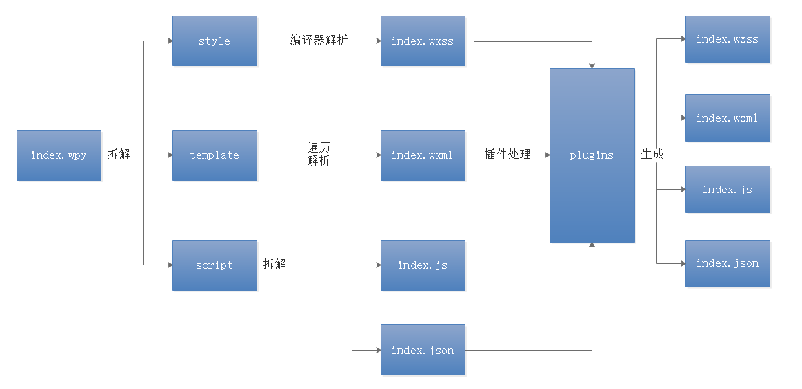
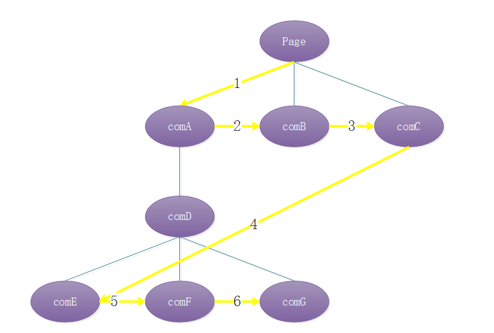
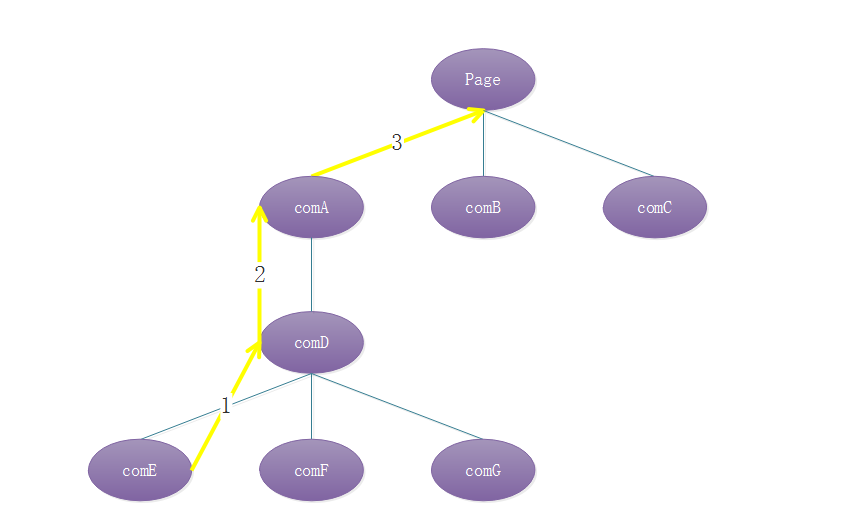

# 1. wepy-介绍

&nbsp; &nbsp; **WePY** (发音: /'wepi/)是一款腾讯团队于2016年11月发布的小程序组件化框架，通过预编译的手段让开发者可以选择自己喜欢的开发风格去开发小程序。

[官网](https://tencent.github.io/wepy/index.html)

## 1.1. 特性

- 类Vue开发风格
- 支持自定义组件开发
- 支持引入NPM包
- 支持[Promise](https://github.com/wepyjs/wepy/wiki/wepy%E9%A1%B9%E7%9B%AE%E4%B8%AD%E4%BD%BF%E7%94%A8Promise)
- 支持ES2015+特性，如[Async Functions](https://github.com/wepyjs/wepy/wiki/wepy%E9%A1%B9%E7%9B%AE%E4%B8%AD%E4%BD%BF%E7%94%A8async-await)
- 支持多种编译器，Less/Sass/Stylus/PostCSS、Babel/Typescript、Pug
- 支持多种插件处理，文件压缩，图片压缩，内容替换等
- 支持 Sourcemap，ESLint等
- 小程序细节优化，如请求列队，事件优化等

## 1.2. 优秀案例

&nbsp; &nbsp; 腾讯疫苗查询小程序、 腾讯翻译君小程序、 腾讯地图小程序、 玩转故宫小程序、 手机充值+、 手机余额查询、 手机流量充值优惠、 友福图书馆（开源）、 素洁商城（开源）、 NewsLite（开源）、 西安找拼车（开源）、 深大的树洞（开源）、 求知微阅读（开源）、 给你的 iPhone X 换个发型、 天天跟我买、 坚橙、 群脱单、 米淘联盟、 帮助圈、 众安保险福利、 阅邻二手书、 趣店招聘、 满熊阅读（开源： 微信小程序、支付宝小程序）、 育儿柚道、 平行进口报价内参、 GitHub掘金版、 班级群管、 鲜花说小店、 逛人备忘、 英语助手君、 花花百科、 独角兽公司、 爱羽客羽毛球、 斑马小店、 小小羽球、 培恩医学、 农资优选、 公务员朝夕刷题、 七弦琴小助手、 七弦琴大数据、 爽到家小程序、 应用全球排行（开源）、 we川大（开源）、 聊会儿、 ... 

## 1.3. 前置知识

- [node](http://nodejs.cn/)&[npm](https://www.npmjs.com.cn/)
- [vue](https://cn.vuejs.org/)
- es6
- [微信小程序]()

# 2. 快速项目搭建

## 2.1. 全局安装

WePY的安装或更新都通过`npm`进行。

```bash
npm install wepy-cli -g
```

## 2.2. 创建空项目

> 1.7.0版本之前的请查询官网完成创建

```bash
wepy init empty my-project
```

## 2.3. 编译并监控项目

等待创建成果后，进入到项目目录

```bash
cd  my-project
```

安装依赖

```bash
npm install		
```

编译并监控项目

```bash
wepy build --watch
```

此时，可以看到目录下多了一个`dist`文件夹，该文件夹便是经过`wepy`编译后的小程序源代码，也就是我们可以用小程序开发者工具直接监控的项目代码。

## 2.4. WePY项目的目录结构

```
    ├─dist                   小程序文件夹
    │  └─pages               小程序页面文件夹
    │          index.js      首页的js文件
    │          index.json    首页的配置文件
    │          index.wxml    首页的标签文件   
    │          index.wxss    首页的样式文件
    │—node_modules           node包           
    │─src                    wepy的项目源代码
    │   │  app.wpy           wepy的小程序的全局组件
    │   │                    
    │   └─pages              wepy的页面组件文件夹
    │           index.wpy    wepy的小程序的首页组件
    │  .editorconfig         代码格式的配置文件
    │  .gitignore            告诉git哪些文件需要忽略
    │  .prettierrc           代码格式化的配置文件
    │  .wepycache            wepy项目的缓存文件 防止build时 重复编译npm目录
    │  .wepyignore           wepy编译工具的忽略清单
    │  package-lock.json     npm的项目描述文件
    │  package.json          npm的项目描述文件
    │  project.config.json   小程序项目内的配置文件
    │  wepy.config.js        wepy的编译配置文件
```

&nbsp;&nbsp; **dist**为小程序运行目录，因此千万不要手动去编辑或者修改!!

# 3. 开发环境配置

## 3.1. 小程序开发者工具配置

由于统一使用`wepy`进行开发，因此关于开发者工具的配置也需要直接在`wepy`项目中直接进行配置。通过`project.config.json`即可进行配置，默认不需要修改。

```json
{
  "description": "project description",
  "setting": {
    "urlCheck": true,
    "es6": false,
    "postcss": false,
    "minified": false
  },
  "compileType": "miniprogram",
  "appid": "touristappid",
  "projectname": "Project name",
  "miniprogramRoot": "./dist"
}
```

`es6`: 对应`关闭ES6转ES5`选项，**关闭**。 重要：未关闭会运行报错。

`postcss`: 对应`关闭上传代码时样式自动补全`选项，**关闭**。 重要：某些情况下漏掉此项也会运行报错。

`minified`: 对应`关闭代码压缩上传`选项，**关闭**。重要：开启后，会导致真机computed, props.sync 等等属性失效。

`urlCheck`: 对应`不检查安全域名`选项，**开启**。 如果已配置好安全域名则建议关闭。

## 3.2. 代码高亮配置

wepy推荐开发者使用较为成熟的编辑器来代替 **微信开发者工具** ， **微信开发者工具** 只用来做显示界面使用。

这里推荐 使用**vs code** ，如需要其他编辑器，[其他编辑器配置](https://tencent.github.io/wepy/document.html#/?id=%e4%bb%a3%e7%a0%81%e9%ab%98%e4%ba%ae)

1. 在 Code 里先安装 Vue 的语法高亮插件 `Vetur`。

2. 打开任意 `.wpy` 文件。

3. 点击右下角的选择语言模式，默认为`纯文本`。

4. 在弹出的窗口中选择 `.wpy 的配置文件关联...`。

5. 在`选择要与 .wpy 关联的语言模式` 中选择 `Vue`。


## 3.3. 启用promise

因为不想陷入异步的回调地狱中，所以在一些复杂的业务当中，我们推荐使用 promise 或者 async-function 来代替传统的回调。因此需要在项目中单独进行配置。

### 3.3.1. 进入项目根目录，安装polyfill

```bash
npm install wepy-async-function --save
```

### 3.3.2. 在app.wpy中导入polyfill

```bash
import 'wepy-async-function';
```

### 3.3.3. 在app.wpy中开启promise

```javascript
export default class extends wepy.app {
    constructor () {
        super();
        this.use('promisify');
    }
}
```

## 3.4. wepy.config.js

&nbsp;&nbsp;wepy项目编译的配置文件

| 属性名    | 含义                                           |
| --------- | ---------------------------------------------- |
| target    | wepy编译后的生成目录                           |
| wpyExt    | wepy组件的后缀名，默认为wepy，可以指定为vue    |
| eslint    | 是否开启eslint的验证                           |
| cliLogs   | 开启控制台打印                                 |
| compilers | 编译sass，js等文件的配置                       |
| plugins   | 插件                                           |
| appConfig | 全局变量，可以在组件中通过 wepy.$appConfig访问 |

# 4. 小程序页面结构和wepy组件结构对比

## 4.1. wepy组件的编译图解

wepy组件编译的流程如图所示，我们在学习wepy组件前，最好提前了解一下。



## 4.2. 小程序页面结构

小程序页面结构分为4个部分

- wxml 标签文件
- wxss 样式文件
- JavaScript 逻辑文件
- json 配置文件

## 4.3. wepy组件结构

wepy组件默认后缀名为 `.wpy`,该文件里面包含有了 **样式**、**标签**和**逻辑部分** 如

```html
/* 样式 */
<style lang="less">
</style>
/* 标签 */
<template>
  <view class="container">
    Hello world
  </view>
</template>
 
 /* 逻辑 */
<script>
import wepy from 'wepy';
export default class Index extends wepy.page {
  config = {
    navigationBarTitleText: 'test'
  };
  onLoad() {
    console.log('onLoad');
  }
}
</script>

```

# 5. app.wpy文件

`wpy`文件分为3个部分，分别是 样式 `style`，标签 `template`，还有 脚本 `javascript`。下面挨个来讲解

## 5.1. style

在`app.wpy` 文件的`style`中，控制的是全局的样式。它有如下特点

1. 设置的样式可以在所有的页面文件中使用

2. 通过`lang`关键字可以设置 `css`,`less`,`scss` 等预处理器

   ```html
   <style lang="less">
   
   </style>
   ```

3. 可以使用 `//`等作为注释（小程序中的wxss中直接写`//`是不支持的）。

   ```css
     view {
       // color: yellow;
     }
   ```

4. 可以通过`style`标签中的`src`关键字导入另外的第三方样式文件

   ```html
   <style src="./styles/base.css"> </style>
   ```

## 5.2. template

   template为标签部分，由于app.wpy最终是要编译为小程序中的`app.js`文件的，因此该`template`无特别用法

## 5.3. JavaScript

   `app.wpy`中的`javascript`为脚本部分，继承自`wepy.app` 它经过编译后，最终会生成两个文件，分别是 `app.js` 和 `app.json`。 主要有以下特点

   1. 代码风格类似`vue`，es6的语法。 继承自 `wepy.app`

      ```javascript
      export default class extends wepy.app {
        config = {
          pages: ['pages/index'],
          window: {
            backgroundTextStyle: 'light',
            navigationBarBackgroundColor: '#fff',
            navigationBarTitleText: 'WeChat',
            navigationBarTextStyle: 'black'
          }
        };
        onLaunch() {
          console.log('on launch');
        }
      }
      ```

   2. 在 `default class`内，`config`字段对应的是小程序中 `app.json`的内容  [全局配置](https://developers.weixin.qq.com/miniprogram/dev/framework/config.html)

      ```javascript
        config = {
          pages: ['pages/index'],
          window: {
            backgroundTextStyle: 'light',
            navigationBarBackgroundColor: '#fff',
            navigationBarTitleText: 'WeChat',
            navigationBarTextStyle: 'black'
          }
        };
      ```

   3. 和`config`同层级，可以定义小程序的[App注册事件](https://developers.weixin.qq.com/miniprogram/dev/framework/app-service/app.html) 和全局变量 `globalData`等

      ```javascript
        config = {...  };
        
        onLaunch() {
          console.log('on launch');
        }
        onShow(){
          console.log("on show");
        }
        globalData={};
      ```

# 6. index.wpy

## 6.1. 介绍

页面组件`wpy`的文件结构类似 `app.wpy`结构，也是由三个部分组成 标签 `template` ，样式 `style`和脚本`javascript`  继承自 `wepy.page`。其中 脚本 `javascript`经过编译后，也是会生成两个文件。分别是小程序中的页面`javascript`和页面`json`

```html

<style lang="less">
</style>

<template>

</template>

<script>
import wepy from 'wepy';
export default class Index extends wepy.page {

}
</script>

```

| 属性         | 说明                                                         |
| ------------ | ------------------------------------------------------------ |
| config       | 页面配置对象，对应于原生的`page.json`文件，类似于`app.wpy`中的config |
| data         | 页面渲染数据对象，存放可用于页面模板绑定的渲染数据           |
| methods      | wxml事件处理函数对象，存放响应wxml中所捕获到的事件的函数，如`bindtap`、`bindchange` |
| 生命周期函数 | 小程序页面[生命周期函数](https://developers.weixin.qq.com/miniprogram/dev/framework/app-service/page.html#生命周期回调函数)，如onLoad、`onReady`等，以及其它自定义的方法与属性 |
| computed     | 计算属性                                                     |
| watch        | 监控数据                                                     |
| 自定义数据   | 可以自定义内部使用的数据                                     |
| 自定义函数   | 可以自定义内部需要使用的函数                                 |
| components   | 页面组件列表对象，声明页面所引入的组件列表                   |
| events       | WePY组件事件处理函数对象，存放响应组件之间通过`$broadcast`、`$emit`、`$invoke`所传递的事件的函数 |
| mixins       | 声明页面引入的Minxin                                         |

## 6.2. 数据绑定

在wepy中，数据绑定的类似vue的风格，也是通过 `{{mydata}}` 来绑定，`this.mydata='hello wepy'`来修改。

**注意，如在异步里修改数据，需要手动调用 `this.$apply();` 来触发数据更新**

**代码**：

```html
<template>
  <view>{{mydata}}</view>
</template>
<script>
import wepy from 'wepy';
export default class Index extends wepy.page {
  data={
        mydata:"hello wepy"
    };
  onLoad() {
     this.mytitle = '你好wepy';
  }
}
</script>

```

## 6.3. 事件

页面中，绑定事件的方式变为更为简单了。并且，可以实现在事件中传递参数。通过@来绑定，可以省略小程序中的关键字 `bind`。如 `bindtap` 变为 `@tap`。

而且，可以通过添加事件后缀来指定对应的事件类型，如：

- `.default`: 绑定小程序冒泡型事件，如`bindtap`，`.default`后缀可省略不写；
- `.stop`: 绑定小程序捕获型事件，如`catchtap`；
- `.user`: 绑定用户自定义组件事件，通过`$emit`触发。**注意，如果用了自定义事件，则events中对应的监听函数不会再执行。**

```html
<template>
  <view class="container" @tap="myTap(123)">
    Hello world
  </view>
</template>
<script>
import wepy from 'wepy';
export default class Index extends wepy.page {
  methods = {
    myTap(data) {
      console.log(data);
    }
  };
}
</script>
```


# 7. component.wpy

组件文件，结构上大体和`页面.wpy`类似，区别在于组件是继承自 `wepy.component`,并且它拥有自己的属性设置，插槽等。关于一些小程序自身的组件基本属性，可以通过 [小程序组件](https://developers.weixin.qq.com/miniprogram/dev/framework/custom-component/) 来进行查阅。这里主要讲解如何**使用自定义组件**和**组件传参**。

## 7.1. 使用自定义组件

### 7.1.1. 声明组件

1. 新建组件  `Myheader.wpy`

2. 编辑组件

   ```html
   <template>
     <view @tap="myTap" >组件中的文字</view>
   </template>
   <script>
   import wepy from "wepy";
   export default class MyHeader extends wepy.component   {
     methods={
       myTap(){
         console.log("组件被点击了");
         this.$emit("parentEvent",{});
       }
     }
   }
   </script>
   ```


### 7.1.2. 使用组件

1. 在页面文件中引入组件

   ```javascript
   import MyHeader from '../components/MyHeader';
   ```

2. 在 `class`中声明引入的组件

   ```javascript
    components = {
       MyHeader
     };
   ```

3. template中使用组件

   ```vue
   <template>
     <view class="container"  >
       <MyHeader></MyHeader>
     </view>
   </template>
   ```


## 7.2. props组件传值

页面和组件之间的传值可以通过 props实现。分为三种：

1. **静态传值** 父组件传递到子组件的值，不会再被父组件改变。只能传递字符串
2. 动态传值 使用 `.sync`修饰符来将父组件的数据绑定到子组件上，单向绑定。`父 -> 子`
3. 动态传值 使用 `.sync` 和 子组件中的`twoWay: true` 实现双向绑定 `父 <-> 子`

### 7.2.1. 静态传值

组件 `MyHeader`

```html
<template>
  <view >{{parentTitle}}</view>
</template>
<script>
    // ....
  props={
    parentTitle:String // 静态传值
</script>

```

父组件

```html
<template>
  <view class="container"  >
    <MyHeader parentTitle="父组件中的title" ></MyHeader>
  </view>
</template>
```

### 7.2.2. 单向绑定

组件 `MyHeader`

```html
<template>
  <view >{{parentTitle}}</view>
</template>
<script>
    // ....
    props={
    	parentTitle:{
      		type:String,
      		default:null
   		 }
    }
</script>
```

父组件  使用 `.sync` 修饰符

```html
<template>
  <view class="container"  >
    <MyHeader :parentTitle.sync="父组件中的title" ></MyHeader>
  </view>
</template>
<script>
import MyHeader from '../components/MyHeader';
import wepy from 'wepy';
export default class Index extends wepy.page {
  data={
    title:"父中的组件"
  }
  onLoad() {
    setTimeout(() => {
      this.title="被修改了";
      this.$apply();
    }, 2000);
  }
}
</script>
```

### 7.2.3. 双向绑定

父组件和子组件上同时加上配置便可实现 组件中的数据双向绑定。

组件 `MyHeader`  加上配置   `twoWay: true`

```html
<template>
  <view @tap="myTap" >子组件 {{parentTitle}}</view>
</template>
<script>
import wepy from "wepy";
export default class MyHeader extends wepy.component   {
  props={
    parentTitle:{
      type:String,
      default:null,
      twoWay:true
    }
  }
  methods={
    myTap(){
      this.parentTitle="组件中修改了";
    }
  }
}
</script>
```

父组件 中继续使用 `.sync` 修饰符

```html
<template>
  <view class="container"  >
    <view>
   父组件上的数据：   {{title}}
    </view>
    <MyHeader:parentTitle.sync="title" ></MyHeader>
  </view>
</template>
<script>
import MyHeader from '../components/MyHeader';
import wepy from 'wepy';
export default class Index extends wepy.page {
  components = {
    MyHeader
  };
  data={
    title:"父中的组件"
  }
  onLoad() {
    setTimeout(() => {
      this.title="父组件中修改了";
      this.$apply();
    }, 2000);
  }
}
</script>
```

## 7.3. 组件通信

组件之间的通信，都通过事件触发的形式来实现。主要有以下三种

1. 父组件向子组件通信   `$broadcast` 
2. 子组件向父组件通信 `$emit`
3. 页面或组件对另一个组件中的方法的直接调用 `$invoke`


### 7.3.1. $broadcast

$broadcast 负责由父组件向子组件传播事件。

流程如下



**使用方式**：

父组件中 触发

```javascript
this.$broadcast("子组件中的事件名",..参数)
```

子组件中，在`events`字段内监听

```
events={
    事件名(...args){
        // 执行逻辑
    }
}
```

### 7.3.2. $emit

$emit 负责由子组件向父组件触发事件 。

**流程如下** 方向和 $broadcast 相反



**使用方式**

子组件中触发

```javasc
  this.$emit("parentFn",1,3,4,5);
```

父组件 `events` 字段中监听

```javascript
  events = {
   parentFn(...args){
     console.log("父组件事件触发");
   }
  };
```

### 7.3.3. $invoke

`$invoke`是一个页面或组件对另一个组件中的方法的直接调用

```javascript
// 页面中的调用
this.$invoke('ComA', 'someMethod', 'someArgs');
// 组件中的调用
this.$invoke('./../ComB/ComG', 'someMethod', 'someArgs');
```

如同文件夹下，在页面index中，A 组件想要调用B组件内的方法

**index.wpy**

```html
    <A></A>
    <B></B>
```

**A.wpy**

```html
<template lang="wxml">
  <view @tap="myTap">组件1</view>
</template>
<script>
import wepy from 'wepy';
import B from './B';
export default class A extends wepy.component {
  methods = {
    myTap() {
      this.$invoke('B', 'show', 'A的呼叫');
    }
  };
  components={
    B
  }
}
</script>
```

**B.wpy**

```html
<template lang="wxml">  
  <view >组件0</view>
</template>
<script>
import wepy from 'wepy';
export default class B extends wepy.component {
  methods = {
    show(msg) {
      console.log("触发  " +msg);
    }
  };
}
</script>
```


#### 7.3.3.1. 组件自定义事件

可以通过使用`.user`修饰符为自定义组件绑定事件，如：`@customEvent.user="myFn"`

其中，`@`表示事件修饰符，`customEvent` 表示事件名称，`.user`表示事件后缀。

目前总共有三种事件后缀：

- `.default`: 绑定小程序冒泡型事件，如`bindtap`，`.default`后缀可省略不写；
- `.stop`: 绑定小程序捕获型事件，如`catchtap`；
- `.user`: 绑定用户自定义组件事件，通过`$emit`触发。**注意，如果用了自定义事件，则events中对应的监听函数不会再执行。**

## 7.4. 插槽slot

插槽slot可以允许我们在页面中往组件的内部动态的插入标签结构

slot有两种使用方式，单个slot和多个slot 当使用多个slot时，只需要指定唯一的`name`属性即可。

在`Panel`组件中有以下模板：

```html
<view class="panel">
    <slot name="title">默认标题</slot>
    <slot name="content">默认内容</slot>
</view>
```

在父组件中使用`Panel`子组件时，可以这样使用：

```html
<panel>
    <view slot="title">新的标题</view>
    <view slot="content">
        <text>新的内容</text>
    </view>
</panel>
```

# 8. 拦截器

可以使用WePY提供的全局拦截器对原生API的请求进行拦截。

## 8.1. 在app.wpy中定义全局拦截器

```javascript
import wepy from 'wepy';

export default class extends wepy.app {
    constructor () {
        // this is not allowed before super()
        super();
        // 拦截request请求
        this.intercept('request', {
            // 发出请求时的回调函数
            config (p) {
                // 对所有request请求中的OBJECT参数对象统一附加时间戳属性
                p.timestamp = +new Date();
                console.log('config request: ', p);
                // 必须返回OBJECT参数对象，否则无法发送请求到服务端
                return p;
            },

            // 请求成功后的回调函数
            success (p) {
                // 可以在这里对收到的响应数据对象进行加工处理
                console.log('request success: ', p);
                // 必须返回响应数据对象，否则后续无法对响应数据进行处理
                return p;
            },

            //请求失败后的回调函数
            fail (p) {
                console.log('request fail: ', p);
                // 必须返回响应数据对象，否则后续无法对响应数据进行处理
                return p;
            },

            // 请求完成时的回调函数(请求成功或失败都会被执行)
            complete (p) {
                console.log('request complete: ', p);
            }
        });
    }
}
```

## 8.2. 使用内置的wepy发送请求

通过 `wepy.request`的方式来发送请求 如：

> 记得要先开启 wepy对promise 和 async 方法的支持。

```javascript
    let movies = await wepy.request({ url: "http://api.apiopen.top/searchAuthors?name=李白" });
    console.log(movies);
```

# 9. 循环标签repeat

当需要循环渲染WePY组件时，必须使用WePY定义的辅助标签`<repeat>`

默认项为 `item` 索引为 `index`

```html
 <repeat for="{{list}}" key="index" index="index" item="item">
 </repeat>
```

