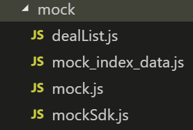

# 1. 美团项目介绍

> 美团小程序

通过微信小程序来实现一个美团首页应用，加深对小程序的理解。

## 1.1. 技术铺垫

-  `html` 和 `css` 和 `JavaScript` 基本功
-  部分 `es6`
-  `mina`
-  `wepy`

## 1.2. 关键技术

| 名称           | 链接                                                         | 备注                 |
| -------------- | ------------------------------------------------------------ | -------------------- |
| 微信小程序     | [开发文档](https://developers.weixin.qq.com/miniprogram/dev/component/) | 官方文档             |
| wepy | [官网](https://tencent.github.io/wepy/index.html) | 官方文档 |
| mock.js        | [官网](http://mockjs.com/)                                   | 用来拦截和模拟请求的 |
| 腾讯地图开发中心 | [官网](https://lbs.qq.com/index.html)                        | 用来获取地理位置     |

## 1.3. 成果


# 2. 项目开展准备

## 2.1. 初始化项目

1. 在电脑任意地方 输入 以下命令 开始创建项目

   ```bash
   wepy init empty meituan
   ```

2. 进入项目，并且按照依赖

   ```bash
   cd meituan
   npm install
   ```

3. 开启 `启用promise`

   ```javascript
   // 按照依赖
   npm install wepy-async-function --save
   
   // 在app.wpy中导入polyfill
   import 'wepy-async-function';
   
   // 在app.wpy中开启promise
   export default class extends wepy.app {
       constructor () {
           super();
           this.use('promisify');
       }
   }
   ```

4. 关闭微信开发者工具的url校验

   `project.config.json`

   ```json
    "urlCheck": false
   ```

## 2.2. 使用mock

项目中引入文件夹 ，并且在`app.wpy`中配置



`app.wpy`中启用

```javascript
import './mock/mock_index_data.js';
```

## 2.3. 运行项目

输入 命令 运行项目

```bash
npm run dev
```

