# 2-3 混合式 App 开发框架

## 课程介绍

Hybrid App的兴起是现阶段移动互联网产业的一种偶然。

**原因：**移动互联网的热潮刮起后，众多公司前赴后继的进入。但是很快发现移动应用的开发人员太少，所以导致疯狂的人才争夺。市场机制下移动应用开发人才的待遇扶摇直上，最终变成众多企业无法负担养一个具备跨平台开发能力的专业移动应用开发团队。

**背景：**而HTML5的出现让Web App露出曙光，HTML5开发移动应用的跨平台和廉价优势让众多想进入移动互联网领域的公司开始心动。可是当下基于HTML5的Web App更是雾里看花，在用户**入口习惯、分发渠道和应用体验**这三个核心问题没解决之前，Web App也很难得以爆发。

**爆发：**正是在这样是机缘巧合下，基于HTML5低成本跨平台开发优势又兼具Native App特质的Hybrid App技术杀入混战，并且很快吸引了众人的目光。大幅的降低了移动应用的开发成本，可以通过现有应用商店模式发行，在用户桌面形成独立入口等等这些，让Hybrid App成为解决移动应用开发困境不错的选择，也成为现阶段Web App的代言人。Hybrid App像刺客一样，在Native App和Web App混战之时，偶然间的在移动应用开发领域占有了一席之地。

在本节课，我们要介绍关于混合式App开发的相关框架，及它们的特点。


**什么是混合式App？**

Hybrid App（混合模式移动应用）是指介于web-app、native-app这两者之间的app，兼具“Native App良好用户交互体验的优势”和“Web App跨平台开发的优势”。


**为什么要学习/了解混合式App?**

- 拓展前端应用/拓宽视野/增加工作应用面
- 快应用效率开发，与原生配合
- 了解机理，以便在特定的应用场景下进行使用


**本课程的学习目标：**

- 理解混合式App与Native App/WebApp的区别
- 能够有基础判断，是否应用是由Native App开发或者是混合式开发
- 什么样的场景或者业务，可以使用混合式开发
- 学习ionic/Cordova/Phonegap，并了解其工作原理


**本课程的主要内容：**

- 混合式App简介
- Cordova打包工具介绍
- Phonegap的基础使用及与Cordova的关系
- Ionic框架的使用与介绍


**本课程的学习准备：**

- IDE编辑器：vscode，webstorm
- Nodejs LTS版本
- 一部iOS手机或者Android手机
- mac上需要下载[Xcode](https://developer.apple.com/xcode/)，windows上需要下 [Android Studio](https://developer.android.com/studio/index.html)
- 如果需要发布，需要开发者身份（AppStore 99美元/年，Android 各大应用商店不一样）


## 混合式App的工作原理

### 混合式App（Hybrid App）

什么是混合式App?

混合应用程序：混合应用程序是一种移动应用程序，以浏览器支持的语言和计算机语言编码。 它们可以通过苹果的App Store，Google Play等应用程序分发平台获得。通常，它们可以从平台下载到目标设备，如iPhone，Android手机或Windows Phone。 用户需要安装才能运行它们。

> Hybrid App：Hybrid App is a mobile application that is coded in both browser-supported language and computer language. They are available through application distribution platforms such as the Apple App Store, Google Play etc. Usually, they are downloaded from the platform to a target device, such as iPhone, Android phone or Windows Phone. The subscribers need to install to run them.


我们来拆解一下里面的含义：

1、mobile application：Hybrid App就是一个移动应用

2、both browser-supported language and computer language：同时使用网页语言与程序语言编写

3、available through application distribution platforms：通过应用商店进行分发

4、a target device：区分目标平台

5、install to run：用户需要安装使用


### Hybrid App工作原理

Hybrid App是指介于web-app、native-app这两者之间的app,它虽然看上去是一个Native App，但只有一个UI WebView，里面访问的是一个Web App，比如百度App最开始的应用就是包了个客户端的壳，其实里面是HTML5的网页，后来才推出真正的原生应用。

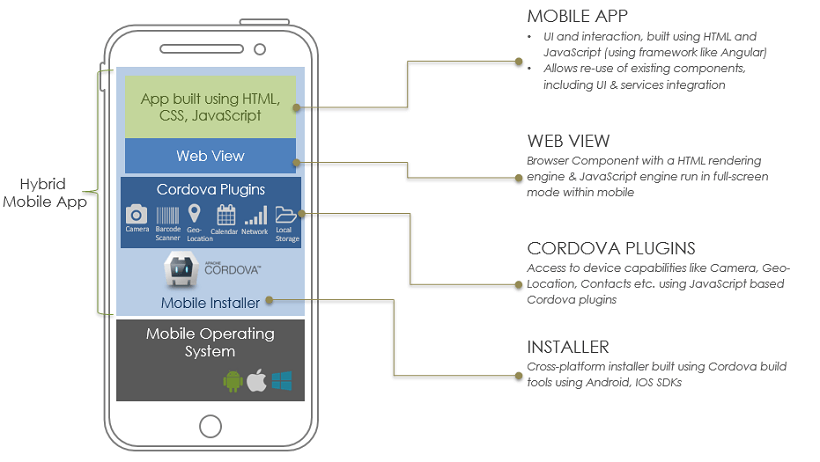


### 与原生/WebApp框架比较

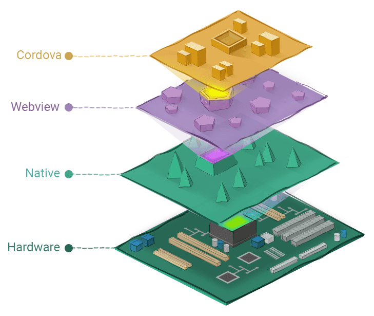

Native App：

优点：

- 可以在离线情况下使用
- 与硬件设备深度集成（GPS，相机，日历，消息，联系人）
- 可以从App商店直接下载（Google Play，App Store）
- 更好的用户体验
- 更流畅的页面过渡
- **数据保护**  - 使本机应用程序更安全更容易。这是许多公司有兴趣为其客户提供的优势，特别是在企业部门，金融科技和具有敏感数据的应用程序中。


缺点：

- 需要更多的精力开发
- **高额的开发成本**：构建复杂的软件肯定需要时间，需要更多的开发人员。跨两个主要平台的用户分布，使得为iOS和Android保持两个单独的应用程序，启动和运行所需的工作量和测试量增加了一倍。
- 比较低的复用性
- 升级过渡比较麻烦
- **版本多、兼容性差**：App Store中的应用程序会推动版本的更新，放弃旧的版本号；而Android版本会定期更新，有很多版本需要向下兼容。 相反，混合应用程序鼓励开发人员以更周到的方式处理UI和功能，并仅引入可在两个操作系统上运行的功能。


Hybrid App：

优点：

- 更快速的开发
- 灵活的升级
- 比较高效与的已有的设备进行集成（需要单独购买比如iOS设备）
- 低成本


缺点：

- 用户交互差
- 页面体验不流畅
- 导航功能比较难实现（左滑右滑等事件与原生进行冲突）
- 需要联网


**与WebApp进行比较**


### 常见的混合式App框架

- 打包工具：Cordova，PhoneGap

- 云平台：DCloud(Uni-app基于Vue)，AppCan，ApiCloud，wex5

- 框架：

  **Ionic：**

  免费和开源，Ionic提供了一个移动和桌面优化的HTML，CSS和JS组件库，用于构建高度交互的应用程序。与Angular，React，Vue或纯JavaScript一起使用。

  **Flutter:** 

  Flutter是一款移动应用SDK，可帮助开发人员和设计人员构建适用于iOS和Android的现代移动应用。

  **React Native:**

  React Native使您能够使用基于JavaScript和React的一致开发人员体验在本机平台上构建世界级的应用程序体验。React Native的重点是在您关注的所有平台上实现开发人员效率 - 学习一次，随处写作。Facebook在多个生产应用程序中使用React Native，并将继续投资React Native

  **Xamarin:**

  Xamarin的基于Mono的产品使.NET开发人员能够使用他们现有的代码，库和工具（包括Visual Studio *），以及.NET和C＃编程语言的技能，为业界最广泛使用的移动设备创建移动应用程序设备，包括基于Android的智能手机和平板电脑，iPhone，iPad和iPod Touch。

- 跨端应用：

  **Electron**

  由Github出品、维护的跨平台桌面应用开发框架。


## Cordova

Apache Cordova是一组设备API，允许移动应用程序开发人员从JavaScript访问本机设备功能，如摄像头或加速度计。结合使用jQuery Mobile或Dojo Mobile或Sencha Touch等UI框架，可以使用HTML，CSS和JavaScript开发智能手机应用程序。

Cordova是Adobe捐献给Apache的项目，是一个开源的、核心的跨平台模块。

而PhoneGap是Adobe的一项商业产品，Cordova和Phonegap的关系就类似于WebKit与Chrome或者Safari的关系。

Phonegap Build，（[iPhone, Android SDK service](https://link.zhihu.com/?target=http%3A//html.adobe.com/edge/phonegap-build/)）和cordova（[Apache Cordova](https://link.zhihu.com/?target=http%3A//cordova.apache.org/)）的合体。
而对于你面对的实际问题，就是需不需要Phonegap Build的功能，需不需要在线打包。


Cordova的前世今生：

> 2008年8月，PhoneGap在旧金山举办的iPhoneDevCamp上崭露头角，起名为PhoneGap是创始人的想法：“为跨越Web技术和iPhone之间的鸿沟牵线搭桥”。
>
> 当时PhoneGap隶属于Nitobe公司。
>
> 经过几个版本的更新，这款PhoneGap开始支持更多的平台，在2011年10月4日，Adobe公司收购了这个Nitobe公司，当时adobe公司还有着adobe air 和flash。
>
> 随后Adobe把PhoneGap项目捐献给了Apache基金会，但是保留了PhoneGap的商标所有权。
>
> 而就在这时候PhoneGap开始分两条路而走，在Adobe公司内部一直保有着PhoneGap的商标所有权，而Apache收录这个项目后将其更名为Apache Callback。
>
> 而捐献之后虽然PhoneGap的升级和维护工作大部分还是依托于Adobe的Nitobe项目组，所以在Adobe的PhoneGap官方宣扬的“PhoneGap”名号，而Apache对外公布的确实Callback名号，当2012年PhoneGap更新到1.4版本后，Apache又把名字更新成Cordova，有趣的是Cordova是PhoneGap团队附近一条街的名字。


### 安装与起步

```js
// 全局安装cordova命令
npm install -g cordova

// 创建cordova的项目
cordova create <path>

// cordova命令帮助
cordova help create

添加平台
cordova platform add <platform name>

// 查看支持的平台
➜ cordova platform
Installed platforms:

Available platforms:
  android ^8.0.0
  browser ^6.0.0
  electron ^1.0.0
  ios ^5.0.0
  osx ^5.0.0
  windows ^7.0.0

//eg:
cd MyApp cordova platform add browser

// 运行
cordova run browser
```


### 支持的平台及打包

平台相关管理命令

```bash
$ cordova platform add ios
$ cordova platform add android

# 查看
$ cordova platform ls
```


预打包环境检查

```bash
$ cordova requirements
Requirements check results for android:
Java JDK: installed .
Android SDK: installed
Android target: installed android-19,android-21,android-22,android-23,Google Inc.:Google APIs:19,Google Inc.:Google APIs (x86 System Image):19,Google Inc.:Google APIs:23
Gradle: installed

Requirements check results for ios:
Apple OS X: not installed
Cordova tooling for iOS requires Apple OS X
Error: Some of requirements check failed
```

- [Android platform requirements](https://cordova.apache.org/docs/en/latest/guide/platforms/android/index.html#requirements-and-support)
- [iOS platform requirements](https://cordova.apache.org/docs/en/latest/guide/platforms/ios/index.html#requirements-and-support)
- [Windows platform requirements](https://cordova.apache.org/docs/en/latest/guide/platforms/windows/index.html#requirements-and-support)


### 平台管理

Cordova提供了保存和恢复平台和插件的功能。

此功能允许开发人员将其应用程序保存并恢复到已知状态，而无需检入所有平台和插件源代码。

添加平台或插件时，有关应用程序平台和插件版本的详细信息会自动保存到`package.json`文件中。`package.json`假设您知道正确的标签和语法，也可以通过直接编辑文件来添加平台或插件。无法以这种方式删除插件或平台。建议的添加和删除插件和平台的方法是使用Cordova CLI命令`cordova plugin add|remove ...`，`cordova platform add|remove ...`以避免任何不同步问题。

该**恢复**步骤发生在一个自动**cordova prepare**发出，利用信息先前保存在`package.json`和`config.xml`文件。

保存/恢复功能派上用场的一个场景是在应用程序上工作的大型团队，每个团队成员都专注于平台或插件。此功能可以更轻松地共享项目并减少在存储库中检查的冗余代码量。


#### 保存平台

要保存平台，请发出以下命令：

```bash
cordova platform add <platform[@<version>] | directory | git_url>
```

运行上面的命令后，**package.json**应该包含如下所示的内容：

```json
"cordova": {
  "platforms": [
    "android"
  ]
},
"dependencies": {
  "cordova-android": "^8.0.0",
}
```

该`--nosave`标志阻止向`package.json`文件添加和删除指定的平台。要防止保存平台，请发出以下命令：

```bash
cordova platform add <platform[@<version>] | directory | git_url> --nosave
```

例子：

- **cordova platform add android**

`cordova-android`从npm 检索平台的固定版本，将其添加到项目并更新`package.json`文件。

- **cordova platform add android@7.1.4**

从npm 检索`cordova-android`平台版本`7.1.4`，将其添加到项目并更新`package.json`文件。

- **cordova platform add https://github.com/apache/cordova-android.git**

**cordova platform add https://github.com/apache/cordova-android**

**cordova platform add github:apache/cordova-android**

npm `cordova-android`从git存储库中检索平台，将其添加到项目中并更新`package.json`。

- **cordova platform add C:/path/to/android/platform**

从指定目录检索Android平台，将其添加到项目中，然后更新`package.json`文件。

- **cordova platform add android --nosave**

`cordova-android`从npm 检索平台的固定版本，将其添加到项目中，但不将其添加到`package.json`文件中。


#### 更新或删除平台

可以从`config.xml`和`package.json`更新和删除平台。

要更新平台，请执行以下命令：

```bash
cordova platform update <platform[@<version>] | directory | git_url>
```

要删除平台，请执行以下命令之一：

```bash
cordova platform remove <platform>
cordova platform rm <platform>
```

一些例子：

- **cordova platform update android**

除了将`cordova-android`平台更新为固定版本之外，它还会更新`package.json`文件。

- **cordova platform update android@3.8.0**

除了将`cordova-android`平台更新为`3.8.0`版本之外，它还会更新`package.json`文件。

- **cordova platform update /path/to/android/platform**

除了将`cordova-android`平台更新为在提供的文件夹中找到的版本之外，它还会更新`package.json`文件。

- **cordova platform remove android**

`cordova-android`从项目中删除平台并将其从`package.json`文件中删除。

*注意：如果平台定义存在于config.xml先前版本的Cordova CLI中，则也将从中删除config.xml。*

- **cordova platform remove android --nosave**

`cordova-android`从项目中删除平台，但不从`package.json`文件中删除它。


#### 恢复平台

执行命令时，平台会自动从`package.json`（和`config.xml`）恢复**cordova prepare**。

如果在两个文件中定义了平台，则将定义的信息`package.json`用作事实来源。

之后`prepare`，任何恢复的平台`config.xml`都将更新`package.json`文件以反映从中获取的值`config.xml`。

如果在未指定a的情况下添加平台`<version | folder | git_url>`，则将从`package.json`或中获取将要安装的版本`config.xml`。

**如果**在两个文件中都`package.json`被**发现**，则优先级高于`config.xml`。

例：

假设您的`config.xml`文件包含以下条目：

```xml
<?xml version='1.0' encoding='utf-8'?>
    ...
    <engine name="android" spec="7.1.4" />
    ...
</xml>
```

如果运行**cordova platform add android**未`<version | folder | git_url>`指定的命令，`android@7.1.4`将检索并安装该平台。

**恢复平台的优先顺序示例：**

假设您已经定义了`config.xml`以及`package.json`平台和版本，如下所示：

**config.xml**：

```xml
<engine name="android" spec=“7.4.1” />
```

**package.json**：

```json
"cordova": {
  "platforms": [
    "android"
  ]
},
"dependencies": {
  "cordova-android": "^8.0.0"
}
```

当`prepare`执行，从版本`package.json`上具有更高的优先级`config.xml`和版本`^8.0.0`将被安装。


### 跨平台通用插件管理

#### 保存插件

要保存插件，请发出以下命令：

```bash
cordova plugin add <plugin[@<version>] | directory | git_url>
```

运行上面的命令后，**package.json**应该包含如下所示的内容：

```json
"cordova": {
  "plugins": [
    "cordova-plugin-device"
  ]
},
"devDependencies": {
  "cordova-plugin-device": "^1.0.0"
}
```

该`--nosave`标志阻止添加和删除指定的插件`package.json`。要防止保存插件，请发出以下命令：

```bash
cordova plugin add <plugin[@<version>] | directory | git_url> --nosave
```

一些例子：

- **cordova plugin add cordova-plugin-device**

`cordova-plugin-device`从npm 检索插件的固定版本，将其添加到项目并更新`package.json`文件。

- **cordova plugin add cordova-plugin-device@2.0.1**

从npm `cordova-plugin-device`版本检索插件`2.0.1`，将其添加到项目并更新`package.json`文件。

- **cordova plugin add https://github.com/apache/cordova-plugin-device.git**

**cordova plugin add https://github.com/apache/cordova-plugin-device**

**cordova plugin add github:apache/cordova-plugin-device**

npm `cordova-plugin-device`从git存储库中检索插件，将其添加到项目中并更新`package.json`。

- **cordova plugin add C:/path/to/console/plugin**

`cordova-plugin-device`从指定目录中检索插件，将其添加到项目中，然后更新`package.json`文件。


#### 在项目中保存现有插件

如果您有一个预先存在的项目，并且想要在项目中保存所有当前添加的插件，则可以使用：

```bash
cordova plugin save
```


#### 删除插件

它可以从删除插件`config.xml`，并`package.json`使用以下命令之一：

```bash
cordova plugin remove <plugin>
cordova plugin rm <plugin>
```

例如：

- **cordova plugin remove cordova-plugin-device**

删除`cordova-plugin-device`从项目的插件，并且删除其入境`package.json`。

*注意：如果插件定义存在于config.xml先前版本的Cordova CLI中，则也将从中删除config.xml。*


#### 恢复插件

插件被自动地从恢复`package.json`和`config.xml`执行时**cordova prepare**命令。

如果在两个文件中定义了插件，则将定义的信息`package.json`用作事实的来源。

之后`prepare`，任何从中恢复的插件`config.xml`都将更新`package.json`文件以反映从中获取的值`config.xml`。

如果在未指定a的情况下添加插件`<version | folder | git_url>`，则将从`package.json`或中获取将要安装的版本`config.xml`。

**如果**在两个文件中都`package.json`被**发现**，则优先级高于`config.xml`。

例：

假设您的`config.xml`文件包含以下条目：

```xml
<?xml version='1.0' encoding='utf-8'?>
    ...
    <plugin name="cordova-plugin-device" spec="2.0.1" />
    ...
</ xml>
```

如果运行**cordova plugin add cordova-plugin-device**未`<version | folder | git_url>`指定的命令，`cordova-plugin-device@2.0.1`将检索并安装该平台。

**恢复插件的优先顺序示例：**

假设你已经在定义`config.xml`和`package.json`插件和版本如下：

**config.xml**：

```xml
<plugin name="cordova-plugin-splashscreen"/>
```

**package.json**：

```json
"cordova": {
  "plugins": [
    "cordova-plugin-splashscreen"
  ]
},
"devDependencies": {
  "cordova-plugin-splashscreen": "1.0.0"
}
```

当`prepare`执行，从版本`package.json`上具有更高的优先级`config.xml`和版本`1.0.0`将被安装。


### 插件系统Plugman

从版本3.0开始，Cordova将所有设备API实现为插件，并在默认情况下禁用它们。它还支持两种不同的方式来添加和删除插件，具体取决于工作流程选择：

- 如果使用跨平台工作流，则使用`cordova`CLI实用程序添加插件，如命令行界面中所述。CLI一次修改所有指定平台的插件。
- 如果使用以平台为中心的工作流，则为每个目标平台单独使用较低级别的 [Plugman](https://github.com/apache/cordova-plugman/)命令行界面。


要安装plugman，必须在计算机上安装[节点](http://nodejs.org/)。然后，您可以从环境中的任何位置运行以下命令以全局安装plugman，以便可以从任何目录使用它：

```
$ npm install -g plugman
```


#### 添加插件

一旦安装了Plugman并创建了Cordova项目，就可以开始向平台添加插件：

```bash
$ plugman install --platform <ios|android> --project <directory> --plugin <name|url|path> [--plugins_dir <directory>] [--www <directory>] [--variable <name>=<value> [--variable <name>=<value> ...]]
```

使用最小参数，此命令将插件安装到cordova项目中。您必须为该平台指定平台和cordova项目位置。您还必须指定一个插件，其中不同的`--plugin`参数形式为：

- `name`：插件内容所在的目录名称。这必须是`--plugins_dir`路径下的现有目录（有关详细信息，请参见下文）或Cordova注册表中的插件。
- `url`：以https：//或git：//开头的URL，指向可克隆且包含`plugin.xml`文件的有效git存储库。该存储库的内容将被复制到`--plugins_dir`。
- `path`：包含有效插件的目录的路径，该插件包含`plugin.xml`文件。此路径的内容将被复制到`--plugins_dir`。

其他参数：

- `--plugins_dir`默认为`<project>/cordova/plugins`，但可以是包含每个已获取插件的子目录的任何目录。
- `--www`默认为项目的`www`文件夹位置，但可以是要用作cordova项目应用程序Web资产的任何目录。
- `--variable`允许在安装时指定某些变量，这对于需要API密钥的某些插件或其他自定义的用户定义参数是必需的。有关更多信息，请参阅[插件规范](https://cordova.apache.org/docs/en/latest/plugin_ref/spec.html#Plugin Specification)。


#### 删除插件

要卸载插件，只需传递`uninstall`命令并提供插件ID即可。

```bash
$ plugman uninstall --platform <ios|android> --project <directory> --plugin <id> [--www <directory>] [--plugins_dir <directory>]
```


#### 查看Plugman帮助

```bash
plugman -help
plugman  # same as above
```

**注意**：`plugman -help`可能会显示一些与注册表相关的其他命令。这些命令适用于插件开发人员，可能无法在第三方插件注册表上实现。

您还可以将`--debug|-d`标志附加到任何Plugman命令，以在详细模式下运行该命令，该模式将显示发出的任何内部调试消息，并可帮助您跟踪丢失文件等问题。

```bash
# Adding Android battery-status plugin to "myProject":
plugman -d install --platform android --project myProject --plugin cordova-plugin-battery-status
```

最后，您可以使用该`--version|-v`标志查看您正在使用的Plugman版本。

```bash
plugman -v
```


#### 插件仓库操作

有许多[插件](http://plugins.cordova.io/)命令可用于与[插件仓库](http://plugins.cordova.io/)进行交互。请注意，这些注册表命令特定于*plugins.cordova.io*插件注册表，可能不会由第三方插件注册表实现。

**搜索插件**

您可以使用Plugman在[Plugin仓库中](http://plugins.cordova.io/)搜索与给定空格分隔的关键字列表匹配的插件ID。

```bash
plugman search <plugin keywords>
```

**更改插件仓库**

您可以获取或设置plugman正在使用的当前插件注册表的URL。通常，您应将此设置保留在http://registry.cordova.io，除非您要使用第三方插件注册表。

```bash
plugman config set registry <url-to-registry>
plugman config get registry
```

**获取插件信息**

您可以通过以下方式获取有关存储在插件存储库中的任何特定插件的信息：

```bash
plugman info <id>
```

这将联系插件注册表并获取插件的版本号等信息。


### 构建过程


默认情况下，`cordova create`脚本会生成基于Web的骨架应用程序，其起始页是项目的`www/index.html`文件。应该将任何初始化指定为在其中定义的[deviceready](https://cordova.apache.org/docs/en/latest/cordova/events/events.html#deviceready)事件处理程序的一部分`www/js/index.js`。

运行以下命令为**所有**平台构建项目：

```bash
$ cordova build
```

您可以选择将每个构建的范围限制为特定平台 - 在这种情况下为“ios”：

```bash
$ cordova build ios/android
```


#### 配置Android打包环境

1. 安装Android-sdk（或者跳过，安装[Android-studio](https://developer.android.com/studio)）

```
brew cask install android-sdk

// unix
// export ANDROID_SDK_ROOT="" 
```

2. 安装Java8

   直接在官网上下载，即可

   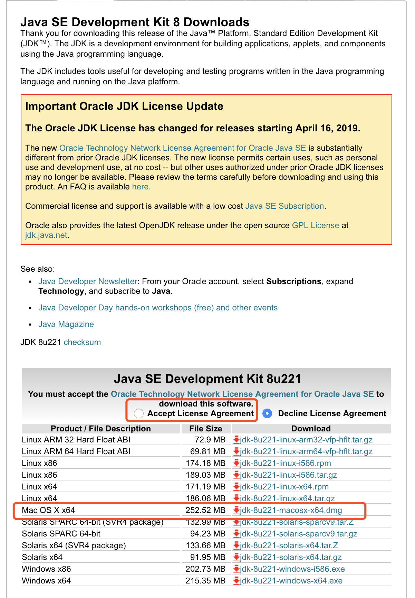

   Mac中配置方法：

   配置JAVA_HOME

   ```
   export JAVA_HOME=/Library/Java/JavaVirtualMachines/jdk1.8.0_211.jdk/Contents/Home
   ```

   在Mac上可以这样去查看

   ```bash
   ➜ /usr/libexec/java_home -V
   
   Matching Java Virtual Machines (2):
       1.8.0_211, x86_64:	"Java SE 8"	/Library/Java/JavaVirtualMachines/jdk1.8.0_211.jdk/Contents/Home
       1.7.0_80, x86_64:	"Java SE 7"	/Library/Java/JavaVirtualMachines/jdk1.7.0_80.jdk/Contents/Home
   ```

   

   Windows配置环境变量：

   JAVA_HOME: `D:\Java\jdk1.8.0`(这里是自己安装的目录)

   PATH: `%JAVA_HOME%\bin`

   CLASSPATH: `.;%JAVA_HOME%\lib;%JAVA_HOME%\lib\tools.jar`(一定要注意有一个点号)

   

3. 安装Android Studio(可选)

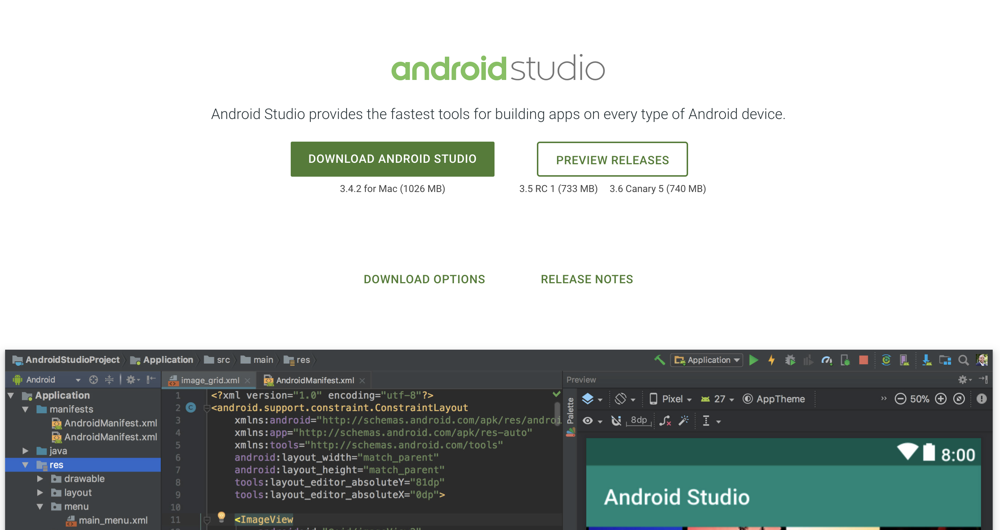


4. 安装Gradle

官方地址：https://gradle.org/install/

**Windows平台：**

步骤1. [下载](https://gradle.org/releases)最新的Gradle分发版

目前的Gradle版本是版本5.5.1，于2019年7月10日发布。分发zip文件有两种版本：

- [安装包](https://gradle.org/next-steps/?version=5.5.1&format=bin)
- [完整包](https://gradle.org/next-steps/?version=5.5.1&format=all)，有文档和来源

如有疑问，请选择仅二进制版本并在线浏览[文档](https://docs.gradle.org/current)和[来源](https://github.com/gradle/gradle)。

需要使用旧版本吗？请参阅[版本页面](https://gradle.org/releases)


步骤2. 解压Gradle安装包

`C:\Gradle`使用**文件资源管理器**创建新目录。

打开第二个**文件资源管理器**窗口，然后转到下载Gradle分发版的目录。双击ZIP存档以显示内容。将内容文件夹`gradle-5.5.1`拖到新创建的`C:\Gradle`文件夹中。

或者，您可以`C:\Gradle`使用您选择的归档工具将Gradle分发ZIP解压缩。


步骤3.  配置环境变量

在**文件资源管理器中，**右键单击`电脑`（或`我的电脑`）图标，然后单击`属性`- > `高级系统设置`- > `环境变量设置`。

在`系统变量下`选择下`Path`，然后单击`编辑`。添加条目`C:\Gradle\gradle-5.5.1\bin`。

单击“确定”保存。


步骤4.验证您的安装

打开控制台（或Windows命令提示符）并运行`gradle -v`以运行gradle并显示版本，例如：


**Mac平台**

```
brew install gradle
```


常见问题1：

端口被占用：

```bash
export PATH=$PATH:/usr/local/android-sdk-linux/
export PATH=$PATH:/usr/local/android-sdk-linux/tools
export PATH=$PATH:/usr/local/android-sdk-linux/platform-tools
export PATH=$PATH:/usr/local/android-sdk-linux/build-tools
```

需要设置成为自己的sdk的目录。


常见问题2：

daemon卡死

```bash
gradle --stop
```


#### 配置iOS打包环境

步骤1. 安装Xcode

步骤2. 安装npm依赖包

```
npm install -g ios-deploy
```

> 需要先安装xcode，再来安装ios-deploy

会打印很长的一串构建过程：

```bash
** BUILD SUCCEEDED **

/Users/itheima/.nvm/versions/node/v10.16.0/bin/ios-deploy -> /Users/itheima/.nvm/versions/node/v10.16.0/lib/node_modules/ios-deploy/build/Release/ios-deploy
+ ios-deploy@1.9.4
added 1 package from 1 contributor in 10.023s
```

步骤3. 添加ios平台

```bash
cordova platform add ios
```

步骤4. 运行ios应用

```
# build ios应用
cordova build ios

# 需要配置开发者账号
cordova run ios

# 模拟器运行
cordova emulate ios
```


常见问题：

使用`cordova requirements ios` 去查看本地的开发环境还需要配置什么

安装cocoapods的命令：

```
sudo gem install cocoapods -n /usr/local/bin

# 然后使用pod --version查看版本，pod setup进行初始化配置
pod --version
1.7.5
```


### 平台与插件的升级

**升级Cordova项目**

Cordova项目没有升级命令。相反，从项目中删除平台，然后重新添加它以获取最新版本：

```
cordova platform rm android
cordova platform add android
```

阅读更新版本中的更改非常重要，因为更新可能会破坏您的代码。查找此信息的最佳位置将在存储库和Cordova博客上发布的发行说明中。您需要彻底测试您的应用，以便在执行更新后验证它是否正常工作。

注意：某些插件可能与新版本的Cordova不兼容。如果插件不兼容，您可能能够找到满足您需要的替换插件，或者您可能需要延迟升级项目。或者，更改插件以使其在新版本下工作并回馈社区。


```
//workflow
npm install -g cordova

cordova platform rm android
cordova platform rm ios
..

// git svn
// plugin
```


**升级Cordova插件**

升级插件涉及与平台相同的过程 - 将其删除，然后重新添加。

```
cordova plugin rm some-plugin
cordova plugin add some-plugin
```


### 一个简单的示例

使用该`cordova`实用程序设置新项目，如Cordova [命令行界面中所述](https://cordova.apache.org/docs/en/latest/guide/cli/index.html)。例如，在源代码目录中：

```bash
$ cordova create hello com.example.hello "HelloWorld"
$ cd hello
$ cordova platform add osx
$ cordova prepare              # or "cordova build"
```

运行应用程序

要在桌面上运行应用程序：

```bash
$ cordova run
```

你应该看到一个带有示例应用程序的边框窗口：

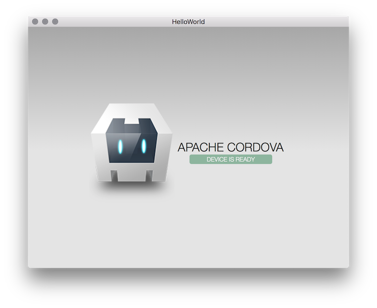

### SPA项目集成

这里我们介绍与Vue项目的集成。

1. 必要的依赖安装

   ```bash
   # 全局安装cordova
   npm i cordova -g
   
   # 全局安装@vue/cli工具
   npm i @vue/cli -g
   ```

2. 初始化Vue项目：

   ```bash
   vue create cordova-demo
   ```

   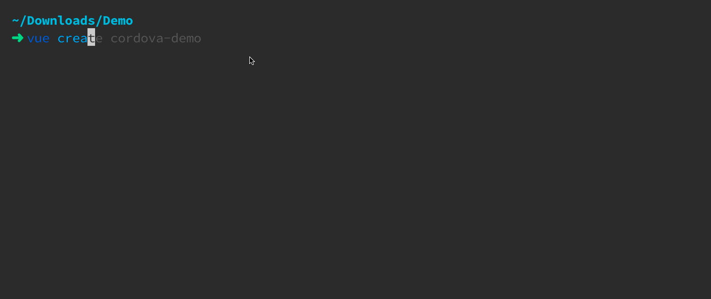

   上面演示了一种常规的SPA应用的配置

3. 创建cordova打包应用

   ```
   cordova create cordova-app
   
   # 添加特定的平台
   cordova platform add android
   cordova platform add ios
   ```

4. 配置cordova打包环境，见[3.6](#构建过程)

5. 目录结构：

   ```bash
   ├── cordova-app
   │   ├── config.xml
   │   ├── hooks
   │   ├── node_modules
   │   ├── package-lock.json
   │   ├── package.json
   │   ├── platforms
   │   ├── plugins
   │   └── www
   └── cordova-vue
       ├── README.md
       ├── babel.config.js
       ├── node_modules
       ├── package-lock.json
       ├── package.json
       ├── postcss.config.js
       ├── public
       ├── src
       └── vue.config.js
   ```

6. 配置`vue.config.js`

   ```js
   module.exports = {
       //基本路径
   	publicPath: './',
   	//输出文件目录
       outputDir: '../cordova-app/www',
       productionSourceMap:false, //不生成map
   }
   ```

7. 进行构建 vue应用

   ```bash
   npm run build 
   ```

8. 运行app，比如android

   ```bash
   cordova run android
   ```

9. 在Vue项目中使用Cordova，插件[vue-cordova](https://github.com/kartsims/vue-cordova)

   ```
   npm install --save vue-cordova
   ```

   在`main.js中`引入 

   ```js
   import VueCordova from 'vue-cordova'
   Vue.use(VueCordova)
   
   // add cordova.js only if serving the app through file://
   if (window.location.protocol === 'file:' || window.location.port === '3000') {
     var cordovaScript = document.createElement('script')
     cordovaScript.setAttribute('type', 'text/javascript')
     cordovaScript.setAttribute('src', 'cordova.js')
     document.body.appendChild(cordovaScript)
   }
   
   //测试的
   Vue.cordova.on('deviceready', () => {
     console.log('Cordova : device is ready !');
     console.log('Vue.cordova :', Vue.cordova);
   });
   ```

10. 使用camera插件

    ```
    # 在cordova-app中
    cordova plugin add cordova-plugin-camera
    ```

    测试一下

    ```
    Vue.cordova.camera.getPicture((imageURI) => {
      window.alert('Photo URI : ' + imageURI)
    }, (message) => {
      window.alert('FAILED : ' + message)
    }, {
      quality: 50,
      destinationType: Vue.cordova.camera.DestinationType.FILE_URI
    })
    ```


11. 真机调试

    方法一：Chrome/Safari进行调试，`chrome://inspect/#devices`

    如果打开是白板，那么需要添加Host

    ```bash
    # 编辑hosts文件，添加： 
    61.91.161.217 chrome-devtools-frontend.appspot.com 
    61.91.161.217 chrometophone.appspot.com
    ```

    

    方法二：

    使用weinre

    ```bash
    # 安装
    npm install weinre -g
    
    # 使用查看帮助
    weinre --help
    ```
    
    修改 `www/index.html`，添加以下代码：

    Html **代码**

    ```js
    
    ```
<script src="http://localhost:8080/target/target-script-min.js#HelloVue"></script>
    ```
    
    访问以下 URL 后，Targets 有了文件连接后，切换到 Elements 后就能调试页面了。
http://localhost:8080/client/#HelloVue
    
    **特别说明：**
    
    1. 真机测试中，不要使用localhost，使用本机IP，让手机与电脑在一个网段
2. 设置weinre端口`--httpPort 8090`，设置绑定IP`--boundHost 192.168.1.100`(举例)
    3. 测试完成之后，别忘记删除`script`标签


## Phonegap

PhoneGap是一个免费且开源的开发环境，是一个用基于HTML，CSS和JavaScript的，创建移动跨平台移动应用程序的快速开发平台。开发者可以开发出在Android、Palm、黑莓、iPhone、iTouch及iPad等设备上运行的App。其使用的是HTML和JavaScript等标准的Web开发语言。开发者使用PhoneGap进行开发，可调用加速计、GPS/定位、照相机、声音等功能。

PhoneGap的官网地址是 [PhoneGap](https://phonegap.com/)


### Phonegap入门

#### 安装桌面应用

下载并安装的新PhoneGap桌面应用程序，该应用程序目前处于测试阶段。提供Windows与Mac版本：

官方下载页面：https://github.com/phonegap/phonegap-app-desktop/releases

课程中显示的是这下面的版本：0.4.5

Mac: https://github.com/phonegap/phonegap-app-desktop/releases/download/0.4.5/PhoneGapDesktop.dmg

Windows: https://github.com/phonegap/phonegap-app-desktop/releases/download/0.4.5/PhoneGapSetup-win32.exe

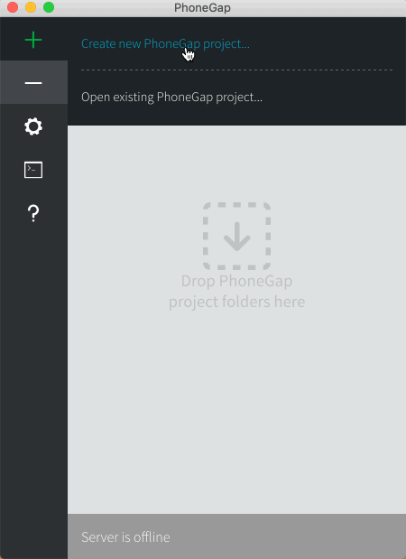


#### 安装移动应用

PhoneGap Developer应用程序适用于多个平台，可让您在移动设备上运行PhoneGap项目，无需进行代码签名或编译。

> **Due to Apple guidelines, the PhoneGap Developer App has been removed from the iOS App Store. New users will be unable to download. No impact to Android or Windows versions.**

PhoneGap目前不支持，直接下载ios PhoneGap应用。

[Windows下载链接](http://www.windowsphone.com/en-us/store/app/phonegap-developer/5c6a2d1e-4fad-4bf8-aaf7-71380cc84fe3)

[Android下载链接](https://play.google.com/store/apps/details?id=com.adobe.phonegap.app)


#### 创建新的PhoneGap应用


phoneGap提供了很多种快速入门的模板：

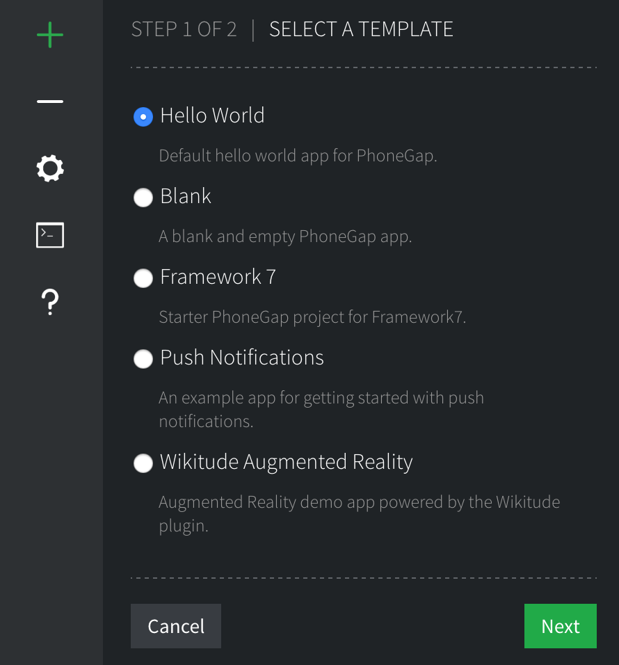


#### 开始调试

打开移动应用，输入IP与端口，点击Connect:（如图示，为http://192.168.31.103;3000与上图进行对应）

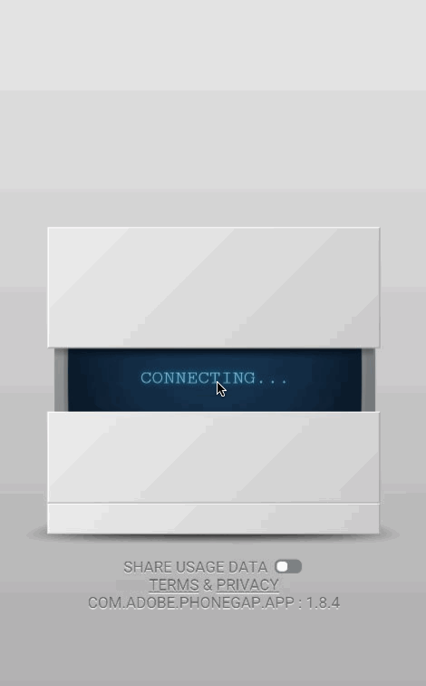


### PhoneGap build简介

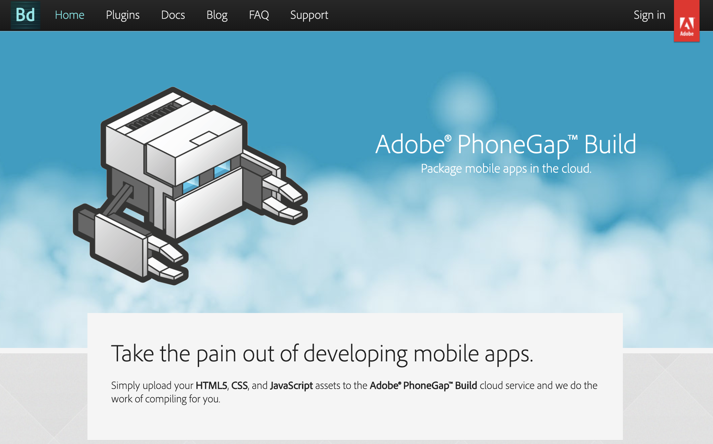

只需将您的**HTML5**，**CSS**和**JavaScript**资产上传到**Adobe®PhoneGap™Build**云服务，我们就会为您进行编译工作。

> Simply upload your **HTML5**, **CSS**, and **JavaScript** assets to the **Adobe® PhoneGap™ Build** cloud service and we do the work of compiling for you.

特点：

- 云服务
- 支持多平台打包
- 团队协作
- 快速部署，分享应用


**关于icon与splash启动页面的在线生成工具：**

icon：https://makeappicon.com/

iOS Splash：http://ios.hvims.com/

Android Launcher Icon Generator：https://romannurik.github.io/AndroidAssetStudio/icons-launcher.html

Cordova icon的自定义说明：https://cordova.apache.org/docs/en/latest/config_ref/images.html

Cordova定义启动页面：https://cordova.apache.org/docs/en/latest/reference/cordova-plugin-splashscreen/index.html


**设计指南：**

Apple的Icon与图片设计指南：

https://developer.apple.com/design/human-interface-guidelines/ios/icons-and-images/app-icon/

Android设计指南：

http://iconhandbook.co.uk/reference/chart/android/


指南网站：

http://iconhandbook.co.uk/reference/chart/


### Phonegap第三方库

https://phonegap.com/tool/

## Ionic

免费和开源，Ionic提供了一个移动和桌面优化的HTML，CSS和JS组件库，用于构建高度交互的应用程序。可以与Angular，React，Vue或纯JavaScript一起使用。

Ionic应用程序主要通过Ionic命令行实用程序（“CLI”）创建和开发，并使用Cordova构建/部署为本机应用程序。

Ionic是Angular的衍生品，Angular是单独的JS库，和jQuery一样能够独立用于开发应用，而Ionic只是对Angular进行了扩展，利用Angular实现了很多符合移动端应用的组件，并搭建了很完善的样式库，是对Angular最成功的应用样例。即使不使用Ionic，Angular也可与任意样式库，如Bootstrap、Foundation等搭配使用，得到想要的页面效果。

> Currently, Ionic Framework has official integration with [Angular](https://angular.io/), but support for **Vue** and **React** are in development. If you’d like to learn more about Ionic Framework before diving in, we [created a video](https://youtu.be/p3AN3igqiRc) to walk you through the basics.


### Ionic与Cordova

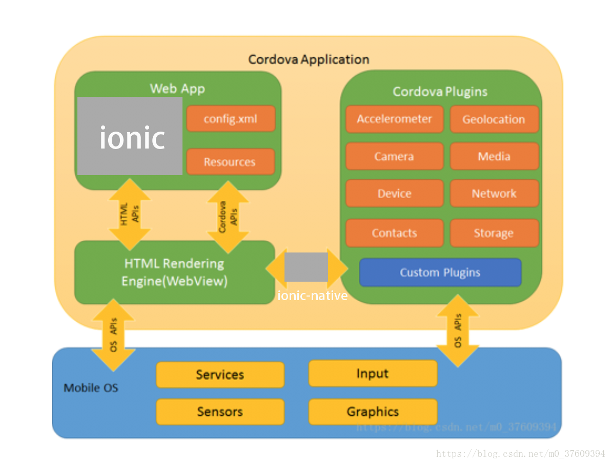

### 起步与使用

使用Node和NPM设置，让我们安装Ionic和Cordova CLI。

```
$ npm install -g ionic cordova
```

> 注意：这`-g`意味着这是全局安装，因此对于Windows，您需要打开Admin命令提示符。对于Mac / Linux，您可能需要运行该命令`sudo`。

完成后，创建您的第一个Ionic应用程序：

```
$ ionic start helloWorld 
```

要运行您的应用程序，请`cd`进入已创建的目录，然后运行 `ionic serve`命令以在浏览器中直接测试您的应用程序！

```
$ cd helloWorld
$ ionic serve
```


### VSCode配置

配置vscode以对ionic+angular支持：

Angular Extension Pack:

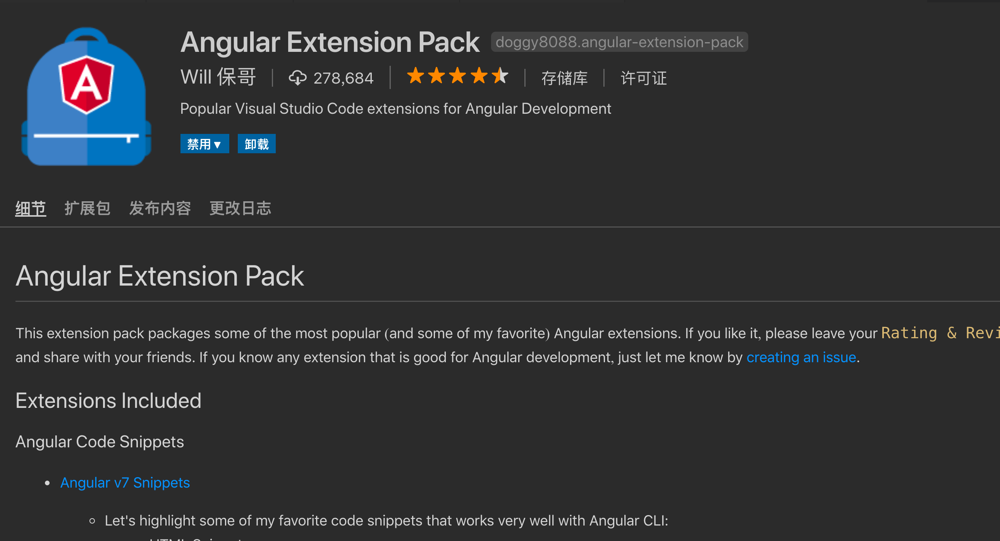

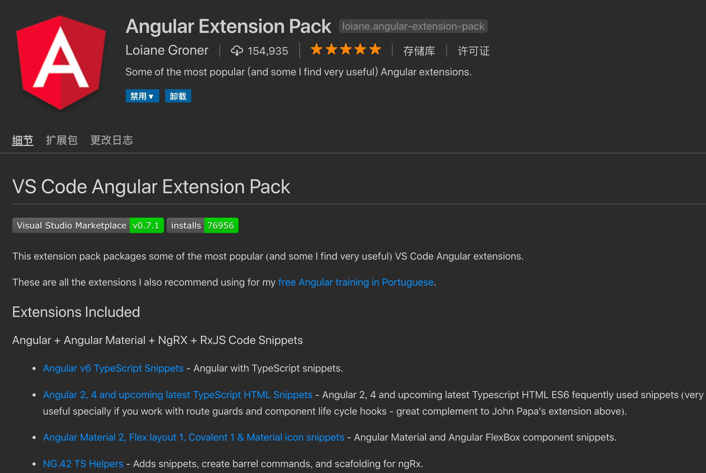

Ionic Extension Pack:

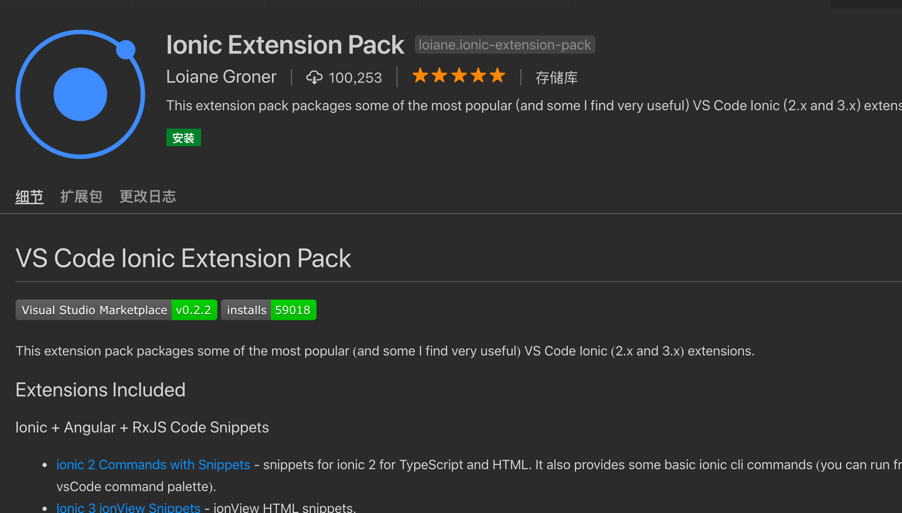


TypeScript保存自动修复：

在VSCode的`settings.json`中加入

```json
  "editor.codeActionsOnSave": {
    "source.fixAll.tslint": true
  },
```


### 核心概念

ionic是一个混合App开发框架，ionic以Angularjs和Cordova为基础，使用npm进行模块管理，使用HTML\CSS\JS进行App开发。

- UI组件

  Ionic Framework是一个UI组件库，它是可重用的元素，用作应用程序的构建块。ionic组件是用网络标准使用HTML，CSS和JavaScript。虽然这些组件是预先构建的，但它们是从头开始设计的，可以高度自定义，因此应用程序可以将每个组件都自己制作，从而使每个应用程序都拥有自己的外观和感觉。更具体地说，Ionic组件可以轻松地主题化，以在整个应用程序中全局更改外观。有关自定义外观的更多信息，请参阅[主题化](https://ionicframework.com/docs/theming/basics)。

  

- 跨平台

  Platform Continuity是Ionic Framework的内置功能，允许应用程序开发人员在多个平台上使用相同的代码库。每个Ionic组件都会将其外观调整为运行应用程序的平台。例如，Apple设备（如iPhone和iPad）使用Apple自己的[iOS设计语言](https://www.apple.com/ios)。同样，Android设备使用Google的设计语言[Material Design](https://material.io/guidelines/)。

  通过在平台之间进行细微的设计更改，用户可以获得熟悉的应用体验。从Apple的App Store下载的Ionic应用程序将获得iOS主题，而从Android Play商店下载的Ionic应用程序将获得Material Design主题。对于从浏览器中被视为渐进式Web应用程序（PWA）的应用程序，Ionic将默认使用Material Design主题。此外，决定在某些场景中使用哪个平台是完全可配置的。有关平台连续性的更多信息，请参阅[主题化](https://ionicframework.com/docs/theming/basics)。

  

- 路由(使用Angular-router)

  传统的网络应用程序使用线性历史记录，这意味着用户可以向前导航到某个页面，并可以点击后退按钮进行导航。这方面的一个例子是点击维基百科，用户在浏览器的线性历史堆栈上前进和后退。

  相比之下，移动应用程序通常使用并行的“非线性”导航。例如，选项卡式界面可以为每个选项卡分别设置导航堆栈，确保用户在导航和切换选项卡时不会失去位置。

  Ionic应用程序采用这种移动导航方法，支持也可以嵌套的并行导航历史，同时保持Web开发人员熟悉的熟悉的浏览器式导航概念。

  对于使用Angular构建的应用程序`@ionic/angular`，我们建议使用开箱即用的[Angular Router](https://angular.io/guide/router)，用于每个新的Ionic 4 Angular应用程序。Ionic的早期版本附带了我们自己的定制路由器，但为了提供最佳的工具和开发人员体验，我们已经转向使用框架推荐的路由器。

  

- 主题化

  在核心，Ionic Framework是使用[CSS](https://developer.mozilla.org/en-US/docs/Web/CSS)构建的，它允许我们利用[CSS属性（变量）](https://developer.mozilla.org/en-US/docs/Web/CSS/Using_CSS_variables)提供的灵活性。这使得设计一个看起来很棒的应用程序非常容易，同时遵循Web标准。我们提供一组颜色，以便开发人员可以拥有一些很棒的默认值，但我们鼓励覆盖它们以创建与品牌，公司或所需调色板相匹配的设计。从应用程序的背景颜色到文本颜色的所有内容都可以完全自定义。有关应用主题的更多信息，请参阅[主题化](https://ionicframework.com/docs/theming/basics)。


目录介绍：

**resources** : android/ios 资源(更换图标和启动动画) 

**src**: 开发工作目录，页面、样式、脚本和图片都放在这个目录下 

**www**: 静态文件，ionic build --prod 生成的单页面静态资源文件 

**platforms**: 生成 android 或者 ios 安装包需要的资源---(cordova platform add android 后 会生成) 

**plugins**: 插件文件夹，里面放置各种 cordova 安装的插件 

**config.xml**: 打包成 app 的配置文件

**package.json**: 配置项目的元数据和管理项目所需要的依赖

**ionic.config.json**、**ionic.starter.json**:ionic 配置文件 

**angular.json** angular 配置文件 

**tsconfig.json:** TypeScript 项目的根目录，指定用来编译这个项目的根文件和编译选项

 **tslint.json**:格式化和校验 typescript 


### Ionic相关的资源介绍

Ionic官网：[https://ionicframework.com](https://ionicframework.com/)，同[ionic.io](https://ionicframework.com)

Ionic Github: [https://github.com/ionic-team/ionic](https://github.com/ionic-team/ionic)

Ionic中文： http://www.ionic.wang/js_doc-index.html

Ionic Icons: https://ionicons.com/

Ionic Native: https://github.com/ionic-team/ionic-native


### Ionic CLI

#### 创建模板项目

```
ionic start
```

使用start命令快速创建ionic项目：

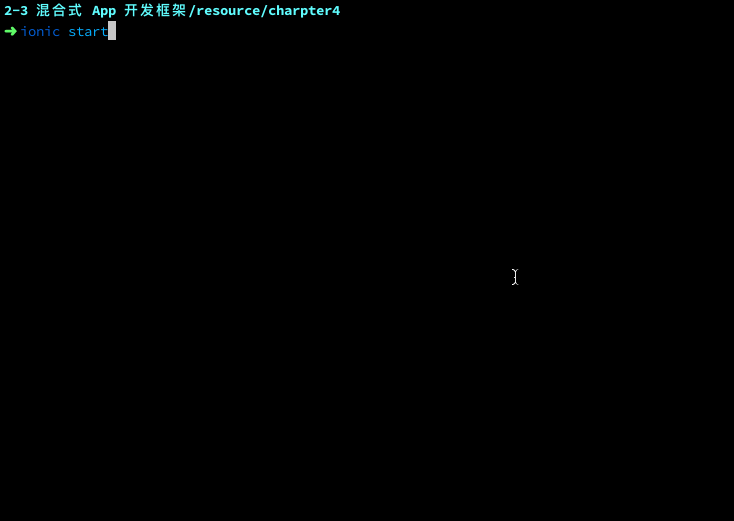


#### 资源文件的处理

```
npm i -g cordova-res
```

用法介绍：

```
cordova-res --help
```


此工具将裁剪和调整JPEG和PNG源图像的大小，以便为iOS和Android设备生成图像。

`cordova-res` 必须在Cordova项目的根目录下运行，例如：

```
resources/
├── icon.png
└── splash.png
config.xml
```

- `resources/icon.png` 必须至少1024×1024px
- `resources/splash.png` 必须至少为2732×2732px

还支持Android [自适应图标](https://developer.android.com/guide/practices/ui_guidelines/icon_design_adaptive)。如果您选择使用它们，请创建以下附加文件：

- `resources/android/icon-foreground.png` 必须至少432×432px
- `resources/android/icon-background.png` 必须至少432×432px

如果使用自适应图标，则不会生成常规Android图标。

通过使用`--icon-background-source`十六进制颜色代码指定选项，例如，也可以将颜色用于图标背景`--icon-background-source '#FFFFFF'`

#### Ionic默认模板

查看ionic提供的模板：

```
$ ionic start --list
```

结果 ：

```
Starters for @ionic/angular (--type=angular)

name         | description
--------------------------------------------------------------------------------------
tabs         | A starting project with a simple tabbed interface
sidemenu     | A starting project with a side menu with navigation in the content area
blank        | A blank starter project
my-first-app | An example application that builds a camera with gallery
conference   | A kitchen-sink application that shows off all Ionic has to offer


Starters for @ionic/react (--type=react)

name       | description
------------------------------------------------------------------------------------
blank      | A blank starter project
sidemenu   | A starting project with a side menu with navigation in the content area
tabs       | A starting project with a simple tabbed interface
conference | A kitchen-sink application that shows off all Ionic has to offer


Starters for Ionic 2/3 (--type=ionic-angular)

name     | description
----------------------------------------------------------------------------------------------------------------
tabs     | A starting project with a simple tabbed interface
sidemenu | A starting project with a side menu with navigation in the content area
blank    | A blank starter project
super    | A starting project complete with pre-built pages, providers and best practices for Ionic development.
tutorial | A tutorial based project that goes along with the Ionic documentation
aws      | AWS Mobile Hub Starter


Starters for Ionic 1 (--type=ionic1)

name     | description
---------------------------------------------------------------------------------------------
tabs     | A starting project for Ionic using a simple tabbed interface
sidemenu | A starting project for Ionic using a side menu with navigation in the content area
blank    | A blank starter project for Ionic
maps     | An Ionic starter project using Google Maps and a side menu
```


命令的使用方式：

```
ionic start <name> <template> [options]
```

关于template及上面的名称

options支持如下参数：

`--list`

`--type=`

​	目前支持的Type：`angular`, `react`, `ionic-angular`, `ionic1`

两个打包构建平台：`--cordova`，`--capacitor`

> capacitor的介绍：https://capacitor.ionicframework.com/

`--id=`


命令示例：

```bash
ionic start myapp blank --type=angular --cordova
```


**ionicApp flow:**

- 注册ionic账号

- 创建ionic App得到对应的App ID

  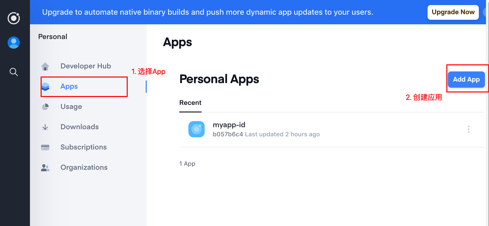

- start命令创建一个ionic项目，可以选择`github`或者ionic git，指定一个SSH key

  ```
  ionic start myapp blank --type=angular --cordova --id=b057b6c4
  ```

  代码推送

  ```bash
  git add .
  git commit -m "指定注释"
  git push ionic master
  ```

  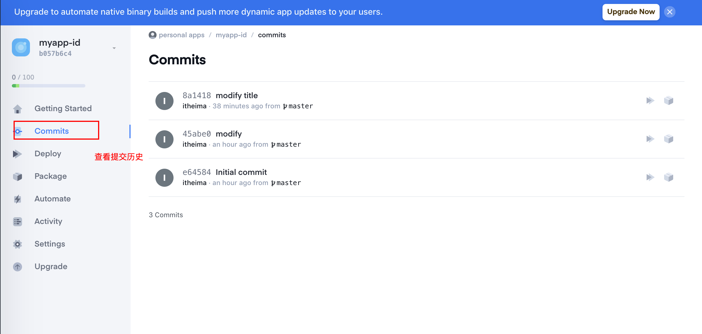

- Deploy指定channel，热更新`master channel`

  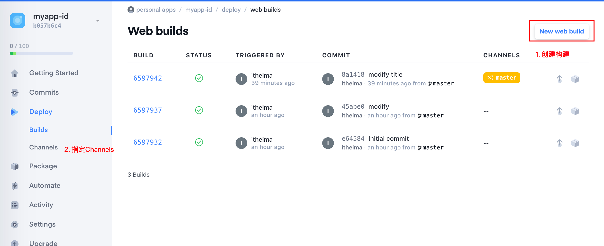

  ```
  ionic deploy add \
  --app-id="b057b6c4" \
  --channel-name="Master" \
  --update-method="background"
  ```

  git推送到远程ionic repo，然后在手机上停留30s-1min，杀死进程，重启App，就可以得到更新了。

  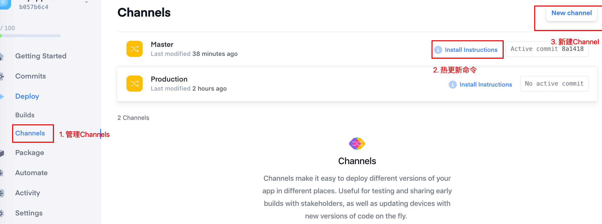


#### Ionic与Cordova相关的构建命令

**平台相关用法：**

```bash
ionic cordova platform [<action>] [<platform>] [options]
```

例子：

```bash
ionic cordova platform
ionic cordova platform add ios
ionic cordova platform add android
ionic cordova platform rm ios
```


**查看构建环境：**

```bash
ionic cordova requirements [<platform>] [options]
```

跟`cordova requirements`一样，提供构建检查 。


**prepare命令：**

```bash
ionic cordova prepare [<platform>] [options]
```

将文件复制到Cordova平台，为本机构建做好准备。

`ionic cordova prepare` 将执行以下操作：

- 执行Ionic构建，将Web应用编译为**www /**。
- 将**www /**目录复制到Cordova平台。
- 将**config.xml**转换为特定于平台的清单文件。
- 将图标和启动屏幕从**资源/**复制到Cordova平台。
- 将插件文件复制到指定的平台。

如果您使用Android Studio或Xcode运行项目，则可能希望使用`ionic cordova prepare`去为构建作准备。

例子：

```bash
ionic cordova prepare
ionic cordova prepare ios
ionic cordova prepare android
```


工作流：

git 管理代码-> 初始化操作 -> .gitignore (platform)-> git pull/ git clone -> npm install -> ionic cordova prepare

-> git push 


**插件相关：**

```bash
ionic cordova plugin [<action>] [<plugin>] [options]
```

例子：

```
ionic cordova plugin
ionic cordova plugin add cordova-plugin-inappbrowser@latest
ionic cordova plugin add phonegap-plugin-push --variable SENDER_ID=XXXXX
ionic cordova plugin rm cordova-plugin-camera
```


### iOS及Android打包

根据您的目标平台和需求，有许多不同的选项可以测试本机功能。

- 实行 [平台检测](https://ionicframework.com/docs/building/cross-platform) 用于本机功能和测试 `ionic serve`
- [部署到iOS](https://ionicframework.com/docs/building/ios)
- [部署到Android](https://ionicframework.com/docs/building/android)
- 立即使用部署到iOS和Android [Ionic DevApp](https://ionicframework.com/docs/building/running#ionic-devapp)


Ionic DevApp扩展了Ionic Framework的功能，可以直接在设备上轻松测试应用程序。DevApp提供实时更改的实时视图，并提供丰富的预安装本机插件库，以测试应用程序的本机功能。

无需安装复杂的Native SDK - 只需一个简单的命令，`ionic serve`在安装DevApp的任何地方运行的应用程序将立即可供预览，LiveReload可在创建后立即刷新更改。

iOS平台：https://itunes.apple.com/us/app/ionic-devapp/id1233447133?ls=1&mt=8

Android平台：https://play.google.com/store/apps/details?id=io.ionic.devapp&hl=en

安装DevApp后，注册或登录Ionic帐户。

> DevApp是每个Ionic帐户附带的免费服务。

确保运行DevApp的设备和计算机位于同一网络上，然后`ionic serve`从项目目录中的命令行运行。

随着`ionic serve`运行，开放DevApp然后从当前运行的应用程序列表中的应用程序。

```
// 监听了所有局域网的请求
ionic serve --address=0.0.0.0

// menu -> ip + port
```

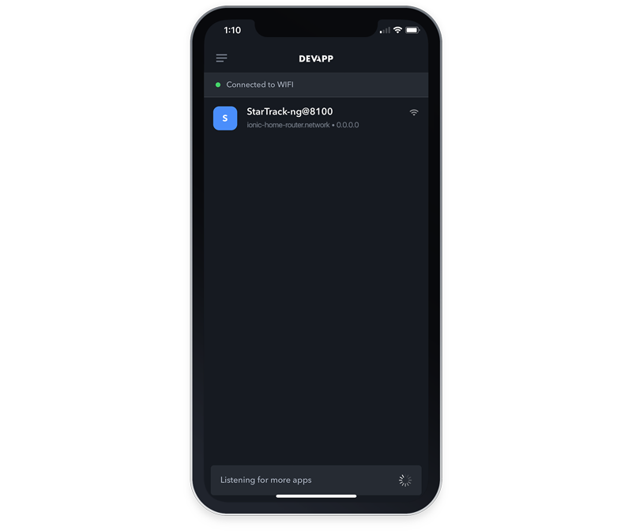

现在，如果应用程序调用任何本机功能，DevApp可以处理此问题并实际返回正确的本机实现。

DevApp有一个它支持的选择插件列表:

```
card.io.cordova.mobilesdk 2.1.0 "CardIO"
com-intel-security-cordova-plugin 2.0.3 "APP Security API"
com.darktalker.cordova.screenshot 0.1.5 "Screenshot"
com.paypal.cordova.mobilesdk 3.5.0 "PayPalMobile"
cordova-admob-sdk 0.8.0 "AdMob SDK"
cordova-base64-to-gallery 4.1.2 "base64ToGallery"
cordova-instagram-plugin 0.5.5 "Instagram"
cordova-launch-review 2.0.0 "Launch Review"
cordova-plugin-3dtouch 1.3.5 "3D Touch"
cordova-plugin-actionsheet 2.3.3 "ActionSheet"
cordova-plugin-add-swift-support 1.6.2 "AddSwiftSupport"
cordova-plugin-admob-free 0.10.0 "Cordova AdMob Plugin"
cordova-plugin-advanced-http 1.8.1 "Advanced HTTP plugin"
cordova-plugin-app-event 1.2.0 "Application Events"
cordova-plugin-apprate 1.3.0 "AppRate"
cordova-plugin-battery-status 1.2.4 "Battery"
cordova-plugin-ble-central 1.1.4 "BLE"
cordova-plugin-bluetooth-serial 0.4.7 "Bluetooth Serial"
cordova-plugin-brightness 0.1.5 "Brightness"
cordova-plugin-calendar 4.6.0 "Calendar"
cordova-plugin-camera 2.4.1 "Camera"
cordova-plugin-compat 1.1.0 "Compat"
cordova-plugin-contacts 2.3.1 "Contacts"
cordova-plugin-datepicker 0.9.3 "DatePicker"
cordova-plugin-device 1.1.6 "Device"
cordova-plugin-device-motion 1.2.5 "Device Motion"
cordova-plugin-device-orientation 1.0.7 "Device Orientation"
cordova-plugin-dialogs 1.3.3 "Notification"
cordova-plugin-email-composer 0.8.7 "EmailComposer"
cordova-plugin-geolocation 2.4.3 "Geolocation"
cordova-plugin-globalization 1.0.7 "Globalization"
cordova-plugin-health 1.0.0 "Cordova Health"
cordova-plugin-image-picker 1.1.1 "ImagePicker"
cordova-plugin-inappbrowser 1.6.1 "InAppBrowser"
cordova-plugin-insomnia 4.3.0 "Insomnia (prevent screen sleep)"
cordova-plugin-ionic 1.1.8 "IonicCordova"
cordova-plugin-ios-keychain 3.0.1 "KeyChain Plugin for Cordova iOS"
cordova-plugin-media 3.0.1 "Media"
cordova-plugin-mixpanel 3.1.0 "Mixpanel"
cordova-plugin-music-controls 2.0.0 "MusicControls"
cordova-plugin-nativeaudio 3.0.9 "Cordova Native Audio"
cordova-plugin-nativestorage 2.2.2 "NativeStorage"
cordova-plugin-network-information 1.3.3 "Network Information"
cordova-plugin-request-location-accuracy 2.2.1 "Request Location Accuracy"
cordova-plugin-safariviewcontroller 1.4.7 "SafariViewController"
cordova-plugin-screen-orientation 2.0.1 "Screen Orientation"
cordova-plugin-secure-storage 2.6.8 "SecureStorage"
cordova-plugin-shake 0.6.0 "Shake Gesture Detection"
cordova-plugin-sim 1.3.3 "SIM"
cordova-plugin-splashscreen 4.0.3 "Splashscreen"
cordova-plugin-statusbar 2.2.4-dev "StatusBar"
cordova-plugin-stripe 1.5.3 "cordova-plugin-stripe"
cordova-plugin-taptic-engine 2.1.0 "Taptic Engine"
cordova-plugin-themeablebrowser 0.2.17 "ThemeableBrowser"
cordova-plugin-touch-id 3.2.0 "Touch ID"
cordova-plugin-tts 0.2.3 "TTS"
cordova-plugin-vibration 2.1.5 "Vibration"
cordova-plugin-whitelist 1.3.2 "Whitelist"
cordova-plugin-x-socialsharing 5.1.8 "SocialSharing"
cordova-plugin-x-toast 2.6.0 "Toast"
cordova-plugin-zip 3.1.0 "cordova-plugin-zip"
cordova-promise-polyfill 0.0.2 "cordova-promise-polyfill"
cordova-sms-plugin 0.1.11 "Cordova SMS Plugin"
cordova-sqlite-storage 2.0.4 "Cordova sqlite storage plugin"
cordova-universal-clipboard 0.1.0 "Clipboard"
de.appplant.cordova.plugin.local-notification 0.8.5 "LocalNotification"
de.appplant.cordova.plugin.printer 0.7.1 "Printer"
ionic-plugin-keyboard 2.2.1 "Keyboard"
phonegap-plugin-barcodescanner 6.0.7 "BarcodeScanner"
phonegap-plugin-mobile-accessibility 1.0.5-dev "Mobile Accessibility"
uk.co.workingedge.phonegap.plugin.launchnavigator 4.0.4 "Launch Navigator"
```


### Angular相关介绍

应用入口文件**app.module.ts**介绍

```js
//ionic angular的核心文件
import { NgModule } from '@angular/core';
import { BrowserModule } from '@angular/platform-browser';
import { RouteReuseStrategy } from '@angular/router';

import { IonicModule, IonicRouteStrategy } from '@ionic/angular';
//ionic打包成app以后配置启动画面 以及导航条的服务  
import { SplashScreen } from '@ionic-native/splash-screen/ngx';
import { StatusBar } from '@ionic-native/status-bar/ngx';

//引入路由配置文件
import { AppRoutingModule } from './app-routing.module';
//引入根组件
import { AppComponent } from './app.component';

@NgModule({
  declarations: [AppComponent],  //申明组件
  entryComponents: [], //配置不会在模板中使用的组件
  imports: [BrowserModule, IonicModule.forRoot(), AppRoutingModule],   //引入的模块 依赖的模块
  providers: [  //配置服务
    StatusBar,
    SplashScreen,
    { provide: RouteReuseStrategy, useClass: IonicRouteStrategy }
  ],
  bootstrap: [AppComponent]
})
export class AppModule {}
```


路由匹配:

App的主路由：

```js
import { NgModule } from '@angular/core';
import { PreloadAllModules, RouterModule, Routes } from '@angular/router';

const routes: Routes = [
  { path: '', loadChildren: './tabs/tabs.module#TabsPageModule' },
  { path: 'button', loadChildren: './button/button.module#ButtonPageModule' }
];
@NgModule({
  imports: [
    RouterModule.forRoot(routes, { preloadingStrategy: PreloadAllModules })
  ],
  exports: [RouterModule]
})
export class AppRoutingModule {}

```


### Ionic常用组件介绍

#### Tab控件

#### button

#### Input

#### Loading

#### Alert

#### Toast

#### Grid布局

#### Modal

#### Toolbar控件

#### Card

#### Navigation


### Ionic中的网络请求

### Ionic Native


### 实际项目应用ionic+Angularjs


## 补充学习

### 自建PhoneGap iOS开发者应用

前题：

- 您必须是注册的Apple开发人员（年99刀）。
- 必须为开发者帐户/密钥配置安装该应用程序的iOS设备。
- 必须自己完成以下步骤


官方消息（需要翻墙），[消息1](https://twitter.com/phonegap/status/982022400085712896?source=post_page---------------------------)，[消息2](https://twitter.com/Ionicframework/status/981341279610134528?source=post_page---------------------------)，PhoneGap开发者应用程序和一些类似的应用程序已从Apple iOS App Store中删除。Apple决定更严格地解释他们自己的[App Store评论指南](https://developer.apple.com/app-store/review/guidelines/?source=post_page---------------------------#software-requirements)。

> 注意：这只会影响iOS App商店，Android用户仍然可以从[Google Play商店](https://play.google.com/store/apps/details?id=com.adobe.phonegap.app&source=post_page---------------------------)下载PhoneGap开发者应用。

**解决方案：**

您可能不了解的PhoneGap开发者应用程序，它是开源的，这意味着任何人都可以自己去构建它。事实上，它也是一个PhoneGap应用程序，这意味着你甚至不需要自己构建它，可以使用[PhoneGap Build](https://build.phonegap.com/apps?source=post_page---------------------------)。

1. 转到[https://github.com/phonegap/phonegap-app-developer](https://github.com/phonegap/phonegap-app-developer?source=post_page---------------------------)给它一个星，因为你知道，有些人认为这是一个成功项目的标志，一些团队得到了明星奖励，但大多数只是告诉开发人员，喜欢他们正在做什么。


2.fork一份项目到自己的github上。

3.编辑文件`phonegap-app-developer/config.xml`并更改`name`，并`id`以任何你喜欢的，并提交。


4.转到PhoneGap Build（[https://build.phonegap.com/apps](https://build.phonegap.com/apps?source=post_page---------------------------)）并创建一个新应用程序。


> 注意：如果您还没有注册，则需要注册。您还需要遵循iOS的签名步骤。此处详细解释了签名：[http](http://docs.phonegap.com/phonegap-build/signing/ios/?source=post_page---------------------------)：[//docs.phonegap.com/phonegap-build/signing/ios/](http://docs.phonegap.com/phonegap-build/signing/ios/?source=post_page---------------------------)

5.输入您的github网址，然后点击“从.git存储库拉取”。


6.完成后，单击iOS选项卡，然后选择您的签名密钥。


7.单击“重建”按钮，并给它一分钟。完成后，抓住手机并打开并下载应用。


恭喜！您已经为自己构建了开发人员应用程序。


### Cordova中文网

https://cordova.axuer.com/

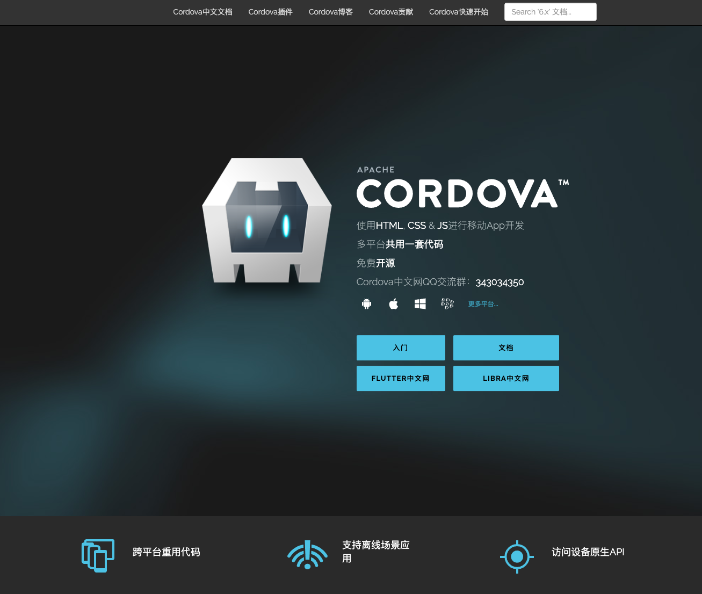

中文文档：

https://cordova.axuer.com/docs/zh-cn/latest/

### Cordova核心插件

下面的示例显示了如何根据需要添加插件，以便在升级到3.0版之后，您在项目中使用的任何Cordova API仍然有效。对于每个命令，您需要选择目标平台，并引用平台的项目目录。

- cordova-plugin-battery-status

  ```bash
  plugman install --platform <ios|android> --project <directory> --plugin cordova-plugin-battery-status
  ```

- cordova-plugin-camera

  ```bash
  plugman install --platform <ios|android> --project <directory> --plugin cordova-plugin-camera
  ```

- cordova-plugin-console

  ```bash
  plugman install --platform <ios|android> --project <directory> --plugin cordova-plugin-console
  ```

- cordova-plugin-contacts

  ```bash
  plugman install --platform <ios|android> --project <directory> --plugin cordova-plugin-contacts
  ```

- cordova-plugin-device

  ```bash
  plugman install --platform <ios|android> --project <directory> --plugin cordova-plugin-device
  ```

- cordova-plugin-device-motion (accelerometer)

  ```bash
  plugman install --platform <ios|android> --project <directory> --plugin cordova-plugin-device-motion
  ```

- cordova-plugin-device-orientation (compass)

  ```bash
  plugman install --platform <ios|android> --project <directory> --plugin cordova-plugin-device-orientation
  ```

- cordova-plugin-dialogs

  ```bash
  plugman install --platform <ios|android> --project <directory> --plugin cordova-plugin-dialogs
  ```

- cordova-plugin-file

  ```bash
  plugman install --platform <ios|android> --project <directory> --plugin cordova-plugin-file
  ```

- cordova-plugin-file-transfer

  ```bash
  plugman install --platform <ios|android> --project <directory> --plugin cordova-plugin-file-transfer
  ```

- cordova-plugin-geolocation

  ```bash
  plugman install --platform <ios|android> --project <directory> --plugin cordova-plugin-geolocation
  ```

- cordova-plugin-globalization

  ```bash
  plugman install --platform <ios|android> --project <directory> --plugin cordova-plugin-globalization
  ```

- cordova-plugin-inappbrowser

  ```bash
  plugman install --platform <ios|android> --project <directory> --plugin cordova-plugin-inappbrowser
  ```

- cordova-plugin-media

  ```bash
  plugman install --platform <ios|android> --project <directory> --plugin cordova-plugin-media
  ```

- cordova-plugin-media-capture

  ```bash
  plugman install --platform <ios|android> --project <directory> --plugin cordova-plugin-media-capture
  ```

- cordova-plugin-network-information

  ```bash
  plugman install --platform <ios|android> --project <directory> --plugin cordova-plugin-network-information
  ```

- cordova-plugin-splashscreen

  ```bash
  plugman install --platform <ios|android> --project <directory> --plugin cordova-plugin-splashscreen
  ```

- cordova-plugin-vibration

  ```bash
  plugman install --platform <ios|android> --project <directory> --plugin cordova-plugin-vibration
  ```


更多插件参见：http://doc.wex5.com/cordova-plugins/


### Gradle构建优化

#### 开启daemon

开启daemon很简单，以Mac为例，在家目录下的`.gradle/gradle.properties`文件（如没有，可需要新建文件），加上如下的代码即可。

```
`org.gradle.daemon=true`
```

或者传递gradle参数

```
`./gradlew task --daemon `
```

为了确保gradle配置生效，建议使用gradle —stop停止已有的daemon。

```
`./gradlew --stop `
```

再次执行gradle任务就可以应用daemon了，留意的话，可以看到类似这样的日志输出。

```
`Starting a Gradle Daemon (subsequent builds will be faster)`
```

#### 设置heap大小

为Gradle分配足够大的内存，则可以同样加速编译。如下修改文件`gradle.properties`

```
`org.gradle.jvmargs=-Xmx5120m -XX:MaxPermSize=2048m -XX:+HeapDumpOnOutOfMemoryError -Dfile.encoding=UTF-8 `
```

由于Flipboard依赖繁多，且文件也多，并结合自身设备8G内存，这里为Gradle分配最大5G。效果目前看起来不错，大家可以根据自己的情况不断调整得到一个最优的值。

#### 开启offline

开启offline之后，可以强制Gradle使用本地缓存的依赖，避免了网络读写操作，即使是需要从网络进行检查这些依赖。

```
`./gradlew --offline taskName `
```

如上使用时，加上—offline参数即可。

注意，如果是某个依赖在本地不存在，则会编译出错，解决方法，只需要暂时关闭offline,等依赖下载到本地后，在后续的执行中加入offline即可。

#### 设置并行构建

现在的工程往往使用了很多模块，默认情况下Gradle处理多模块时，往往是挨个按顺序处理。可以想象，这种编译起来会有多慢。好在Gradle提供了并行构建的功能，可以让我们充分利用机器的性能，减少编译构建的时间。

修改`gradle.properties`文件

```
`org.gradle.parallel=true `
```

或向gradle传递参数

```
`./gradlew task --parallel `
```

当我们配置完成，再次执行gradle task，会得到类似这样的信息，信息标明了开启Parallel以及每个task使用的线程信息。

```
`./gradlew clean --info  Parallel execution is an incubating feature. ....... :libs:x:clean (Thread[Task worker Thread 3,5,main]) completed. Took 0.005 secs. :libs:xx:clean (Thread[Daemon worker Thread 3,5,main]) started. :libs:xxx:clean (Thread[Task worker Thread 2,5,main]) completed. Took 0.003 secs. :libs:xxxx:clean (Thread[Task worker Thread 3,5,main]) started. :libs:xxxxx:clean (Thread[Task worker Thread 2,5,main]) started. :libs:xxxxxx:clean (Thread[Task worker,5,main]) completed. Took 0.004 secs. :libs:json-gson:clean (Thread[Task worker,5,main]) started. `
```


参考文章：[关于加速Gradle构建](https://droidyue.com/blog/2017/04/16/speedup-gradle-building/)


### 加速brew下载

**替换现有上游**

```
git -C "$(brew --repo)" remote set-url origin https://mirrors.tuna.tsinghua.edu.cn/git/homebrew/brew.git

git -C "$(brew --repo homebrew/core)" remote set-url origin https://mirrors.tuna.tsinghua.edu.cn/git/homebrew/homebrew-core.git

brew update
```

**复原**

```
git -C "$(brew --repo)" remote set-url origin https://github.com/Homebrew/brew.git

git -C "$(brew --repo homebrew/core)" remote set-url origin https://github.com/Homebrew/homebrew-core

brew update
```


**Homebrew-bottles**

临时替换

```
export HOMEBREW_BOTTLE_DOMAIN=https://mirrors.tuna.tsinghua.edu.cn/homebrew-bottles
```

**长期替换**

```
echo 'export HOMEBREW_BOTTLE_DOMAIN=https://mirrors.tuna.tsinghua.edu.cn/homebrew-bottles' >> ~/.bash_profile
source ~/.bash_profile
```

### 加速Android SDK下载

什么是Android SDK

SDK：（software development kit）软件开发工具包。被软件开发工程师用于为特定的软件包、软件框架、硬件平台、操作系统等建立应用软件的开发工具的集合。而 Android SDK 就是 Android 专属的软件开发工具包。
加速下载的方法

由于 Google 服务器在中国大陆无法正常访问，Android SDK 无法正常更新，给安卓开发者带来诸多不便。下面介绍几种网上找到的加速 Android SDK 更新的方法。

#### 修改 hosts 文件

在使用 Android SDK Manager 的时候，主要会连接到两个地址 dl.google.com 和 dl-ssl.google.com，key发现这两个地址都是无法正常访问的，如何解决呢？我们可以通过修改 hosts 文件，将上面的地址定向到能正常访问的 Google 服务器。我们可以使用站长工具的超级 ping 来查找可用IP。

打开地址：http://ping.chinaz.com/，分别测试 dl.google.com 和 dl-ssl.google.com 的IP地址，将获取到的IP写入C:\Windows\System32\drivers\etc\hosts文件。

#### 使用国内镜像源

先在这里推荐几个：
1.mirrors.neusoft.edu.cn //东软信息学院
2.ubuntu.buct.edu.cn/ubuntu.buct.cn //北京化工大学
3.mirrors.opencas.cn (mirrors.opencas.org/mirrors.opencas.ac.cn) //中国科学院开源协会
4.sdk.gdgshanghai.com 端口：8000 //上海GDG镜像服务器
5.mirrors.dormforce.net //（栋力无限）电子科技大学

其中，强烈推荐电子科技大学的镜像源！
使用方法：
启动 Android SDK Manager ，打开主界面，依次选择「Tools」、「Options…」，弹出『Android SDK Manager – Settings』窗口；
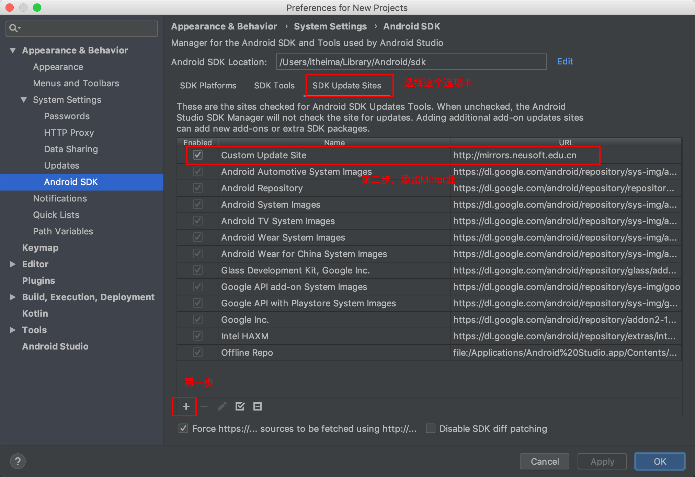

下载提速：

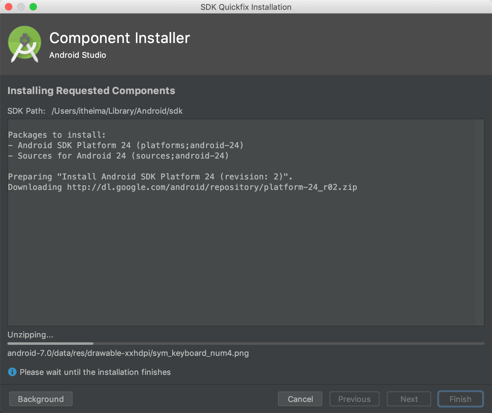


### 参考资料

1. [Building Hybrid Mobile Apps](https://www.wavemaker.com/learn/hybrid-mobile/building-hybrid-mobile-apps/)

   很好一篇入门学习混合App的架构的文章

2. [Hybrid VS Native App: Which one to choose for your business?](https://existek.com/blog/hybrid-vs-native-app/)

   这篇文章里面介绍到了混合App与原生App的特点，以及如何进行选择