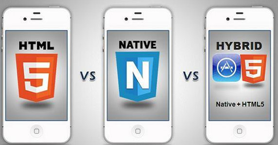
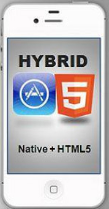

# H5结合原生开发App(Hybird App)

## 第一章 如何开发App

### 目标

1. 了解App分类
2. 了解不同App的开发方式
3. 了解App开发哪些需要前端参与

### 导读

​	App开发，首先需要明确分类是什么，不同类型的App，开发方式是不一样的，我们会介绍现有App的分类,以及开发他们分别需要掌握什么技术。

​	无论你是否了解**App**开发,通过本章的学习，希望你知道在App开发中哪些需要咱们前端参与。

### App分类

​	相信大伙都用过App,**App** 主要指的是在手机上运行的第三方应用程序.但是如何开发App可能就不知道啦,并且不同类型的App开发起来用到的技术是不同的,所以咱们首先得搞明白App有哪些分类。

​	这里说的分类是站在开发人员的角度,不是用户的角度所以不要说什么:聊天类,外卖类…,那么站在开发人员的角度App主要有哪几类呢?

1. NativeApp(原生应用)
2. webApp(网页应用)
3. HybirdApp(混合应用)

目前就是这三种类型的App

### NativeApp

​	NativeApp也叫原生应用，指的是基于手机操作系统开发的第三方应用程序,通俗来说绝大多数通过应用商店下载,点击对应图标运行的就是这一类。

​	开发这一类App,需要使用对应操作系统厂商提供的开发工具,编写对应的代码,使用系统提供的功能,最后上传到应用商店,让用户安装使用，因为是直接下载使用，并且使用的原生技术，界面、交互、流畅度都是最好的。

​	但是手机的操作系统目前主流有两种:**iOS**,**Android**,并且不同操作系统中开发原生App的代码是不同的,一套代码不能通用,所以如果需要针对iOS跟Android平台开发原生App,需要有对应的开发人员,成本较高。

​	换个说法就是NativeApp用最高的开发成本，提供最好的用户体验。有没有成本低一些的开发方式呢？

### webApp

​	Web App不需要安装，通过HTML、CSS和JavaScript等网站技术实现,可以在任意浏览器中执行功能的网站类应用，跟普通网站的区别是，常规的网站主要用来进行数据的展示，Web App主要侧重于功能，通俗点来说就是：用web技术实现的App。

​	因为只需要浏览器即可运行，所以可以跨平台，一套代码多端复用，开发速度快，成本低，同时用户无需安装，代码在服务器用户也无需手动更新，听起来是不是很美。但依赖于网站技术，不同浏览器的显示差异，是开发者需要考虑的，而网速以及浏览器本身的性能限制，都会的影响用户体验，而最重要的一点就是现在前端技术无法实现所有的原生功能，而这部分功能的缺失，可能会极大的影响用户体验。

​	综上：webApp就是用很低的开发成本，最短的开发周期，提供不太好的用户体验。那么有没有结合两者优点的应用程序呢?

### HyBirdApp

​	HyBirdApp也叫混合应用，开发需要结合前端技术和原生技术，这也是为什么它叫混合应用。因为结合了两种技术，所以既拥有 Web 开发的速度优势，又同时能拥有强大的原生能力，也是咱们这个阶段的学习重点，后面的章节会重点介绍它，所以这里不再展开。

### 总结

​	本章三种不同的App分类，原生应用，网页应用，混合引用，对于前端开发人员而言，需要我们参与只有webApp，和Hybrid App ，原生技术部分的内容一般有专门的开发人员去处理大家不用担心。