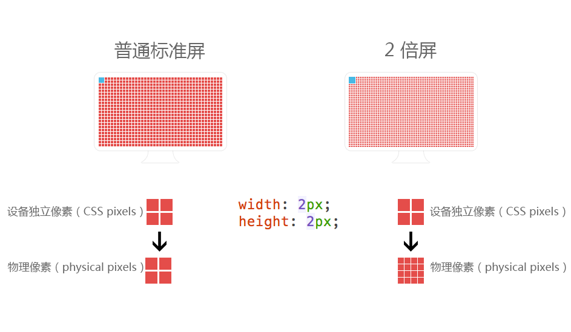
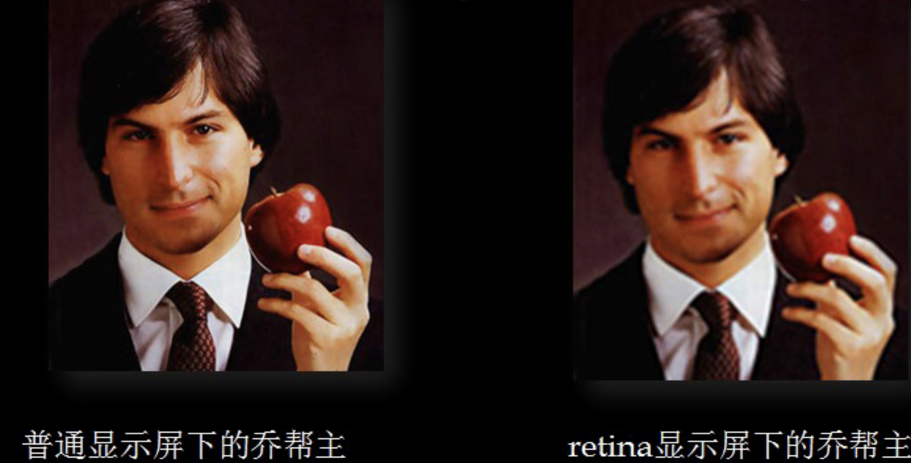
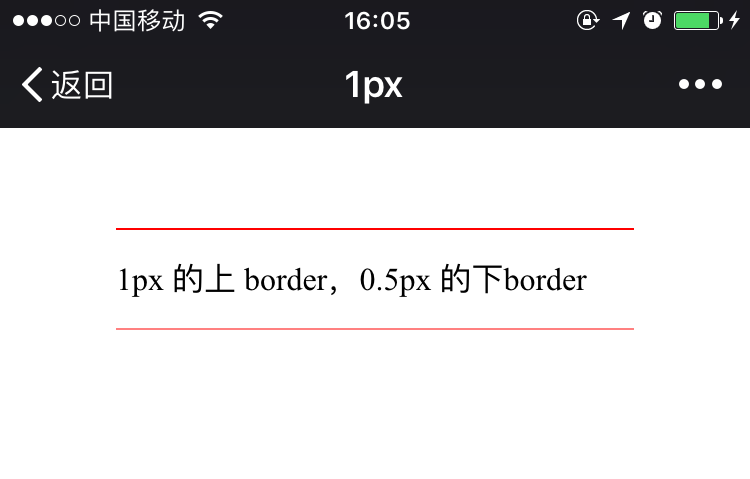
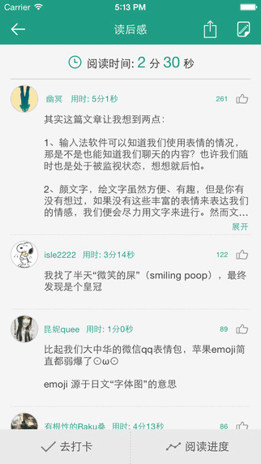

## 第三章 HyBirdApp界面开发

虽然混合应用开发的界面部分就跟移动端网页开发基本一样，但如果直接把移动端网页原封不动的丢到混合应用中运行，显示效果肯定要打折扣，在一些细节上显示的会不够细腻，主要原因有两点：

1. 前端在适配屏幕时处理不当，导致布局走样或者间距不合适，从而影响显示效果；
2. 网页渲染对硬件适配能力存在不足，容易出现模糊现象，导致界面不精细。

总结起来，我们需要集中解决这两个问题，即页面适配和精细还原设计稿。

### 目标

1. 移动端页面适配方案
2. 设计稿的还原方案


### 3.1 页面适配
移动端页面适配是前端开发领域的老问题了。随着系统和设备的更新迭代，目前只要在页面头部设置 viewport 适配代码，再配合 flex 弹性布局，基本上适配大部分的页面。

```css
//viewport适配代码
<meta name="viewport" content="width=device-width, initial-scale=1, user-scalable=no, minimum-scale=1.0, maximum-scale=1.0">
```

但上述方式只能实现相对“粗略”的适配，即便设置了 viewport，不同手机间的像素差异仍然很大。市面上常见尺寸中，宽度最小的手机只有 320px，最大的 iPhone 8 Plus 却达到了 414px，这种情况下想用 px 实现精细布局已不太可能。我们需要一种可以随屏幕宽度变化而变化的相对单位，才能做到真正的适配。目前，rem 方案的可靠性和兼容性已经得到业内的广泛认可，这里我们也推荐一种非常简单的基于 rem 的适配方案。

但上述方式只能实现相对“粗略”的适配，即便设置了 viewport，不同手机间的像素仍然存在差异。市面上常见尺寸中，宽度最小的手机只有 320px，最大的 iPhone 8 Plus 却达到了 414px，这种情况下想用 px 实现精细布局已不太可能。我们需要一种可以随屏幕宽度变化而变化的相对单位，才能做到真正的适配。目前，rem 方案的可靠性和兼容性已经得到业内的广泛认可，这里也推荐一种非常简单的基于 rem 的适配方案。

适配原理是先假定我们的屏幕宽度为 640px，此时将根节点（html）字号设置为 10px，即 “1rem=10px”，进而得到屏幕总宽度等于 64rem。

```css
html{font-size:10px;}

/* 此时屏幕宽度 = 64rem */
```

当以此标准实现的页面运行在其他设备上时，我们只要通过改变根节点的字号，使“屏幕总宽度=64rem”这个等式始终成立就可以了，之前的做法是使用 JavaScript 检测屏幕宽度，然后计算出 rem 的值。

```js
var html=document.documentElement;
var rootSize = html.clientWidth / 640 * 10;
html.style.fontSize=rootSize+'px' 
```

得益于规范的推广和手机系统的更新，如今我们用 CSS 也能实现相同效果，因为新规范中有一个 vw 单位，能够以屏幕宽度为单位1，实现任意百分比例的取值，即：

```css
屏幕宽度=100vw
```

关联我们需要实现的等式`屏幕宽度 = 64rem`，可以得到：/

```css
100vw = 64rem
```

进而得到：

```css
1rem = 1.5625vw
```

实际上这样就实现了**屏幕总宽度恒等于 64 rem**，然后就可以愉快的使用 rem 单位做可以适配任何屏幕的精确布局了。

以上是理论，实际上这里会产生一个 Bug。由于多数屏幕的宽度都小于 640px，计算出来的 rem 也会小于 10px，但 WebKit 内核会强制将最小字号锁定在 12px，这将直接导致我们的适配等式无法成立，从而在应用中出现较大的偏差，所以实际开发中我们要将根节点（html）字号矫正为 15.625vw ，适配等式就变成了“屏幕总宽度=6.4rem”，那么“1rem=100px”，可以绕过 WebKit 的限制，同时开发中的换算压力也不大。

说了这么多，真正需要写的代码只有一行：

```css
html { font-size: 15.625vw;}
```

此时在 640px 宽度的页面中，1rem=100px，且无论在任何尺寸的手机上都会保持这个比例，简单的应用示例如下：

```html
<div style="width: 3.2rem;height:3.2rem;background:hotpink;">
  在任何手机屏幕上都显示为屏幕宽度50%的正方形
</div>
```

前端基于这套适配方案开发，**需要将设计稿宽度约定为 640px**，当在设计稿上量取20px时，代码中只要除以100，就可以很简单的换算得到 0.2rem。

如果设计稿宽度不是 640px（设计稿尺寸往往大于640px），也没有关系，这时可以有两种做法，一是根据实际设计稿尺寸修改根字号的值，但可能出现在算根字号的时候除不尽，勉强四舍五入的话，就会产生适配偏差，不推荐这么做；另一种做法就简单了，直接把设计稿的宽度修改为640px，也是推荐大伙使用的方法。

### 3.2设计稿还原

提升网页的精细程度可以从两方面入手，一是使用技术手段排除显示层面的模糊现象，二是用心还原设计意图。

#### 显示模糊-图片模糊

常见的显示模糊有两种情况，一是图片模糊，二是边框模糊，有经验的前端开发者应该对这两个问题都不陌生。


图片模糊的原因是手机屏幕的可测量尺寸与物理像素尺寸不一致，通常 Web 前端会习惯性的将图片尺寸切成可测量尺寸，而**图片显示最清晰的状态应该是图片尺寸与显示屏的物理像素尺寸一致的时候**。

以iPhone8的屏幕为例，添加 viewport 适配代码以后，屏幕的可测量宽度为 375px，但这块屏幕的物理像素宽度却是 750px，说明这块屏幕的像素比（DPR）是2，也就是说显示的时候会用2个物理像素去模拟一个像素，来提高屏幕的显示精度。





如果在这块屏幕上显示图片，理论上一张宽度375px的图片已经可以自动全屏了，但由于图片的像素数过低，包含的信息量不够分配给每一个物理像素，显示的时候就会通过插值算法生成更多的像素，去分配给物理像素显示，这必定会导致图片的显示锐度下降。而如果图片本身宽度就是 750px 的话，所包含的像素信息就正好能够分配给每一个物理像素，此时便可在这块屏幕上呈现最佳的显示效果。

也不是图片只要够大就没问题，图片尺寸大了将直接影响加载速度和内存占用，所以还要根据实际情况做取舍。如果是 App 的界面素材，通常会随 Hybrid App 打包进本地，这时不需要考虑加载速度，可以适当增大图片尺寸，目前主流机型的屏幕宽度最大就是 1080px，切图时可以参考这个值取适当大小的切片。而如果是业务中的远程图片，考虑到加载速度，单张图片大小不宜过大，建议控制在 50k 以内，如果后端能自动压缩图片最好，否则就只能控制图片的尺寸了。

个别情况也可以例外，例如产品详细页，通常只有几张产品大图，并发不会太多，而且通常会做成切换显示效果，第一时间只会显示第一张图片，这些因素就为图片加载创造了很好的条件。因此为了保证显示效果，将产品图做大一点也没有关系。

但如果是带缩略图的产品列表页，就一定要严格控制缩略图尺寸了，原因有两点，产品列表首屏显示6-10个产品很正常，这就是6-10个图片并发，图片加载慢的话很容易让加载时间超过1s，影响用户体验。另外产品列表通常会做成滚动加载，随着用户浏览加载的图片越来越多，手机的内存占用也会急剧上升，App的运行会更耗电。

总而言之，本地图片尽量做大，远程图片根据需求和场景做适当取舍，不能只为了显示清晰而丢了加载速度。

#### 显示模糊-边框问题

边框模糊也就是经典的 1px 边框问题，其产生的原因，从本质上来讲，跟图片模糊的原因一样。用 CSS 画出的 1px 只是可测量尺寸上的 1像素，不能保证就是物理层面上的1像素。在视网膜屏成为标配的今天，CSS 画的 1px 边框基本上都会被呈现为物理像素 2px 或 3px，到了界面上就会显得不精细，跟原生显示的真正1像素有明显差异。



1px 问题的解法有很多，其中利用 transform 所实现的方法应该是最方便的解法了,结合为元素和媒体查询。代码如下所示：

```css
.border-bottom{border-bottom:1px solid #ccc;}

@media screen and (-webkit-min-device-pixel-ratio: 2) { 
  .border-bottom{position:relative;border:0;}
  .border-bottom:before{
    position: absolute;
    right: 0;
    bottom: 0;
    left: 0;
    height: 1px;
    content: '';
    transform: scaleY(.5);
    background-color: #ccc;
  }
}
```

这样显示出来的是真正的1像素边框，看上去非常锐利，显得界面更精致。

#### 还原设计

还原设计这个点其实没有太多可说的，作为前端开发应该对设计稿进行还原。但在PC 时代还原设计还好说，毕竟直接量设计稿就可以达到像素级别的精度，但在混合应用开发中，压根就不存在什么像素级还原。因为最终的界面要跑在各种不同尺寸的屏幕上，这个界面是没有标准答案的，我们前端能做的只能是在所有屏幕上都尽可能的还原“设计意图”，不至于让界面看上去跟设计稿不是一回事。

这里简单提一下比较容易出问题的两个点。

**首先是字号设置**。我们使用的 rem 适配方案，理论上只要所有单位都用 rem 实现，是可以将设计稿完美适配到所有屏幕的，但文字是界面上比较特殊的一类元素，它们的适配逻辑并不应该简单的仿效布局适配。对于阅读性文字理应设置成一个最适合阅读的固定尺寸（px），大屏就显示的多一些，小屏就显示的少一些，而不是随着屏幕宽度增加而等比增大字号；修饰性文字则完全可以使用 em 单位做相对缩放，这样从逻辑上更能体现其与父元素之间的关系，而不是强调其与屏幕宽度之间的关系，这一点当手机横屏显示时差异非常大，使用 rem 单位的文字在横屏下会大的离谱，甚至会直接导致布局失效。



所以我们通常还是会用 px 或者 em 单位进行字号设置。但这样做也存在问题，就是只要稍微设置不当，就显得文字与周围布局不协调，从而破坏设计意图。这时候可以反复调整字号大小，并对比观察界面和设计稿，直到它们看上去感觉一样为止。

```css
/*阅读类文本使用固定像素*/
.p{font-size:14px;}

/*标题类文本使用相对字号*/
.pro_title{font-size:1.2em;}
.channel_title{font-size:1.8em;}
```

除了字号以外，有些间距设置有时也不应该使用 rem 单位，究其根本还是因为它们从内在逻辑上就跟屏幕宽度没关系，比如说下图文字列表的 padding：


这个间距从设计意图上说，是列表项文字的“呼吸空间”，它的大小应该只跟文字大小有关系，凡是这种地方，都没有办法“像素级”还原设计稿，我们只能用心调试，去忠实的还原设计意图。其中em是相对单位，相对于父元素的字体大小。

```css
/*使用em单位设置文字间距*/
.item{...;padding: 1.2em;}
```

总结下来，凡是跟布局无关的地方，其实都不太适合用 rem 单位，这些地方都需要我们认真对待，避免失真，只有所有细节都做好了，才能整体呈现出较高的还原度。

### 总结

​	在混合应用的界面开发中，在处理好了页面适配之后，尽可能精细的还原设计稿，对于图片和线段的显示模糊知道如何解决，不同于PC网页，移动端设计稿在还原时因为屏幕尺寸不一，无法做到像素级别还原，这时就需要根据设计意图进行还原。