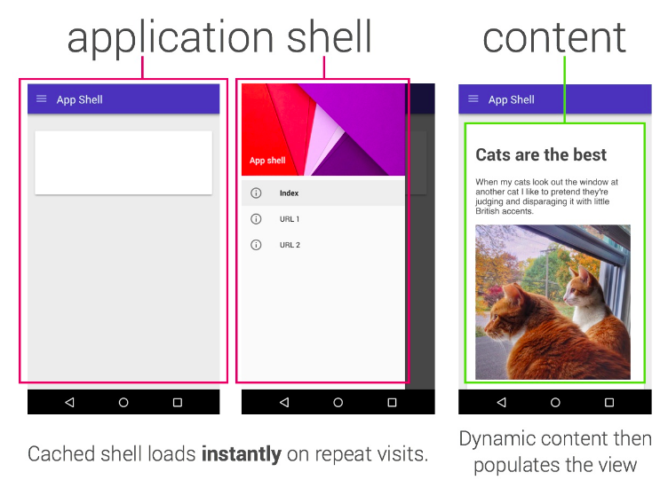
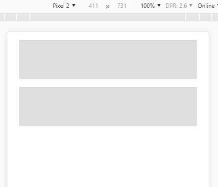
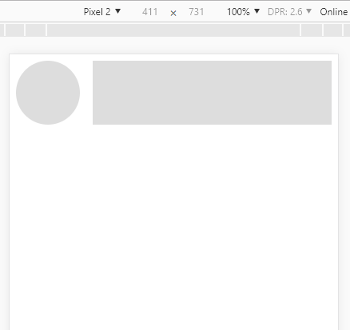
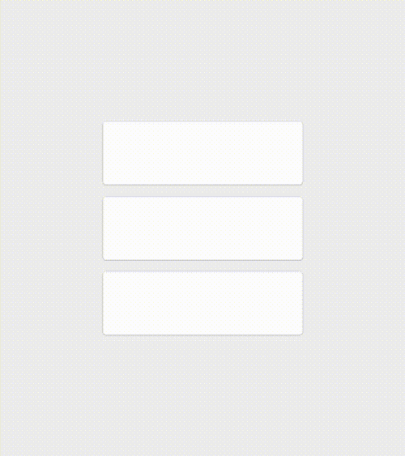
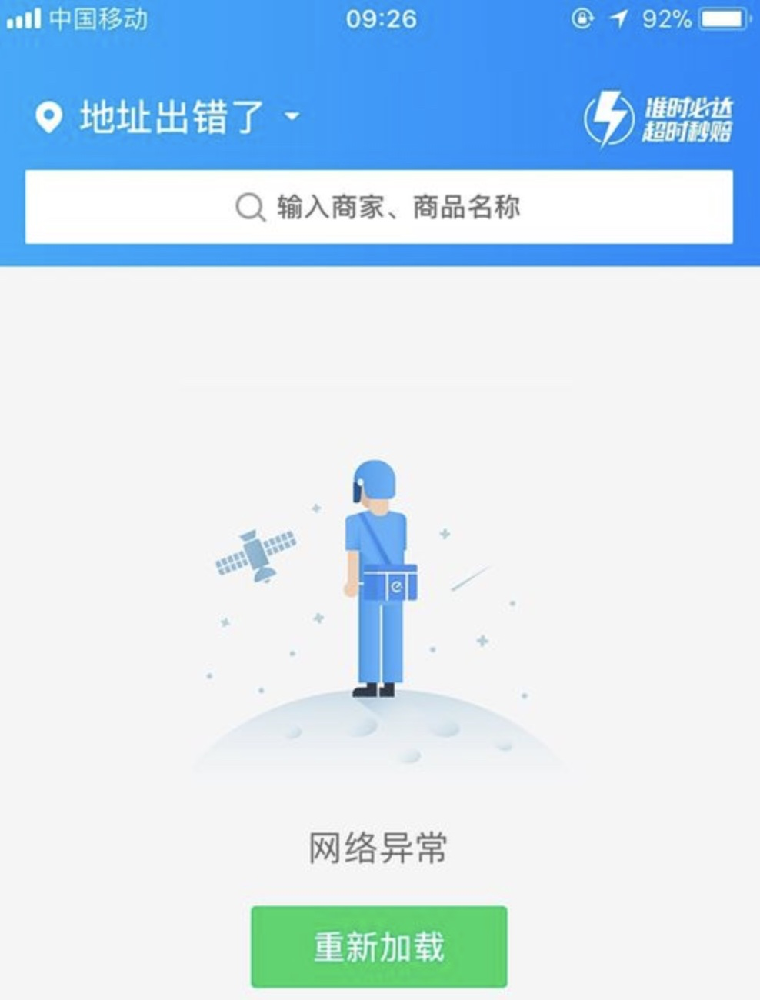
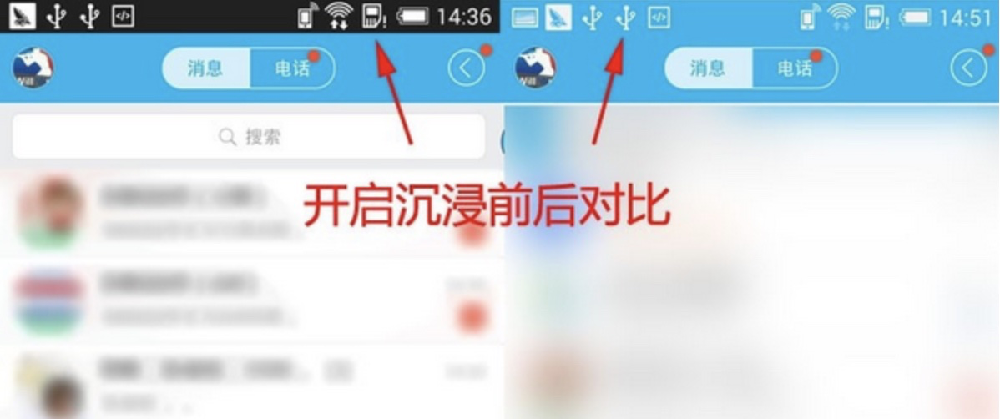

## 第四章 Hybrid App 优化体验


“优化”是前端开发中非常重要的一个课题。Web 属于 BS 架构，客户端只是一个浏览器，资源基本在服务端管理，Web 页面在资源加载方面具有天然劣势，体验和性能都与 CS 架构的 App 不可同日而语，因此围绕加载提速、呈现提速的有了各种优化手段，而这些也是 Web 前端的日常，但是在混合应用中有如何使用呢，本章将为你揭晓？

#### 目标

1. 了解HyBird App中前端优化的内容
2. 了解HyBrid App中原生优化的内容

#### 4.1页面加载优化

在Web开发中用到的加载提速，呈现提速这些优化手段在 Hybrid App 开发中多数仍然适用。

Hybrid App 会将页面打包到本地，资源加载问题虽然得到了一定程度上的缓解，但不代表我们就可以完全无视加载问题。实际上以当今手机的平均性能水平来看，如果页面的 CSS 和脚本体积过大，仍然可能造成肉眼可见的渲染延迟，这在 App 中是不能容忍的。

造成渲染延迟的原因，第一是由于静态资源读取慢，第二是手机的运算能力普遍不足，导致页面绘制时间和脚本执行时间过长，所以 Hybrid App 开发中我们仍然要对页面性能严格要求，务必保证页面打开后立即呈现。其中涉及代码压缩合并、CSS 性能、JS 性能等问题属于前端基础知识，这里不再展开。

#### 4.2图片加载优化

图片是最能拖慢页面显示速度的元素，在图片扎堆的列表页上这个问题最为严重，如果有必要我们也可以采用 Web 中常用的图片懒加载技术，但懒加载的本质是分散加载时间，提升首屏展示速度，资源总加载时间并没有减少，所以如果首屏显示不是特别迟滞，使用懒加载的意义并不大。给图片提速最好的解决方式是缓存，有条件可以使用 CDN 加速，没条件可以在 App 端做图片缓存，但这需要结合原生能力。


#### 4.3数据加载优化

App 界面除了页面自身结构外，往往还有很多内容是由异步数据渲染出来的。对于这些业务数据，我们没办法要求“立即呈现”，在等待数据的过程中，我们可以从三个方面着手提升体验，首先是让页面框架先加载，内容区域填充占位内容，给用户造成立即呈现的错觉；其次要显示生动且合理的加载动画，缓解用户的等待焦虑；再次从数据源着手提速，可以考虑加带宽，或者减少单次请求数据量等方式，给接口提速，毕竟这才是一切问题的根源。

第一种优化手段也有一个别名做骨架屏，即实现一个只包含布局骨架的页面，每次先加载，内容区域可以填充一些占位元素，等待异步数据就绪再填充真实内容：



骨架屏的重点是占位元素的实现，大致分两种方式。

一种是手写占位元素，数据回来之后，然后用真实内容的 DOM 元素直接替换

另一种思路是利用真实内容的 DOM 结构和样式占位。

其中第一种代码大概思路如下

```css
<style>
.shell .placeholder-block {
    display: block;
    height: 5em;
    background: #ddd;
    margin: 1em;
}
</style>
<div class="shell">
    <div class="placeholder-block"></div>
    <div class="placeholder-block"></div>
</div>
```

效果如下图所示：



这种方式比较简单直接，但缺点是占位元素的样式需要单独维护，如果整个项目涉及多处不同的占位元素，工作量就比较大了。

第二种是为真实Dom在占位状态下叠加一个样式用来呈现 loading 状态，我们看下面这段代码：

```css
<style>
.list{overflow:hidden;}
.list .avat{float: left;width:5em;height: 5em;overflow:hidden;border-radius: 2.5em;margin-right: 1em;}
.list .title{height: 5em;overflow:hidden;}
/*占位元素通用类*/
.placeholder .avat {
    background: #ddd;
}
.placeholder .title{
    background: #ddd;
}
</style>
<div class="list placeholder">
    <div class="avat"></div>
    <div class="title"></div>
</div>
```

效果如下图所示：



当真实内容渲染后，需要将占位状态的叠加类去掉，最终效果差别不多，大伙可以根据需求选取使用的方案。

#### 4.4缓解焦虑

如果各种技术手段都上了，仍然觉得不够“快”，那么还有最后一个体验优化思路，就是当用户操作时给以积极的界面反馈，从而吸引用户注意力，避免等待焦虑，比如给按钮做一个绚丽的点击动画、给控件做一个漂亮的过渡动画，添加一个有意思的loading动画等等，都属于这一类优化方式，说白了就是障眼法，但效果不错。




#### 4.5App优化

之前讨论的是前端可以参与的优化方案，但HyBrid App中最终呈现给用户是App的外观，无法跟网页一样"刷新”，需要自己维护自己的生老病死，对于自己不同的状态需要进行处理，这点跟Vue的生命周期钩子类似，初次参与HyBrid App开发的前端程序员需要适应。

##### 网络状态管理
网络状态管理，包括请求异常处理和网络异常处理。当请求出现异常时，我们需要捕获异常，使界面呈现恰当的内容，比如在内容区域填充异常提示界面，或者给用户恰当的弹窗或气泡提示。这需要我们的异步请求方法能够集中处理异常，大概的代码思路如下：

```javascript
//ajax错误处理
catchAjaxError = function(code, status) {
    switch (code) {
        case 0:
            // 网络错误，请检查网络连接！
            break;
        case 1:
            // 请求超时！
            break;
        case 2:
            // 授权错误！
            break;
        case 3:
            // 服务端数据异常！
            break;
        default:
            // 服务端错误!
    }
};
```

当监听到设备离线时，所有的异步数据都将不可用，此时 App 将无法正常提供服务，此时我们可以让 App 跳转到一个异常页面以提示用户，大家在日常使用时 应该讲过这类洁面




##### 状态栏处理

随着全面屏在愈发流行，软件层面与之配合的沉浸式状态栏也逐渐成为了手机系统的标配，开启沉浸式特性的确会使 App 的界面设计呈现出更好的整体效果，大伙可以看看图片中的两种洁面，右边的更具有沉浸式体验。这种系统层面的优化手段，使用成本低，产出效果好，我们应该积极响应,这种特性通常只需要一个简单的配置就可以实现,大伙可以根据自己的框架选型找到设置的方法。




##### 适当引入原生能力

当有些需求超出 Web 前端能力范围的时候，我们只能借助原生能力实现。比如打电话,亦或者 App 开发经常会遇到的输入框需求，希望新页面打开后输入框立即获取焦点，并自动弹出软键盘，这个功能使用纯前端能力无法完美实现，如果这个需求对产品确实非常重要，那么就只能结合原生来实现。

如何引入原生能力取决于开发采用的框架，通常的混合应用开发框架都有自己的原生插件生态，可以从插件库里找到自己需要的插件，具体的插件需要结合开发框架选型来决定，下一章会详细介绍不同的框架，这里不做展开。


#### 总结

本章集中介绍了HyBird App开发中可能会遇到的优化点，以及对应的优化方案。希望你能够了解它跟Web前端开发体验优化的关系和区别，在日后参与到HyBirdApp开发中给出合理的体验优化方案。