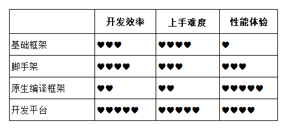

## 第五章 Hybrid App 开发框架对比

本章会横向对比几大HyBird App开发框架，旨在帮助大伙在技术选型时有一个参考的依据。目前可供选择的混合应用开发框架大致可以分为五类：基础框架、脚手架、原生编译框架、开发平台、自研框架。

### 目标

1. 了解混合应用开发框架的分类
2. 了解不同混合应用开发框架的区别

### 基础框架

基础框架是指以 WebView 与原生 API 交互为核心的经典混合应用开发框架，典型代表是 Cordova、Phonegap，早期还有 Interl XDK，不过已经停止维护。

Cordova 提供了跨平台的交互机制、插件机制，理论上可以在框架基础上实现任意混合开发需求。但它也存在我们在之前提到的两大问题，第一：前端只能做成 SPA（Single Page Application）；第二：插件生态相对不够丰富。带来的结果就是前端交互体验受限，另外部分个性化需求可能需要自己开发原生插件，需要额外的原生力量投入。开发成本视需求而定，性能体验比较差，基本上无法用于商业产品，仅适合简单的信息展示类或者工具类 App 项目。

### 脚手架

脚手架是指在基础框架的基础上做 UI 层封装，典型代表是 Ionic，其底层仍然是 Cordova，使用 Angular 封装了整套样式、插件，只对开发者暴露 Angular 层面的语法。相对基础框架来说，脚手架提供了整套 UI 组件和交互插件，使开发者可以摆脱界面开发，专注于业务逻辑，能有效提高 App 开发速度。

脚手架并没有解决基础框架 Cordova 存在的两个核心问题，Ionic 也是采用 HTML5 动画转场，在低端机上普遍表现不佳，但是感谢现在移动设备的更新迭代，性能问题现在已经影响不大。插件生态也需要依赖 [Cordova 插件库](https://cordova.apache.org/plugins/)。此外，还为开发者增加了 UI 层框架的学习成本。如果不介意基础框架的缺点，同时能接受框架自带 UI 风格，或者 UI 开发能力偏弱，那么选择脚手架可以更快速地开发出 UI 精致的混合应用。

### 原生编译框架

所谓原生编译框架，是指使用特定语法开发，经过编译产出跨平台原生 App 的开发框架。目前比较流行的有 ReactNative、Weex、NativeScript，它们都使用 JavaScript 作为开发语言，当然也有现在非常火的Flutter，但是开发语言是Drat，需要额外的学习成本，大家可以试情况选择。UI 层语法（框架）稍有区别，分别是 React、Vue、XML，但它们的共同点是，UI 层都提供了一套标签体系，这是最终能将 App 原生化的前提。编译引擎在处理代码时会将标签转换成对应的原生组件，性能之所以高的原因就是这个，这一点理念上其实也跟微信小程序非常类似。

这种理念相比经典混合方案更为先进，一步到位地解决了开发效率和应用性能问题，开发效率虽不及经典模式，但比原生开发还是要快上不少。但并不能说这是完美的解决方案，因为这种方案的本质是用自有标签操控原生组件，框架的编译性能直接影响操控的性能，而标签体系的丰富度和可定制性将直接制约开发需求能否顺利实现。当某种需求无法用自定义标签实现时，就需要以各种形式引入原生能力，一方面这会降低开发效率，如果没有任何原生开发能力，也没有原生开发者的技术支持，这将是无法跨越的问题。

虽然可以通过插件解决原生能力使用问题，但 ReactNative 和 Weex 都没有官方维护的原生插件生态，这使开发者查找和鉴别插件非常不便，而且就开发者的反馈来看，框架自身以及插件都有不少坑，不懂原生开发很难玩转得转。

针对这一问题，NativeScript 建立维护了一个相当完善的[官方插件生态](https://market.nativescript.org/)，你可以理解为跟AppStore类似，开发者可以很方便的在这里查找模块，对不具备原生开发能力的开发者来说，某个需求能不能实现，查一下就知道。但是这个框架在国内不算流行，就连访问也最好自备梯子，入坑可能有一定风险，新手不建议淌坑。

总结一下，原生编译框架的开发效率介于原生开发和混合开发之间，App 性能也介于原生开发和混合开发之间，需要同时具备前端开发能力和原生开发能力，适合技术储备足够、产品开发节奏相对较快的团队。

### 开发平台

开发平台是指将 App 开发的整个生命周期都放在云端的一种开发方式，开发者需要做的仅仅是**写代码、上传代码、下载安装包**，其他配置都可以在平台上操作，AppCan、DCloud、APICloud 都属于这一类。

这种模式是在 Cordova 流行之后，国内厂商针对其缺陷改进而来的，使用多页（webView）+原生转场替换前端动画，提供官方维护的插件库，可视化管理几乎所有的开发配置，尽可能把开发门槛降到最低。

它们的优点非常明显，极大幅度的降低了 App 开发成本，甚至开发 iOS 应用都不需要 Mac 电脑，得益于开发者都集中在国内，插件的丰富程度和社区的本土化也都做的不错，可以说这完全是为前端开发者量身打造的混合应用开发方案。

其底层仍然是经典混合开发模式，开发语言就是前端语言，开发效率可以得到保证，但缺点也主要集中在前端语言的体验瓶颈上，另外多页面加载虽然解决了动画流畅性问题，但却带来了每次载入新页面的加载延迟，这些都需要在开发中着重优化，比如加载提速，loading美化，骨架屏之类的。另外代码放在云端理论上存在不可控因素（DCloud 支持本地打包），对这一点比较敏感的项目可能不适合选择平台模式。

### 自研框架

自研框架是指结合 App 项目需求，由原生团队自主研发混合应用框架，以满足最符合项目预期的开发效率和灵活性。比如可以将部分模块嵌入 WebView 由前端实现以缩短开发周期，或者直接载入 URL 满足灵活的内容更新需求，对于性能，提要要求高的部分还是使用原生来实现。

这种方式的优点在于可以任意调整混合比例，实现成本和效率的平衡。虽然也算一种混合开发方式，但团队建制上依然是传统的原生+Web，比较适合原生开发能力充裕的团队。

### 横向对比

因为本文是写给前端开发者的，所以对咱们而言，以上框架的对比结果是这样的：

开发快不快、上手难不难、效果好不好，是做技术选型最优先考虑的三个要素。其中开发效率和性能体验属于框架的客观属性，这两方面的表现通常不会因为开发者的原因而发生太大改变，上图中这两列的分值越高，说明效率越高、性能越好；上手难度则有一定主观性，不同开发者由于能力或习惯不同，可能会产生完全不同的主观印象，以上打分仅供纯前端开发者参考，分值越高，说明上手难度越低。

从开发效率上来看，由高到低依次是“开发平台 > 脚手架 > 基础框架 > 编辑框架”。对比的基本逻辑是这样的，前三位都是用传统前端语言开发，默认开发效率高于非前端语言。其中脚手架由于提供了 UI 层封装，所以效率高于基础框架；开发平台在基本组件封装的基础上，还提供了一站式的开发体验，效率又高于脚手架。根据自己的实际情况也可能有不同的结论，如果你使用 React Native 超溜的话，开发效率也许不比其他方式低。

上手难度的对比结果显示，“编译框架 > 脚手架 > 基础框架 > 开发平台”，上手难度依次降低。这个结果完全出自前端视角，基本逻辑是非纯前端开发的编译框架难度最高，脚手架因为增加了 UI 层框架的学习成本，所以理论上难度高于基础框架，基础框架因为强制要求 SPA，所以理论上难度高于多页面模式的开发平台。这方面本来就是“会者不难，难者不会”，所以没有太多好说的。

性能体验方面，由高到低的排名依次是“编辑框架 > 开发平台 > 脚手架 > 基础框架”，遵循的排名逻辑是原生编译的性能要高于前端渲染。后三位中，开发平台由于引入原生转场动画，所以理论上体验优于另外两种；脚手架和基础框架在体验上其实没有可以拿出来做比较的点，都是纯前端呈现界面，原生交互的实现也一样，它俩的排名没有价值，可以忽略。

这里没有加上自研框架的原因是因为使用该方式开发的公司基本都有充足的原生人员，基本不会存在无法实现的原生功能，除非原生压根没有提供，而前端补充加入，从事的开发还是前端部分的内容，用到的原生功能全部由原生团队提供，不用担心碰到原生瓶颈。因为不存在技术选择问题，所以就没有可比性了。

### 总结

本章帮助大家站在前端的角度分析了不同框架的入门速度，开发速度，性能体验，旨在让大伙在选取开发框架时有取舍的依据，但是如果原生能力足够其实选取时就不会有这么多的负担，所以我要强调一下，是站在前端的角度。