## 第六章 WebView

前面给大伙在理论上讲解了HyBirdApp的开发方式，框架选型，优化方案，本章咱们会介绍一下webView，其中涉及原生代码的部分选择性阅读即可，不需要掌握。

### 目标

1. 了解什么是WebView
2. 了解Web加载网页的步骤


### 6.1什么是WebView

之前已经讨论过HyBird App其实就是结合前端技术和原生技术实现的App，前端技术实现的应用咱们称之为webApp，通过一个运行在原生App内部的特殊浏览器运行，而这个浏览器我们称之为webView.你可以把他当做跟html标签一样，只不过这个标签是原生技术提供的，目前移动端的操作系统就是安卓和ios，其他的因为份额太小不予考虑。


#### 安卓的WebView


首先咱们来说说安卓，Android WebView是在Android平台上的一个基于webkit引擎、展现web页面的控件，内部使用渲染引擎来展示网页的内容，提供了网页的前进后退、网页放大、缩小、搜索等功能。Android的WebView在低版本和高版本采用的webkit内核不同，4.4之后直接使用了Chrome，结合现在手机的更新速度，以及安卓版本的市场份额，低版本的基本可以忽略不计。

[百度统计](https://mtj.baidu.com/data/mobile/device/)

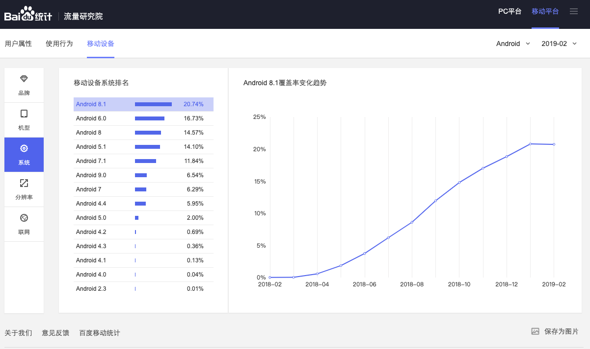


#### iOS的WebView

ios早期使用的是UIWebView，ios8之后推出了WKWebView，它基于webkit内核，相比于之前的UIWebView速度更快，占用内存更少，支持更多的HTML特性，考虑到市场份额，设备的更新迭代，现在基本看不到低版本的ios设备了，所以现在说到ios中的webView，我们指的基本都是WKWebview。它的作用跟安卓的WebView基本一致，只是使用的时候语法略微不同而已。

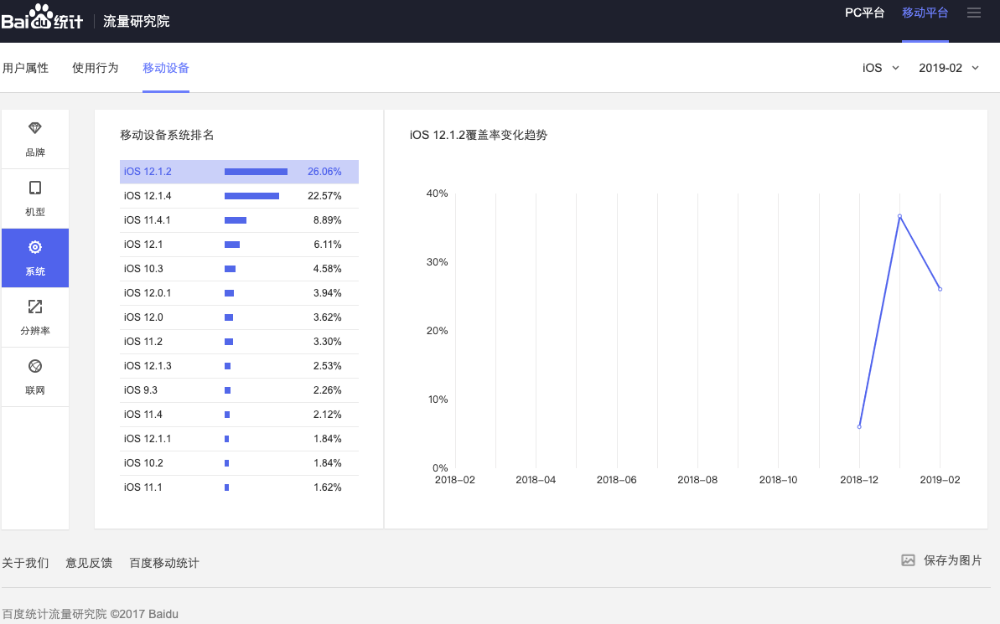

#### 小结

有了WebView之后，我们就可以在原生应用程序中通过这个组件(控件)载入WebApp(移动web页面)，虽然不是单纯的浏览器，但其中用到的前端技术和移动web基本一致，原生部分会有原生开发人员配合，咱们做好前端部分即可。

### 6.2WebView基本使用

WebView是原生应用提供的功能，可以在原生应用中载入网页。为了使用需要配置开发环境，咱们这里使用配置起来较为容易的ios进行演示，大家重点是了解WebView如何载入网页，不需要去专门学习原生语法。


#### WebApp

为了演示加载网页，我们准备了一个写好的移动Web页面(WebApp)，是一个电商网站的首页，有一些常见的web效果，比如轮播图，倒计时，首先咱们通过**vsCode**的`live Server`插件预览这个网页 

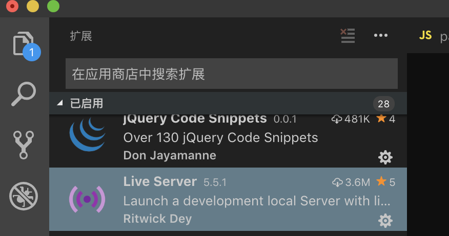

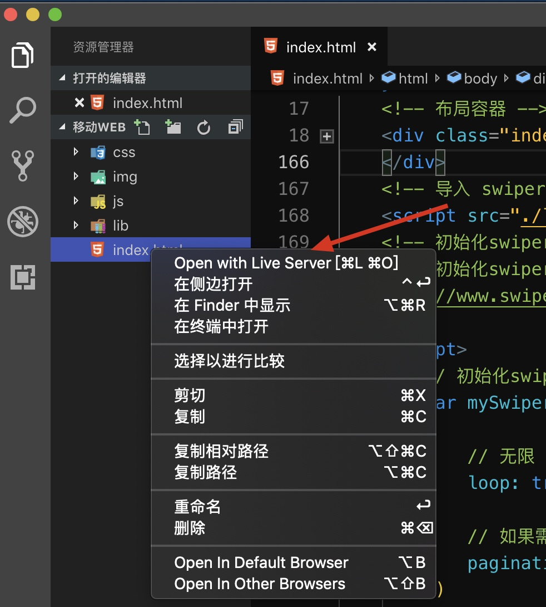

打开之后，通过chrome切换到移动端视图,可以更换显示的设备查看效果，凭借rem实现了页面适配，结合视口，不同设备的显示效果差异不会太大

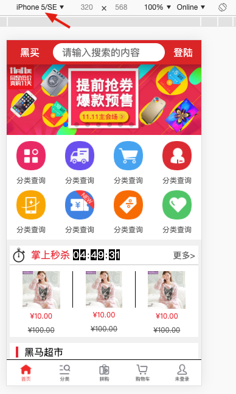

通过浏览器的展示已经演示完毕，接下来我们通过ios中的webView来展示他

#### 准备工作

为了使用ios的WebView，我们需要先配置ios的开发环境，首先你需要一台运行者mac系统的计算机，进入AppStore,搜索并下载Xcode,软件有点大，需要等待一会。

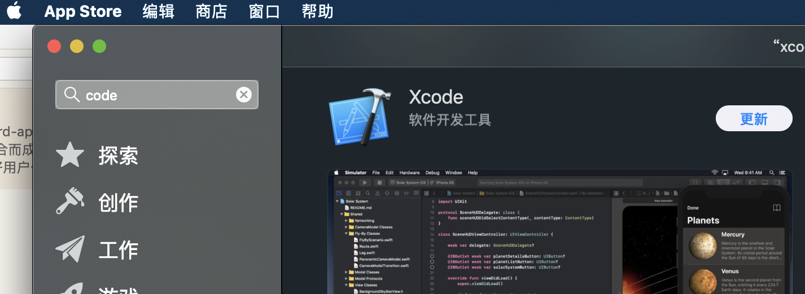


#### 项目创建

打开Xcode选择 `create a new Xcode project`

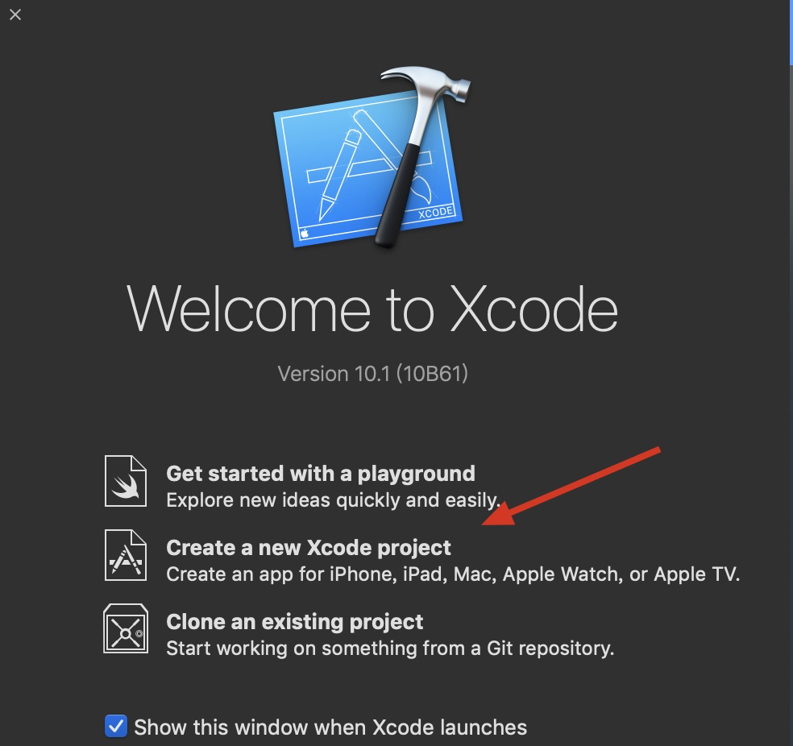

选择 `Single View App`

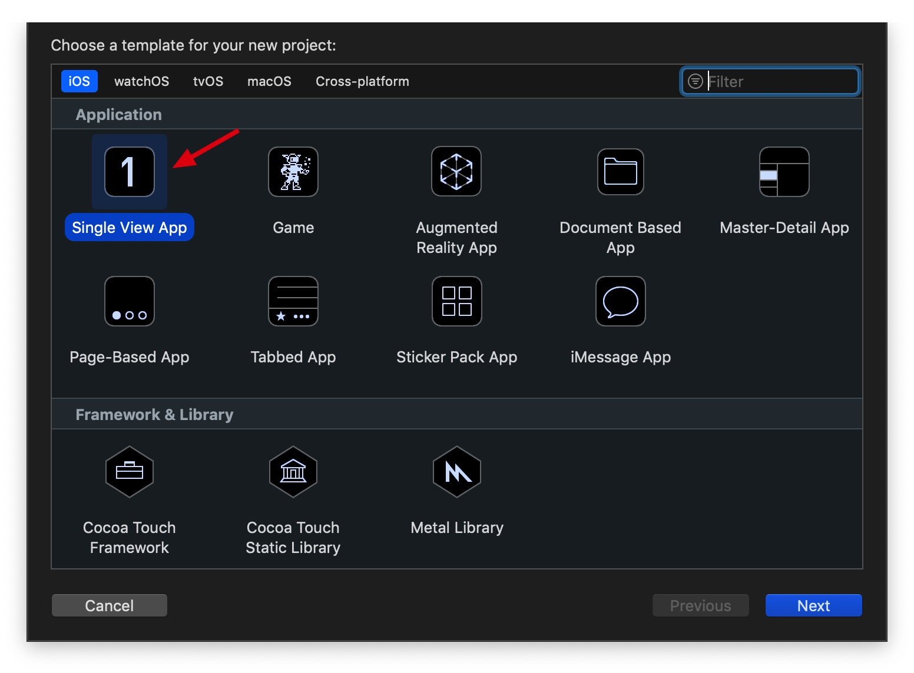

截图部分根据自己实际情况填充内容，如果不知道如何填写，可以和截图一致

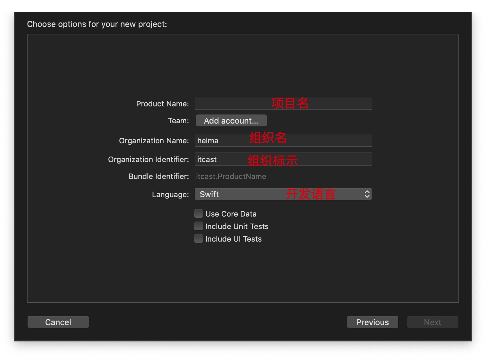

选择路径，新建文件夹，选择并新建项目

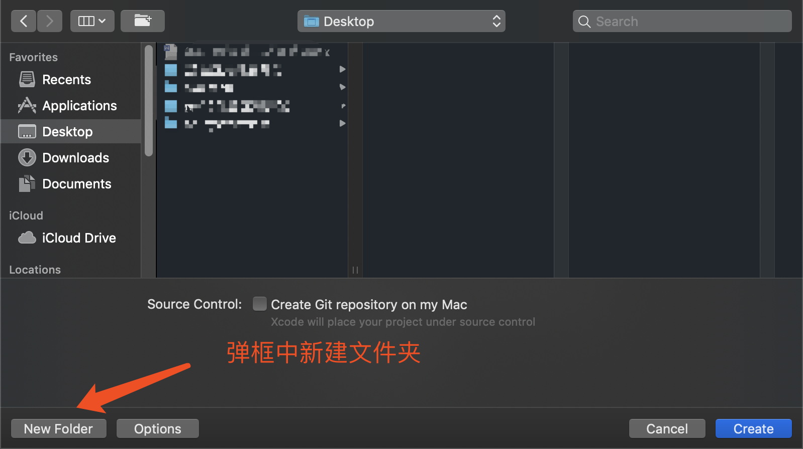

项目新建好之后，选择`ViewController`打开文件

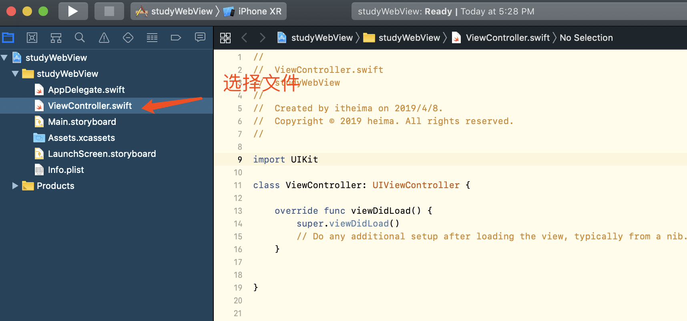


#### 编码

在`ViewController.swift`内的viewDidLoad中增加如下代码，其中网页地址部分可以任意设置一个进行测试

```swift
override func viewDidLoad() {
        super.viewDidLoad();
        
        // 创建wkWebview 并且加载url
        var webView = WKWebView(frame: self.view.bounds);
        // 设置自己为wkWebview的代码
        webView.navigationDelegate = self;
        // 添加到页面上
        self.view.addSubview(webView);
        
        // 创建URL对象
        var url = URL(string: "网页地址")
        // 创建URLRequest对象
        var request = URLRequest(url: url!);
        // 加载url
        webView.load(request)
    }
}
```

#### 运行效果

点击左上角的运行按钮，稍等片刻，在打开的模拟器从中，就可以看到具体的网页了


#### 本地WebApp测试

还记得刚刚我们使用`vscode`的`live Server`功能打开了一套本地的webApp，把url地址替换到刚刚使用`xcode`创建项目的地址部分，重新运行。稍等片刻就可以看到在原生的App中运行着咱们写的webApp了。

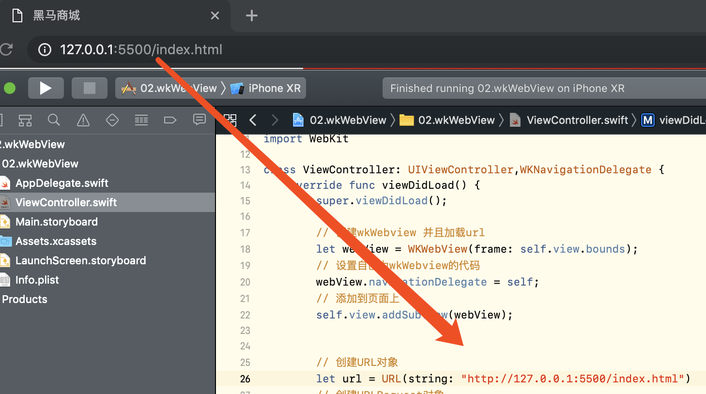

#### 小结

通过原生App载入了本地和网络的webApp，旨在让大伙了解，当webApp写好之后，载入其实很简单，至于是安卓还是ios中载入实际工作中需要结合具体的需求来决定，安卓部分跟ios的语法不同，但是步骤基本一致。并且原生部分会有原生开发人员来完成，我们需要的只是编写页面即可。


### 总结

通过本章的学习希望大伙掌握以下两点

1. 知道webview是什么？原生提供的运行在应用程序内部的特殊浏览器，内核是webkit

2. 了解webview载入网页的步骤？

   1. 创建webView
   2. 添加到应用程序界面上
   3. 设置url
   4. 载入url对于的页面

   