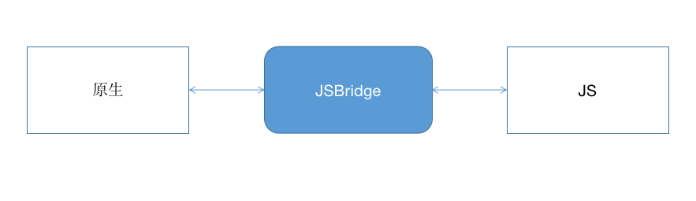

## 第八章 JSBridge

上述从语法层面给大伙介绍了原生和JS互相调用的方法，如果每次都从头写一遍费时费力，所以就有了一个通用的通讯方式：JSBridge。 他其实是一个很简单的东西，更多的是一种形式、一种思想，至于实现的语法可以多种多样。

### 目标

1. 了解JSBridge的概念
2. 了解JSBridge前端部分的实现步骤

### 8.1用途

JSBridge 简单来讲，主要是 给 JS 提供调用 原生 功能的接口，让混合开发中的『前端部分』可以方便地使用地址位置、摄像头甚至支付等 原生功能。

既然是"简单来讲"，那么 JSBridge 的用途肯定不只"调用 原生 功能"这么简单宽泛。实际上，JSBridge 就像其名称中的"Bridge"的意义一样，是 原生 和h5之间的桥梁，它的核心是 构建 原生 和h5 间的通信通道，而且是 双向通信的通道。



而双向的含义是：

- JS 向 原生 发送消息 : 调用相关功能、通知 原生 当前 JS 的相关状态等。
- 原生 向 JS 发送消息 : 回溯调用结果、消息推送、通知 JS 当前 原生 的状态等。


### 8.2设计思想

本文主要讲解前端的设计思想：

JSBridge 的主要功能有两个：**调用 原生（给 原生 发消息）** 和 **接收 原生 调用（接收 原生 消息）**。因此，JSBridge 可以设计如下：

```javascript
window.JSBridge = {
    // 调用 Native
    invoke: function(msg) {
        // 判断环境，获取不同的 nativeBridge(原生)
        nativeBridge.postMessage(msg);
    },
    receiveMessage: function(msg) {
        // 处理 msg
    }
};
```

因为需要调用不同的原生方法，所以方法名应该可以动态传入。这里，我们将原生方法名抽象为 桥名（BridgeName），最终演化为 一个 BridgeName 对应一个 原生 功能或者一类 原生 消息。 基于此点，JSBridge 的实现可以优化为如下：

```javascript
window.JSBridge = {
    // 调用 Native
    invoke: function(bridgeName, data) {
        // 判断环境，获取不同的 nativeBridge(原生)
        nativeBridge.postMessage({
            bridgeName: bridgeName,
            data: data || {}
        });
    },
    receiveMessage: function(msg) {
        var bridgeName = msg.bridgeName,
            data = msg.data || {};
        // 具体逻辑
    }
};
```

JSBridge 大概的雏形出现了。现在还有一个问题急需解决，消息都是单向的，那么调用 原生 功能时 ,调用的结果前端部分如何实现。

对于 JSBridge 的 Callback ，其实就是 RPC 框架的回调机制。当然也可以用更简单的 JSONP 机制解释：

> 当发送 JSONP 请求时，url 参数里会有 callback 参数，其值是 **当前页面唯一** 的，而同时以此参数值为 key 将回调函数存到 window 上，随后，服务器返回 script 中，也会以此参数值作为句柄，调用相应的回调函数。

由此可见，callback 参数这个 **唯一标识** 是这个回调逻辑的关键。这样，我们可以参照这个逻辑来实现 JSBridge：用一个自增的唯一 id，来标识并存储回调函数，并把此 id 以参数形式传递给 Native，而 Native 也以此 id 作为回溯的标识。这样，即可实现 Callback 回调逻辑。

```javascript
(function () {
    var id = 0,
        callbacks = {};

    window.JSBridge = {
        // 调用 Native
        invoke: function(bridgeName, callback, data) {
            // 判断环境，获取不同的 nativeBridge
            var thisId = id ++; // 获取唯一 id
            callbacks[thisId] = callback; // 存储 Callback
            nativeBridge.postMessage({
                bridgeName: bridgeName,
                data: data || {},
                callbackId: thisId // 传到 Native 端
            });
        },
        receiveMessage: function(msg) {
            var bridgeName = msg.bridgeName,
                data = msg.data || {},
                callbackId = msg.callbackId; // Native 将 callbackId 原封不动传回
            // 具体逻辑
            // bridgeName 和 callbackId 不会同时存在
            if (callbackId) {
                if (callbacks[callbackId]) { // 找到相应句柄
                    callbacks[callbackId](msg.data); // 执行调用
                }
            } else if (bridgeName) {

            }
        }
    };
})();
```

当然，这段代码片段只是一个示例，主要用于剖析 JSBridge 的原理和流程，里面存在诸多省略和不完善的代码逻辑，读者们可以自行完善。

【注】：这一节主要讲的是，JavaScript 端的 JSBridge 的实现，对于 Native 端涉及的并不多。在 Native 端配合实现 JSBridge 的 JavaScript 调用 Native 逻辑也很简单，主要的代码逻辑是：接收到 JavaScript 消息 => 解析参数，拿到 bridgeName、data 和 callbackId => 根据 bridgeName 找到功能方法，以 data 为参数执行 => 执行返回值和 callbackId 一起回传前端。 Native 调用 JavaScript 也同样简单，直接自动生成一个唯一的 ResponseId，并存储句柄，然后和 data 一起发送给前端即可。

### 总结

这篇文章主要剖析的 JSBridge 的实现及应用，包括 **JavaScript 与 Native 间的通信原理**，**JSBridge 的 JavaScript 端实现** 以及 **引用方式**，并给出了一些示例代码，希望对读者有一定的帮助，也有一些具体的JSBridge实现，大伙可以自行去[github](<https://github.com/>)搜索。