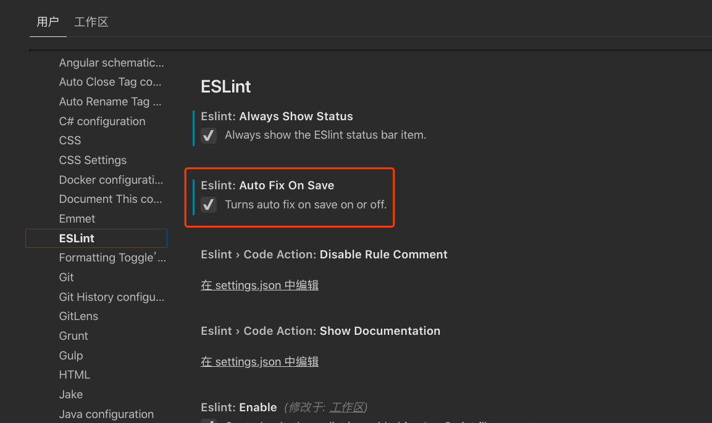
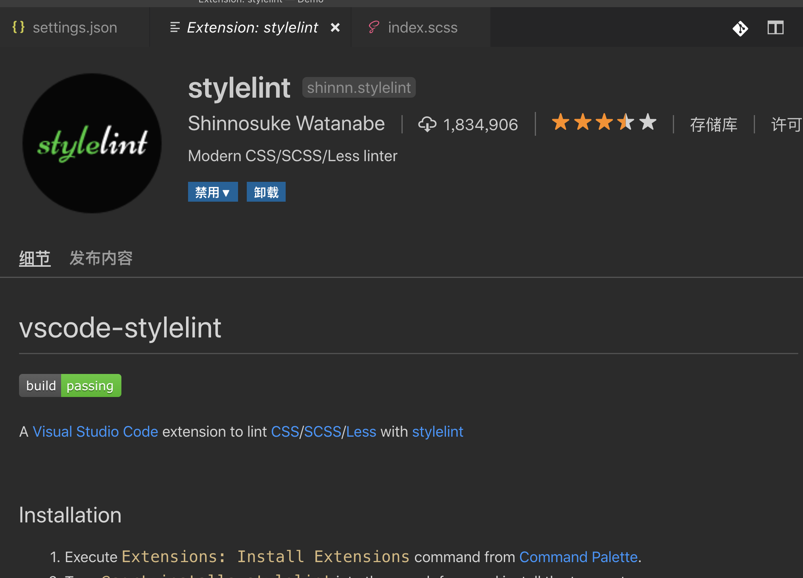
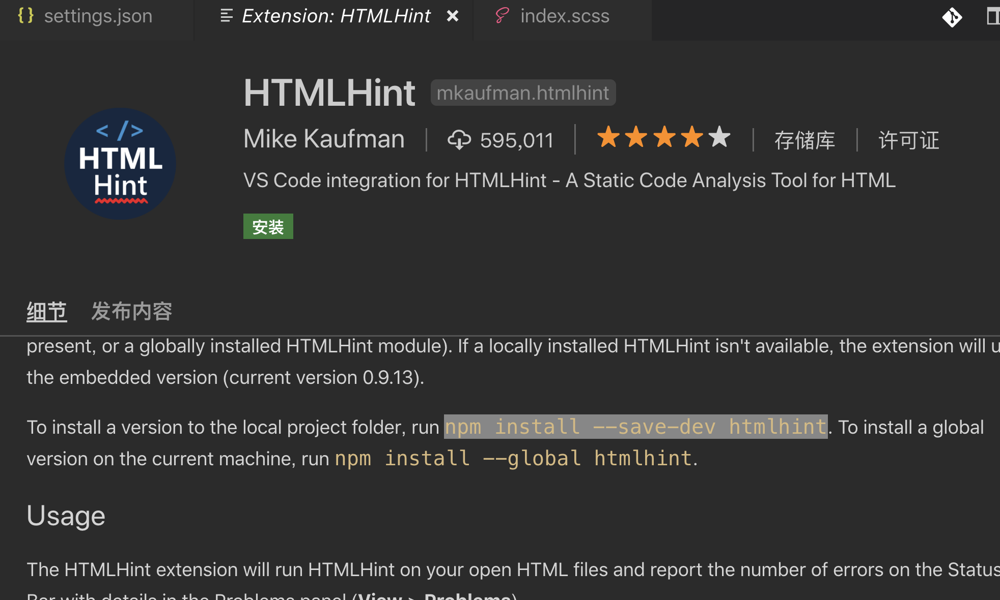

# 5-2 项目质量监测

## 课程介绍

没有规矩不成方圆，所以我们写代码也要有"规矩"，但是我们通常记不住所有的"规矩"，因为人嘛，不可能不犯错。但是，这难不到我们程序员，我们让机器、代码、程序帮我们搞定，让它们来帮我们进行代码质量检查，以便提高的程序的健壮性。

通常来说，项目的质量决定了：

- 软件项目的**命运**
- 软件项目的**可维护性**
- 软件项目的**运维成本**
- 软件项目的**扩展性**


**为什么要进行代码质量检查？**

代码检查很重要，原因有三：

1. **避免低级bug**：一些常见代码问题，如果在编译或运行前不能及时发现，代码中的语法问题会直接导致编译或运行时错误，影响开发效率和代码质量；
2. **统一代码习惯**：每一个团队或个人都会有一些代码规范或者代码习惯，为了便于后期维护和阅读，我们编写的代码也需要符合一定的格式规范；
   - 空格
   - 统一缩进
   - 命名规范
   - ...
3. **保证线上代码质量**：在版本管理中，我们需要在提交或发布之前自动执行一些代码检查工作，确保我们的代码符合最终版本要求。


如何让一个团队的人产出的代码都在一个基本水平底线之上呢？最初是靠制订规范。要确保规范得以执行只能靠人，所以文字规范成了code review的公共参照标准。**单纯靠人的事最终都容易流于形式，所以需要工具加以保证。**虽说工具并不能完全实现规范中的规则，但至少能够在一定程度上缓解代码不统一的局面。


**本课程的学习路径：**

- Why
- What
- How


**本课程的主要内容：**

代码质量监测包括：代码规范（代码编写层面）、功能实现（测试层面）、Code Review（团队协作层面）。

本课程，代码规范作为展开，以eslint为例子；代码质量中的功能实现，以e2e test为例子。

关于，功能实现中的单元测试，5-3课程中有具体的框架使用及介绍。


- 代码Lint——告别低级代码错误，简单的配置让程序来自动检查
- e2e test——了解什么是黑盒测试，如何进行e2e test，即End to End Test，端到端的测试。
- 开源测试平台：Codecov介绍——配合Ci工具，让测试过程自动化，大大提升效率


这些徽章都是可以点击的，第一个点进去是 https://travis-ci.org/，travis-ci 是一个 CI（Continuous integration，持续集成） 平台，主要提供集群编译、单测、集成测试的环境。`.org` 的服务对公有仓库免费，`.com` 面向私人、团队、公司的项目提供商业支持（收费）。使用起来非常简单，使用 Github 帐号登录进去，就能看见开始界面。

第二个徽章是 [codecov.io](https://codecov.io/)（单测覆盖率统计平台），接入过程也很简单，也是不同语言选择不同的[配置文件](https://docs.codecov.io/docs/supported-languages)，codecov 可以无缝衔接 travis-ci，只需要在原来的配置文件上稍作修改即可，核心就是生成单测的结果文件。\


**本课程的学习准备：**

- IDE vscode，node > 10.15
- 包管理工具：yarn, cnpm
- Github账号


## 代码质量检查

### 前端代码中的常见问题(Why Lint)

#### 书写风格

这个问题不用作过多阐述，想必接手过他人代码的同学，多少都有些体会。简单来说，太过随意的代码会让强迫症患者难以容忍，难以阅读理解的代码有时甚至不如推倒重来。

```javascript 
// bad
var once
  , upon
  , aTime;

// good
var once,
    upon,
    aTime;

// bad
var hero = {
    firstName: 'Bob'
  , lastName: 'Parr'
  , heroName: 'Mr. Incredible'
  , superPower: 'strength'
};

// good
var hero = {
  firstName: 'Bob',
  lastName: 'Parr',
  heroName: 'Mr. Incredible',
  superPower: 'strength'
};
```


#### 代码规范

什么样的代码是低质量或高质量的？好的代码可能会让你如读小说一般被吸引，糟糕的代码会让你看一眼就不想继续、甚至看半天而不知所云。

有人可能认为初级程序员才会有这种问题，其实不然，一些工作经验两三年的同学写的代码依然如此。对于一些个人自学意识不够积极、没有团队规范性指引的同学，很容易习惯成“学习半年、然后重复三年无长进”的情况。

Lint会通过源代码去查找：

- 格式问题

- 不遵守编码标准和惯例

- 精确定位程序中可能存在的逻辑错误

  

#### 高度耦合

这种问题其实是非常普遍的。一个函数几百行、一个文件数千行、一个类几十个方法、方法参数定义随意、没有任何注释、方法与变量命名无明确的语义、数据修改与变更穿插在各种方法中等等。 这样的编码方式，你要去理解它的逻辑往往真的很难，一般只能一块块一行行的去做阅读理解（可能还会开启边看边骂娘模式）。

这主要原因在于开发者个人的基础知识能力、编码经验和意识等的不足。

其实针对这种情况，常见的开源的编码规范都会有所提及。我的建议是这些同学应该好好温习一下面向对象编程、函数式编程、数据结构、常见设计模式，看一看各种开源的编码规范并尝试去真正的理解它们。当你回顾一个月前的代码时，发现可以改进或重构使得编码逻辑更为简洁清晰，说明你是在成长与进步的。

经常看到有同学问这类问题：新项目正在选型，Vue.js、React、Angular 三大框架哪个合适？其实团队开发成员对这些都比较有经验，哪种都可以；如果团队成员前端开发经验大都不是太丰富或人员不够稳定，选择 Vue.js 最适合，为什么？因为它更简单简洁，容易上手。Vue.js 通过 prop、data、computed、method、watch 等各种钩子，一定程度上限定了编码方式与风格，使得初级开发者写出来的代码也不会太难看，这也是它越来越受社区推崇的原因之一。


### 代码质量监测（Def: Lint Code）

那么，什么是代码质量监测？

Lint或者Linter是一种分析源代码以标记编程过程中（代码、样式、构建）书写的错误的工具或者过程。

> **Lint**, or a **linter**, is a tool that analyzes [source code](https://en.wikipedia.org/wiki/Source_code) to flag programming errors, [bugs](https://en.wikipedia.org/wiki/Software_bug), stylistic errors, and suspicious constructs.[[1\]](https://en.wikipedia.org/wiki/Lint_(software)#cite_note-1) The term originates from a [Unix](https://en.wikipedia.org/wiki/Unix) [utility](https://en.wikipedia.org/wiki/List_of_utility_software) that examined [C language](https://en.wikipedia.org/wiki/C_(programming_language)) source code.[[2\]](https://en.wikipedia.org/wiki/Lint_(software)#cite_note-BellLabs-2)


代码Lint是动态的监测代码编写的错误，以便我们能写出高质量的代码。

> 与Prettier或者Format要区别开来，Lint只会告诉你代码中的错误或者不符合规范的地方，而Format是用来对格式进行调整的。


### 如何进行代码质量监测(How to Lint)

为了统一团队的代码规范，除了一纸规范说明之外，还需要引入工具进行限制。虽说工具并不能完全实现规范中的规则，但至少能够在一定程度上缓解代码不统一的局面。

相对于后端，前端代码规范的质量检查涉及到HTML, CSS，Javascript ，如今还涉及到SCSS，ES5，JSX,  React，Vue，Angular等。

常见的代码质量Lint工具：

HTML / tpl:  [HTMLHint](http://htmlhint.com/)

CSS / SCSS: [StyleLint](https://stylelint.io/)

JS / JSX: [ESLint](https://eslint.org/)


### 3种常见的Js检验工具比较

常见三个可以使用的js校验器，但是怎么选择使用哪一个呢？接下来让我们看看这四种流行方案的特点、优点和不足：[JSLint](http://www.jslint.com/)、[JSHint](http://jshint.com/)、[ESLint](http://eslint.org/)。


四种工具用相同的基本方式工作。他们都有一套用户分析、报告js文件错误的规则。他们都可以通过npm安装。他们都可以通过命令行使用、作为IDE插件使用、也可以集成到编辑器中。他们四种均支持使用注释进行配置。


#### JSLint

JSLint是其中最老的工具。在2002年 Douglas Crockford开发了该工具，根据其经验，强制使用js语言中精粹的部分。如果你同意这些精粹，JSLint能成为一个好的工具。

JSLint的缺点是不能配置和拓展。你根本不能禁掉需要特性，并且很多缺少文档。官方文档非常不友好，例如缺少如何将其集成到编辑的信息。

**优点**

- 参数配置完成，可以直接使用

**缺点**

- JSLint不存在配置文件，如果想改变参数设置，那就存在问题
- 有限的配置选项，许多规则不能禁掉
- 不能增加个性化规则
- 没有文档记录规则
- 很难弄清楚哪个规则引起的错误


#### JSHint

作为一个可配置的JSLint版本，JSHint被开发出来。你可以配置每个规则，将其放到一个配置文件中，这样在大项目中可以容易使用。JSHint对每个规则有好的文档，所以可以准确知道每个规则的作用。将其集成到编辑器也是简单的。

JSHint的一个小缺点是里面的松散默认配置。也即是你在使其可用之前必须将其启动。和ESLint相比，确定哪个规则用户开启或关闭错误信息，JSHint是更加困难。

**优点**

- 大多是参数可以配置
- 支持配置文件，在大项目中容易使用
- 已经支持需要类库，像jQuery、QUnit、NodeJS、Mocha等
- 支持基本的ES6

**缺点**

- 难于知道哪个规则产生错误
- 存在两类选项：强制选项和松散选项。使得配置有些混乱
- 不支持自定义规则


#### ESLint

ESLint是比较新出来的工具。它被设计的容易拓展、拥有大量的自定义规则、容易的通过插件来安装。它给出准确的输出，而且包括规则名，这样可以知道哪个规则造成了错误。

ESLint文档多少有些混乱。规则容易查找，以及被分为逻辑组，但是配置指南在有些地方容易弄混。然而它可以在一个地方提供链接去编辑集成、插件和样例。

**优点**

- 灵活：任何规则都可以开启闭合，以及有些规则有些额外配置
- 很容易拓展和有需要可用插件
- 容易理解产出
- 包含了在其他检查器中不可用的规则，使得ESLint在错误检查上更有用
- 支持ES6，支持JSX的工具
- 支持自定义报告

**缺点**

- 需要一些配置
- 速度慢

> [JSCS](http://jscs.info/)已经合并到ESlint


总结一下：

| 分类       | JSLint       | JSHint | ESLint |
| ---------- | ------------ | ------ | ------ |
| 初始配置   | 有           | 有     | 可配置 |
| 自定义     | 命令行，有限 | 可配置 | 可配置 |
| 配置文件   | 否           | 是     | 是     |
| ES6        | 是           | 是     | 是     |
| JSX        | 否           | 是     | 是     |
| 执行效率   | 高           | 中     | 低     |
| 输出友好度 | 低           | 中     | 高     |
| Stars      | 3.3k         | 8.2k   | 14.2k  |


## Lint工具介绍

Lint是一种工具，可以分析源代码，并在出现错误或与团队编码约定不符时通知用户。在某些情况下，它还可以自动修复错误。

虽然已经为不同语言开发了许多种Lint，但是有些人可能遇到过以下问题。

- 这是我第一次使用这种语言进行编码，什么被认为是这种语言的一般编码风格？

- 我正在使用Lint的默认设置，但错误验证过程太严格。

  我想更改设置，但是更改设置会更容易忽略某些错误吗？

即使对于单一语言，也提出了各种编码约定。因此，特别是首先，确定哪些编码约定更好地遵循可能是困难的。

因此，让我们研究一下常用的开源软件上的Lint设置，看看正在使用哪种设置和编码约定。


### ESLint

ESLint是JavaScript的linting实用程序。

ESLint不依赖于特定的编码约定，用户也可以自由地启用或禁用各个编码约定。从这个意义上讲，它的一个主要特点是其高度可定制性。

用户可以通过定义原始[规则来](https://eslint.org/docs/rules/)灵活地设置编码标准，这些规则是ESLint中默认可用的编码规则。此外，第三方共享的着名编码约定，例如“Google JavaScript Style Guide”或“Airbnb JavaScript Style Guide”也可以重复使用。

您甚至可以在遵循这些编码约定的同时启用/禁用特定文件的特定规则。

如果您不知道要开始的设置，可以参考ESLint官方提供的“ [入门](https://eslint.org/docs/user-guide/getting-started) ”指南，以使用建议的编码约定。


核心概念：

- 配置文件：

  `.eslintrc`，`.eslintrc.js`，`.eslintrc.yml`

- Rules：
  - “off” 或 `0` - 关闭规则
  - “warn” 或 `1` - 开启规则，使用警告级别的错误：warn (不会导致程序退出)
  - “error” 或 `2` - 开启规则，使用错误级别的错误：error (当被触发的时候，程序会退出)

  看一个例子：

  ```json
  {
      "rules": {
          "semi": ["error", "never"],
          "quotes": ["error", "single"]
      }
  }
  ```

  也可以写成：

  ```json
  {
      "rules": {
          "semi": [2, "never"],
          "quotes": [2, "single"]
      }
  }
  ```

- Extends：

  使用别人提供的包， 如google

  ```json
  { 
      "extends"："google"，
  }
  ```

  通过使用上述说明，用户可以轻松使用Google JavaScript样式指南中的编码约定，而无需从头开始编写设置。

- Plugins:

  ESLint提供的默认规则涵盖了基本规则，但JavaScript可以使用的范围非常广泛。因此，您可能希望规则不在默认规则中。在这种情况下，可以在ESLint中开发自己的独立规则。为了让第三方开发自己的规则，ESLint允许使用[插件](https://eslint.org/docs/developer-guide/working-with-plugins)。如果你在npm中搜索eslint-plugin- *，你可以找到第三方提供的大量自定义插件。

  如果ESLint的默认规则未提供您要使用的规则，则建议您查找插件。

  与可共享配置类似，它很容易设置。例如，如果要对React代码执行静态分析，可以安装名为[eslint-plugin-react的插件](https://www.npmjs.com/package/eslint-plugin-react)，并使用以下设置来执行React语法特有的静态分析。

  ```json
  { 
      "extends": "google"，
      "plugins": [ 
          "react" 
      ]，
      "rules"": { 
          "semi": ["error", "never"],
          "quotes": ["error", "single"]
      } 
  }
  ```

  

#### 起步与安装

1. 在项目中去使用

   ```json
   // npm init 指令会在项目根目录下生成 package.json 文件。
   npm init
   
   // --save-dev 会把 eslint 安装到 package.json 文件中的 devDependencies 属性中，意思是只是开发阶段用到这个包，上线时就不需要这个包了。
   npm install eslint --save-dev
   ```

   - 使用`npm run`

   新增`package.json` 脚本，或者使用 `npx`命令

   ```javascript
"scripts": {
       "lint": "eslint src",
       "lint:create": "eslint --init"
   }
   ```
   
   然后使用`run`命令：

   ```bash
npm run lint
   ```
   
   - 直接使用`npx`命令：

   ```bash
npx eslint --init
   
   // 或者
   ./node_modules/.bin/eslint --init
   ```
   
2. 在全局使用

   ```bash
   npm install -g eslint
   ```

#### ESLint初始化

配置方法使用 `eslint --init`方法

```bash
➜ npx eslint --init
? How would you like to use ESLint? (Use arrow keys)
  To check syntax only 
❯ To check syntax and find problems 
  To check syntax, find problems, and enforce code style 
  
? What type of modules does your project use? (Use arrow keys)
❯ JavaScript modules (import/export) 
  CommonJS (require/exports) 
  None of these 
  
// 这里可以针对你的开发项目进行配置
? Which framework does your project use? 
  React 
  Vue.js 
❯ None of these 

// 可以配置代码运行的地方，是浏览器还是Node环境？
? Where does your code run? 
❯◉ Browser
 ◉ Node
 
// 最张在哪里缓存
? What format do you want your config file to be in? (Use arrow keys)
❯ JavaScript 
  YAML 
  JSON 

// 成功创建了配置文件
? What format do you want your config file to be in? JavaScript
Successfully created .eslintrc.js file in /Users/itheima/Downloads/Demo
```

配置文件`.eslintrc.js`：

> 废弃的用法：`.eslintrc`，eslint使用配置的顺序：`.eslintrc.js` > `.eslintrc.yaml` > `.eslintrc.yml` > `.eslintrc.json` > `.eslintrc` > `package.json`

`.eslintrc.js`文件：

```js
module.exports = {
    "env": {
        "browser": true,
        "es6": true,
        "node": true
    },
    "extends": "eslint:recommended",
    "globals": {
        "Atomics": "readonly",
        "SharedArrayBuffer": "readonly"
    },
    "parserOptions": {
        "ecmaVersion": 2018,
        "sourceType": "module"
    },
    "rules": {
    }
};
```

再来看看，`yaml`文件配置：

```yaml
env:
  browser: true
  es6: true
  node: true
extends: 'eslint:recommended'
globals:
  Atomics: readonly
  SharedArrayBuffer: readonly
parserOptions:
  ecmaVersion: 2018
  sourceType: module
rules: {}
```


该文件导出一个对象，对象包含属性 `env`、`extends`、`parserOptions`、`plugins`、`rules` 五个属性：

- `env`：指定脚本的运行环境。每种环境都有一组特定的预定义全局变量，（如：nodejs，browser，commonjs等）中。

- `parserOptions`：用于指定想要支持的JavaScript语言选项

  - `ecmaVersion` - 默认设置为3，5（默认）， 你可以使用 6、7、8 或 9 来指定你想要使用的 ECMAScript 版本。你也可以用使用年份命名的版本号指定为 2015（同 6），2016（同 7），或 2017（同 8）或 2018（同 9）

  - `sourceType` - 设置为 `"script"` (默认) 或 `"module"`（如果你的代码是 ECMAScript 模块)。

  - ```
    ecmaFeatures
    ```

    \- 这是个对象，表示你想使用的额外的语言特性:

    - `globalReturn` - 允许在全局作用域下使用 `return` 语句
    - `impliedStrict` - 启用全局 [strict mode](https://developer.mozilla.org/en-US/docs/Web/JavaScript/Reference/Strict_mode) (如果 `ecmaVersion` 是 5 或更高)
    - `jsx` - 启用 [JSX](http://facebook.github.io/jsx/)

- `globals`：执行代码时脚步需要访问的额外全局变量。

- `rules`：开启某些规则，也可以设置规则的等级。

- `extends`: 对默认规则进行扩展，可以使用`Airbnb`，或者`Standard`规则。


#### .eslintignore

可以在项目根目录创建，告诉ESLint忽略某些文件或者目录。相当于.gitignore都是纯文本文件。
例如

```
# 注释，忽略文件node_modules**/.jsbuild
```

常见的eslintignore内容：

```
node_modules/*
**/node_modules/*
dist/*
/build/**
/coverage/**
/docs/**
/jsdoc/**
/templates/**
/tests/bench/**
/tests/fixtures/**
/tests/performance/**
/tmp/**
/lib/rules/utils/unicode/is-combining-character.js
test.js
!.eslintrc.js
```


#### ESLint的使用方法

- 本地使用方法：

  如果你想让 ESLint 成为你项目构建系统的一部分，我们建议在本地安装。你可以使用 npm：

  ```bash
  $ npm install eslint --save-dev
  ```

  紧接着你应该设置一个配置文件：

  ```bash
  $ ./node_modules/.bin/eslint --init
  ```

  之后，你可以在你项目根目录运行 ESLint：

  ```bash
  $ ./node_modules/.bin/eslint yourfile.js
  ```

  使用本地安装的 ESLint 时，你使用的任何插件或可分享的配置也都必须在本地安装。

  

- 全局使用

  如果你想使 ESLint 适用于你所有的项目，我们建议你全局安装 ESLint。你可以使用 npm：

  ```
  $ npm install -g eslint
  ```

  紧接着你应该设置一个配置文件：

  ```
  $ eslint --init
  ```

  之后，你可以在任何文件或目录运行 ESLint：

  ```
  $ eslint yourfile.js
  ```


#### 常用ESlint配置

ESLint的规范：

Standard: https://github.com/standard/eslint-config-standard

具体地址：[eslintrc.json](https://github.com/standard/eslint-config-standard/blob/master/eslintrc.json)

Airbnb: https://github.com/airbnb/javascript

1. comma逗号

   ```js
   rules: {
   	"comma-dangle": ["error", "never"],
   }
   ```

   Bad:

   ```js
   var foo = {
   	a: '123',
   	b: '321', // wrong error
   }
   ```

   Right:

   ```js
   var foo = {
   	a: '123',
   	b: '321'
   }
   ```

2. quotes引号

3. semi分号

4. 空行

5. 驼峰命名

6. 日志输出

7. 强等判断

8. 冗余的变量

9. 空格
   - 关键字后的空格
   - 函数名后的空格
   - 缩进


#### 在IDE中的配置

- 以下是vscode中插件配置：


配置文件：

```json
  "eslint.alwaysShowStatus": true,
  "eslint.autoFixOnSave": true,
  "editor.formatOnSave": true,
  "eslint.validate": [
    "javascriptreact",
    {
      "language": "html",
      "autoFix": true
    },
    {
      "language": "javascript",
      "autoFix": true
    }
  ],
  "eslint.options": {
    "plugins": ["html"]
  },
```

快速修复配置：

打开 `"editor.formatOnSave":  true`并且要打开`eslint.validate`如上面的配置，或者在UI界面里面设置。




- 在Webstorm中的配置：

使用Configure Preferences


相比于vscode就智能很多。


#### 实战vue项目配置

ESlint配置文件：

```js
module.exports = {
  root: true,
  env: {
    node: true,
  },
  extends: [
    'plugin:vue/essential',
    '@vue/standard',
  ],
  rules: {
    'no-console': process.env.NODE_ENV === 'production' ? 'error' : 'off',
    'no-debugger': process.env.NODE_ENV === 'production' ? 'error' : 'off',
    semi: ['error', 'never'],
  },
  parserOptions: {
    parser: 'babel-eslint',
  },
}

```


需要安装的VSCode插件：

- vue(高亮语法)
- vetur(格式化，代码规范)
- Vue peek(组件跳转)
- vue beautify(vue格式化)
- Vue VSCode Snippets 和 Vue Snippets(代码提示)
- Prettier(格式化 与 上面的Vetur其实是合作格式化)

vscode配置格式化：

```json
"eslint.validate": [
  "javascript",
  "javascriptreact",
  {
    "language": "html",
    "autoFix": true
  },
  {
    "language": "vue",
    "autoFix": true
  }
],
"vetur.format.defaultFormatter.js": "prettier-eslint",
  // prettier
"prettier.trailingComma": "es5",
"prettier.semi": false,
"prettier.jsxSingleQuote": true,
"prettier.singleQuote": true,
"prettier.eslintIntegration": true,
```

配置emmet:

```json
  "emmet.syntaxProfiles": {
    "vue-html": "html",
    "vue": "html"
  },
```


在Vue-cli工具中，可以使用`npm run lint`:

```bash
// bash输出
➜ npm run lint

> vue-recipe@0.1.0 lint /Users/itheima/vue-demo
> vue-cli-service lint

 DONE  No lint errors found!
```

来执行vue cli配置好了的Lint脚本：

```json
  "scripts": {
    "serve": "vue-cli-service serve",
    "build": "vue-cli-service build",
    "lint": "vue-cli-service lint"
  },
```

> vscode中插件推荐使用：
>
> Vue, Vetur, Vue Peek, vue-beautify


#### 实战react项目配置

使用`create-react-app`创建react项目：

```bash
npx create-react-app my-app

cd my-app

npm start
```

> 如果`npx`命令没有，请全局安装`create-react-app`，使用`npm install -g create-react-app`


然后是安装eslint相关依赖：

```json
"devDependencies": {
  "eslint": "^5.16.0",
  "babel-eslint": "^10.0.2",
  "eslint-plugin-html": "^6.0.0",
  "eslint-plugin-react": "^7.14.2"
}
```


配置eslint，或者使用`eslint --init`进行初始化：

```js
module.exports = {
    "env": {
        "browser": true,
        "commonjs": true,
        "node": true,
        "es6": true
    },
    "extends": [
        "eslint:recommended",
        "plugin:react/recommended"
    ],
    "globals": {
        "Atomics": "readonly",
        "SharedArrayBuffer": "readonly"
    },
    "parserOptions": {
        "ecmaFeatures": {
            "jsx": true,
            "arrowFunctions": true,
            "classes": true,
            "modules": true,
            "defaultParams": true
        },
        "ecmaVersion": 2018,
        "sourceType": "module"
    },
    "plugins": [
        "react"
    ],
    "rules": {
    },
    "settings": {
        "react": {
            "pragma": "React",
            "version": "latest",
        },
    },
};
```

几点配置需要注意：

- 安装插件：`eslint-plugin-react`
- 配置`extends`: `"plugin:react/recommended"`
- 配置`settings`


配置Airbnb：

```bash
npm --save-dev install eslint-config-airbnb eslint-plugin-import eslint-plugin-jsx-a11y babel-eslint
```

有三个依赖：

- eslint-config-airbnb
- eslint-plugin-import
- eslint-plugin-jsx-a11y
- Babel-eslint


修改项目配置：

```js
module.exports = {
    "env": {
        "browser": true,
        "commonjs": true,
        "node": true,
        "es6": true
    },
    // 这里有变化 
    "extends": [
        "eslint:recommended",
        "plugin:react/recommended",
        "plugin:import/errors",
        "plugin:jsx-a11y/recommended",
        "airbnb"
    ],
    "globals": {
        "Atomics": "readonly",
        "SharedArrayBuffer": "readonly"
    },
    "parser": "babel-eslint",
    "parserOptions": {
        "ecmaFeatures": {
            "jsx": true,
            "arrowFunctions": true,
            "classes": true,
            "modules": true,
            "defaultParams": true
        },
        "ecmaVersion": 2018,
        "sourceType": "module"
    },
    // 这里有变化 
    "plugins": [
        "react",
        "jsx-a11y",
        "import"
    ],
    "rules": {
      // 这里可以添加jsx-ally与import相关的自定义rules
    },
    "settings": {
        "react": {
            "pragma": "React",
            "version": "latest",
        },
    },
};
```


### StyleLint

官网：https://stylelint.io/

- 安装依赖：

  ```bash
  npm install -D stylelint-config-recommended stylelint-config-standard
  
  // yarn 
  yarn add stylelint-config-recommended stylelint-config-standard -D
  ```

- 配置忽略

  ```
  // .stylelintignore   忽略stylelint检查的文件
  /src/**/*.css
  ```

- `.stylelintrc.js`文件配置

  ```json
  module.exports = {
    "extends": ["stylelint-config-recommended", "stylelint-config-standard"],
    "rules": {
      "indentation": 2
    }
  }
  ```

- vscode配置

  安装`Prettier` + `stylelint`插件，方便格式化代码。

  

  配置文件：

  ```
    "[scss]": {
      "editor.formatOnSave": true
    },
    // 打开scss的validate配置
    "scss.validate": true,
  ```

  

### HTMLHint

官网：[https://htmlhint.io](https://htmlhint.io/)

github: https://github.com/htmlhint/HTMLHint

- 安装依赖：

  ```bash
  npm install htmlhint --save-dev
  
  // yarn 
  yarn add htmlhint -D
  ```

- 配置忽略

  ```
  // .stylelintignore   忽略stylelint检查的文件
  /src/**/*.css
  ```

- `.htmlhintrc`文件配置

  ```json
  /**
  标签名必须小写
  属性名必须小写
  属性值必须放在双引号中
  属性值一定不可为空
  属性值一定不可重复
  Doctype必须是 HTML 文档的第一行
  标签必须成对
  标签必须自封闭
  特殊字符必须
  ID 属性必须唯一
  src 属性一定不可为空
  title 属性必须出现在标签中
  img 标签必须包含 alt 属性
  Doctype 必须是 HTML5
  ID 和 Class 的命名规则必须统一
  不该使用样式标签
  不该使用行内样式
  不该使用行内脚本
  空格和制表符一定不可混合在行前
  ID 和 Class 一定不可使用广告关键词
  href 必须是绝对路径或者相对路径
  属性值一定不可使用不安全字符
  script 标签不该使用在头部
  */
  {
    "tagname-lowercase": true, 
    "attr-lowercase": true,
    "attr-value-double-quotes": true,
    "attr-value-not-empty": false,
    "attr-no-duplication": true,
    "doctype-first": true,
    "tag-pair": true,
    "empty-tag-not-self-closed": true,
    "spec-char-escape": true,
    "id-unique": true,
    "src-not-empty": true,
    "title-require": true,
    "alt-require": true,
    "doctype-html5": true,
    "id-class-value": "dash",
    "style-disabled": false,
    "inline-style-disabled": false,
    "inline-script-disabled": false,
    "space-tab-mixed-disabled": "space",
    "id-class-ad-disabled": false,
    "href-abs-or-rel": false,
    "attr-unsafe-chars": true,
    "head-script-disabled": true
  }
  ```

- vscode配置

  安装`Prettier`，`HTMLHint`插件，方便格式化代码。

  

  用户配置文件：

  ```
    "[html]": {
      "editor.defaultFormatter": "esbenp.prettier-vscode"
    },
    // 打开scss的validate配置
    "files.associations": {
    	"*.ext": "html"
    },
  ```

  


## e2e test

通常对Web应用程序执行两种类型的测试：**单元测试**和**端到端**（E2E）测试。


**单元测试**

在测试中使用“单元”的想法是将代码分解为易于测试的小部件。通常，单元是单个函数，但也可以是类或甚至是复杂的算法。

单元测试的一个关键概念是函数的给定输入应始终产生相同的输出。

例如，如果我们有一个函数添加了两个调用的数字，`add`我们可以编写一个单元测试来确保我们作为参数提供的特定数字对总是返回我们期望的输出。

`add.spec.js`

```js
// Function we want to test
const add = (x, y) => x + y;

// Unit test
test("should add two numbers", () => {
  const result = add(2, 3);
  expect(result).toBe(5);
});
```

任何时候我们运行该测试并且它不等于5，我们可以得出一个错误已经输入我们的代码。


**组件测试**

在大多数Vue.js应用程序中，函数并不真正代表应用程序的原子组成。当然，我们可以对我们的方法进行单元测试，但我们真正关心的是生成的HTML。

因此，Vue.js app测试中的单元是一个*组件*而不是一个函数。

我们如何测试组件？我们以此为例：

`displayGreeting.js`

```js
export default {
  template: `<div>Hello, {{ name }}</div>`,
  props: ['name']
};
```

如前所述，对于给定输入（在这种情况下，支柱），单元测试必须返回一致的输出（在这种情况下，文本内容）。

使用像Vue Test Utils这样的库，我们可以在内存中安装Vue组件并创建一个“包装器”对象。然后，我们可以查询包装器以对呈现的HTML进行断言。

`displayGreeting.spec.js`

```js
import displayGreeting from "./displayGreeting.js";

test("displays message", () => {
  const name = "Michael";
  const wrapper = mount(displayGreeting, { propsData: { name } });
  expect(wrapper.text()).toBe(`Hello, ${name}`);
});
```


单元测试优点：

- 测试运行得很快
- 测试是精确的，允许您识别确切的问题

单元测试缺点：

- 为应用程序的每个方面编写测试都非常耗时
- 尽管单元测试通过，整个应用程序可能仍然无法正常工作


### 什么是e2e test?

e2e test（End to End test端到端）测试是一种功能测试。与单元测试不同，不会将应用程序分解为更小的部分以进行测试 - 而是测试整个应用程序。

e2e测试与您的应用程序交互，就像真实用户一样。例如，您可以编写一个E2E测试：

1. 加载您的网站
2. 点击“注册”链接
3. 为注册表单中的输入提供一些有效的详细信息
4. 单击“注册按钮”。

如果身份验证令牌已存储在Cookie中并且应用程序重定向到配置文件页面，则应通过此测试。


E2E测试优点

- 可以一次隐式测试很多东西
- e2e测试可确保您拥有一个工作系统

e2e测试缺点：

- 运行缓慢 - 通常需要5或10分钟才能运行一个站点
- 测试很脆弱 - 一个无关紧要的变化，如改变组件逻辑，就需要重新设计e2e test了
- 测试无法查明失败的原因


所以，主要的业务流程可能会写E2E，不过规模要小很多，主要目的是：

- 便于给PM展示业务流程
- 便于修改Bug之后的回归


### e2e test工具介绍

#### Cypress

1. 安装 & 桌面应用

   ```bash
   npm install cypress --save-dev
   ```

   或者直接下载桌面应用：

   https://download.cypress.io/desktop

2. 使用方式：

   ```
   ./node_modules/.bin/cypress open
   
   // npx
   npx cypress open
   
   // yarn 
   yarn run cypress open
   ```

   或者添加 `package.json`:

   ```json
   {
     "scripts": {
       "cypress:open": "cypress open"
     }
   }
   ```

   使用npm命令：`npm run cypress:open`

#### Nightwatch

#### TeatCafe

### e2e test案例

## Codecov

### Codecov简介

### Codecov使用

### 前端项目中的应用

## 补充学习

### 补充资料

#### [代码质量管控的四个阶段](https://zhuanlan.zhihu.com/p/29086959)


我把代码质量管控通常需要经历的四个阶段，称之为“四个现代化”：

- 规范化 - 建立代码规范与Code Review制度
- 自动化 - 使用工具自动检查代码质量
- 流程化 - 将代码质量检查与代码流动过程绑定
- 中心化 - 以团队整体为视角，集中管理代码规范，并实现质量状况透明化

#### 软件测试的分类

**第一部分：软件测试的分类**

- 按测试执行阶段划分

  单元测试、集成测试、系统测试、验收测试（正式验收测试、Alpha测试、Beta测试）
- 按测试技术划分

  白盒测试、黑盒测试、灰盒测试

- 被测试对象是否运行划分

  动态测试、静态测试（文档检查、代码走查、界面检查）
- 按不同的测试手段划分

  手工测试、自动化测试*
- 按测试包含的内容划分

  功能测试、界面测试、安全测试、兼容性测试、易用性测试、性能测试、压力测试、负载测试、恢复测试

- 其他测试

  冒烟测试、回归测试、探索性测试/自由测试（测试思维）

**第二部分：接下来对软件测试分类进行一个说明**


**第三部分：测试工具**

SVN，Git——>版本控制管理工具

禅道——>Bug管理工具

Fiddler——>抓包，定位问题你

postman，jmeter，soapui——>接口测试

Loadrunner，Jmeter——>性能，压力测试

#### [What is “Linting”?](https://stackoverflow.com/questions/8503559/what-is-linting)

#### React中的配置资料

[Configure ESLint, Prettier, and Flow in VS Code for React Development](https://medium.com/@sgroff04/configure-eslint-prettier-and-flow-in-vs-code-for-react-development-c9d95db07213)

[React开发团队如何使用ESLint](https://blog.sideci.com/how-the-react-developer-team-uses-eslint-2828564814da)

### 完整的ESLint文件配置属性的解释

```json
/*
 * ESLint的JSON文件是允许JavaScript注释的，但在gist里显示效果不好，所以我把.json文件后缀改为了.js
 */

/*
 * ESLint 配置文件优先级：
 * .eslintrc.js(输出一个配置对象)
 * .eslintrc.yaml
 * .eslintrc.yml
 * .eslintrc.json（ESLint的JSON文件允许JavaScript风格的注释）
 * .eslintrc（可以是JSON也可以是YAML）
 *  package.json（在package.json里创建一个eslintConfig属性，在那里定义你的配置）
 */

/*
 * 你可以通过在项目根目录创建一个.eslintignore文件告诉ESLint去忽略特定的文件和目录
 * .eslintignore文件是一个纯文本文件，其中的每一行都是一个glob模式表明哪些路径应该忽略检测
 */

{
  //ESLint默认使用Espree作为其解析器
  //同时babel-eslint也是用得最多的解析器
  "parser": "espree",

  //parser解析代码时的参数
  "parserOption": {
    //指定要使用的ECMAScript版本，默认值5
    "ecmaVersion": 5,
    //设置为script(默认)或module（如果你的代码是ECMAScript模块)
    "sourceType": "script",
    //这是个对象，表示你想使用的额外的语言特性,所有选项默认都是false
    "ecmafeatures": {
      //允许在全局作用域下使用return语句
      "globalReturn": false,
      //启用全局strict模式（严格模式）
      "impliedStrict": false,
      //启用JSX
      "jsx": false,
      //启用对实验性的objectRest/spreadProperties的支持
      "experimentalObjectRestSpread": false
    }
  },

  //指定环境，每个环境都有自己预定义的全局变量，可以同时指定多个环境，不矛盾
  "env": {
    //效果同配置项ecmaVersion一样
    "es6": true,
    "browser": true,
    "node": true,
    "commonjs": false,
    "mocha": true,
    "jquery": true,
     //如果你想使用来自某个插件的环境时，确保在plugins数组里指定插件名
     //格式为：插件名/环境名称（插件名不带前缀）
    "react/node": true
  },

  //指定环境为我们提供了预置的全局变量
  //对于那些我们自定义的全局变量，可以用globals指定
  //设置每个变量等于true允许变量被重写，或false不允许被重写
  "globals": {
    "globalVar1": true,
    "globalVar2": false
  },

  //ESLint支持使用第三方插件
  //在使用插件之前，你必须使用npm安装它
  //全局安装的ESLint只能使用全局安装的插件
  //本地安装的ESLint不仅可以使用本地安装的插件还可以使用全局安装的插件
  //plugin与extend的区别：extend提供的是eslint现有规则的一系列预设
  //而plugin则提供了除预设之外的自定义规则，当你在eslint的规则里找不到合适的的时候
  //就可以借用插件来实现了
  "plugins": [
    "eslint-plugin-airbnb",
    //插件名称可以省略eslint-plugin-前缀
    "react"
  ],

  //具体规则配置
  //off或0--关闭规则
  //warn或1--开启规则，警告级别(不会导致程序退出)
  //error或2--开启规则，错误级别(当被触发的时候，程序会退出)
  "rules": {
    "eqeqeq": "warn",
    //你也可以使用对应的数字定义规则严重程度
    "curly": 2,
    //如果某条规则有额外的选项，你可以使用数组字面量指定它们
    //选项可以是字符串，也可以是对象
    "quotes": ["error", "double"],
    "one-var": ["error", {
      "var": "always",
      "let": "never",
      "const": "never"
    }],
    //配置插件提供的自定义规则的时候，格式为：不带前缀插件名/规则ID
    "react/curly": "error"
  },

  //ESLint支持在配置文件添加共享设置
  //你可以添加settings对象到配置文件，它将提供给每一个将被执行的规则
  //如果你想添加的自定义规则而且使它们可以访问到相同的信息，这将会很有用，并且很容易配置
  "settings": {
    "sharedData": "Hello"
  },

  //Eslint检测配置文件步骤：
  //1.在要检测的文件同一目录里寻找.eslintrc.*和package.json
  //2.紧接着在父级目录里寻找，一直到文件系统的根目录
  //3.如果在前两步发现有root：true的配置，停止在父级目录中寻找.eslintrc
  //4.如果以上步骤都没有找到，则回退到用户主目录~/.eslintrc中自定义的默认配置
  "root": true,

  //extends属性值可以是一个字符串或字符串数组
  //数组中每个配置项继承它前面的配置
  //可选的配置项如下
  //1.字符串eslint：recommended，该配置项启用一系列核心规则，这些规则报告一些常见问题，即在(规则页面)中打勾的规则
  //2.一个可以输出配置对象的可共享配置包，如eslint-config-standard
    //可共享配置包是一个导出配置对象的简单的npm包，包名称以eslint-config-开头，使用前要安装
    //extends属性值可以省略包名的前缀eslint-config-
  //3.一个输出配置规则的插件包，如eslint-plugin-react
    //一些插件也可以输出一个或多个命名的配置
    //extends属性值为，plugin：包名/配置名称
  //4.一个指向配置文件的相对路径或绝对路径
  //5.字符串eslint：all，启用当前安装的ESLint中所有的核心规则
    //该配置不推荐在产品中使用，因为它随着ESLint版本进行更改。使用的话，请自己承担风险
  "extends": [
    "eslint:recommended",
    "standard",
    "plugin:react/recommended",
    "./node_modules/coding-standard/.eslintrc-es6",
    "eslint:all"
  ]
}
```

